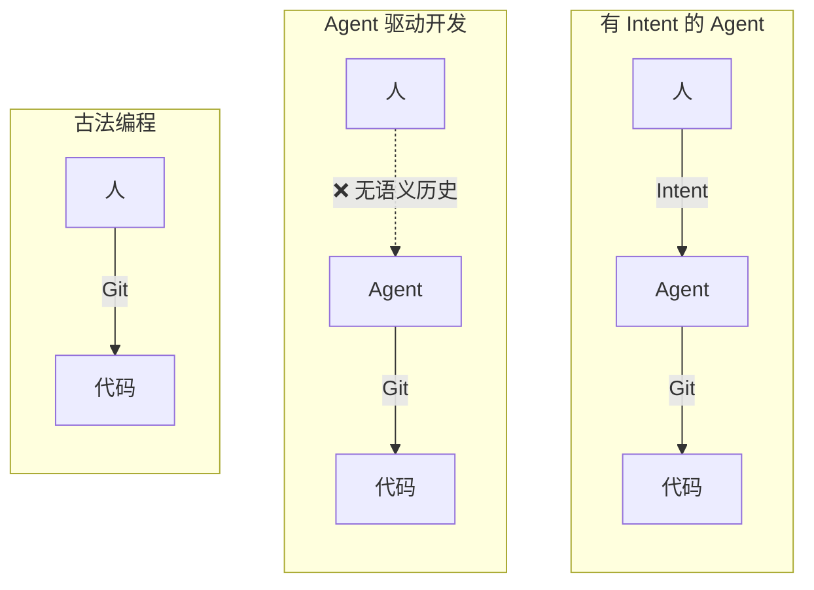
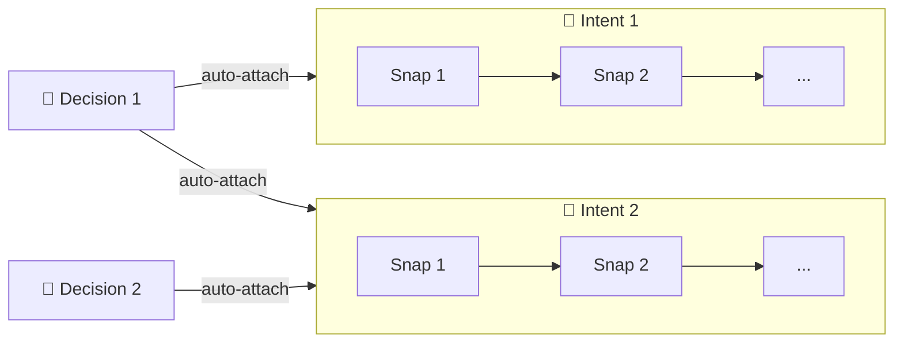

# Intent

中文 | [English](README.md)

Git 之上的开发语义历史层。它记录**目标**、**语义检查点**和**决策**。

## 为什么

Git 记录代码怎么变的。但它不记录**你为什么走这条路**、途中做了什么决策、上次停在哪里。

Intent 补上这层缺失的 **语义历史** — 一组既能保留产品形成历史、又能穿越上下文丢失的正式对象。

> 开发正在从"写代码"转向"引导 agent、沉淀决策"。历史层应该反映这一点。



## 三个对象，一张图

| 对象 | 记录什么 |
|---|---|
| **Intent** | 从用户 query 中识别出的目标 |
| **Snap** | 一个语义检查点，记录发生了什么变化、学到了什么，以及后续反馈 |
| **Decision** | 跨多个 intent 持续生效的长期约束 |

对象自动关联。Decision 自动挂载到每个 active intent；intent 自动挂载到每个 active decision。关系始终双向且只增不减。



## 快速开始

```bash
git clone https://github.com/dozybot001/Intent.git
cd Intent
pipx install .
npx skills add dozybot001/Intent -g
```

从源码安装 CLI 并添加 agent skill。需要 Python 3.9+、Git、Node.js 和 [pipx](https://pipx.pypa.io/)。

想在浏览器中查看语义历史，在 clone 的仓库目录下启动 **IntHub Local**：

```bash
itt hub start
```

然后在你自己的项目仓库里：

```bash
itt hub link --api-base-url http://127.0.0.1:7210
itt hub sync
```

> **Tips：** 由于 `itt` 是一个全新的命令，agent 没有被训练过，建议每个 session 开始时打个 `/`，选到技能，回车就进入工作流了。

## Showcase

这个项目用 Intent 管理自身的开发过程。运行 `itt hub start` 后，完整的语义历史（33 个 intent、156 个 snap、22 个 decision）会作为 showcase 项目自动加载到 IntHub — 从最初的 PyPI README 到 2.0.0 发布。

> Showcase 跨越了多次格式迭代，早期对象可能缺少后来新增的 `origin` 或 `rationale` 字段。

## 文档

- [愿景](docs/CN/vision.md) — 为什么需要语义历史
- [CLI 设计文档](docs/CN/cli.md) — 对象模型、命令、JSON 契约
- [路线图](docs/CN/roadmap.md) — 阶段规划
- [Dogfooding 实录](docs/CN/dogfooding.md) — 跨 agent 协作案例
- [IntHub Local](docs/CN/inthub-local.md) — 运行本地 IntHub 实例

## 许可证

MIT
