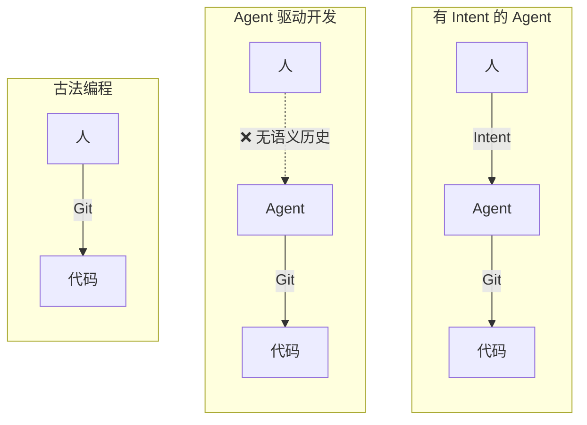
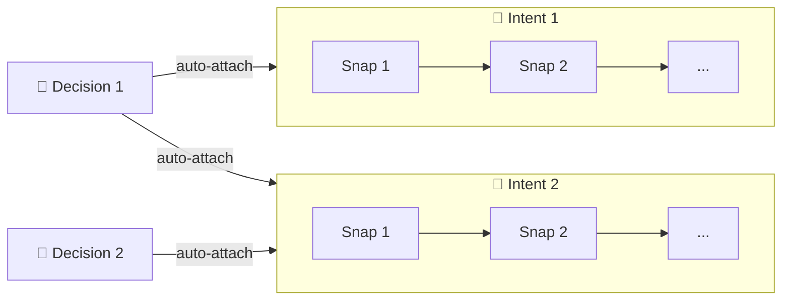
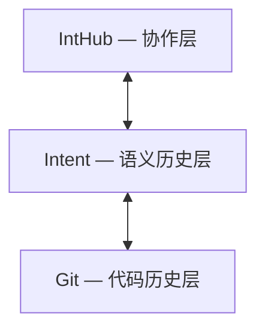

# Intent

中文 | [English](README.md)

为 agent 驱动的开发提供语义历史。记录**你做了什么**以及**为什么**。

## 为什么

Git 记录代码怎么变的。但它不记录**你为什么走这条路**、途中做了什么决策、上次停在哪里。

Intent 补上这层缺失的 **语义历史** — 一组能穿越上下文丢失的正式对象。

> 开发正在从"写代码"转向"引导 agent、沉淀决策"。历史层应该反映这一点。



## 三个对象，一张图

| 对象 | 记录什么 |
|---|---|
| **Intent** | 从用户 query 中识别出的目标 |
| **Snap** | 一次 query-response 交互 — query、摘要、反馈 |
| **Decision** | 跨多个 intent 持续生效的长期约束 |

对象自动关联。Decision 自动挂载到每个 active intent；intent 自动挂载到每个 active decision。关系始终双向且只增不减。



## 安装

```bash
pipx install intent-cli-python   # CLI
npx skills add dozybot001/Intent -g  # Agent skill
```

需要 Python 3.9+ 和 Git。CLI 提供命令，skill 教 agent 何时使用。

> **小发现：** Claude Code 里输入 `/` 选 `intent-cli` 回车，agent 就直接进入工作流了。Codex 的话，每个 session 提一次 skill 就够，后面会自己保持。

## IntHub



IntHub 是构建在 Intent 之上的远端协作层。首个路径是 **IntHub Local** — 从 [GitHub release](https://github.com/dozybot001/Intent/releases) 下载，然后：

```bash
itt hub login --api-base-url http://127.0.0.1:7210
itt hub link
itt hub sync
```

在浏览器中打开 `http://127.0.0.1:7210`。

## 文档

- [愿景](docs/CN/vision.md) — 为什么需要语义历史
- [CLI 设计文档](docs/CN/cli.md) — 对象模型、命令、JSON 契约
- [路线图](docs/CN/roadmap.md) — 阶段规划
- [Dogfooding 实录](docs/CN/dogfooding.md) — 跨 agent 协作案例
- [IntHub Local](docs/CN/inthub-local.md) — 运行本地 IntHub 实例

## 许可证

MIT
