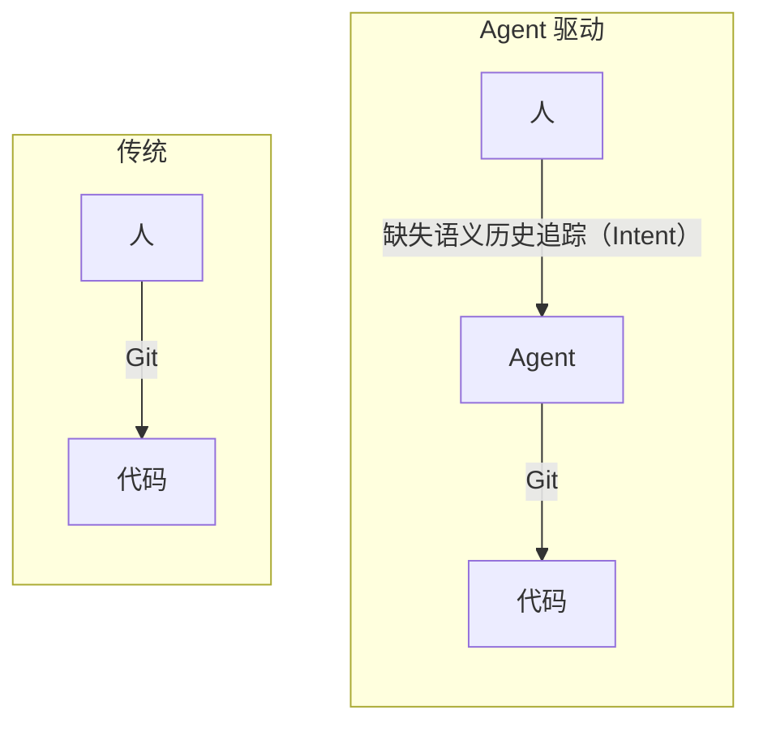

# Intent CLI

中文 | [English](README.md)

为 agent 驱动的开发提供语义历史。记录**你做了什么**以及**为什么**。

## 为什么

Git 记录代码怎么变的。但它不记录**你为什么走这条路**、途中做了什么决策、上次停在哪里。

今天这些上下文散落在聊天记录、PR 讨论和你的脑子里。勉强能用，直到会话结束、agent 失忆、或者队友接手时一头雾水。

Intent 补上这层缺失的 **语义历史**。不是更多文档，也不是更好的 commit message，而是一组能穿越上下文丢失的正式对象。

> 变化很简单：开发正在从"写代码"转向"引导 agent、沉淀决策"。历史层应该反映这一点。



在传统开发里，Git 足以连接人的意图和代码历史。进入 agent 驱动开发后，Git 仍然记录代码变化，但人和 agent 之间的语义层没有稳定的历史追踪。Intent 补上了这个缺口 — 它是人与 Agent 之间的记录桥梁，正如 Git 是 Agent 与代码之间的记录桥梁。

## 三个对象，一张图

| 对象 | 记录什么 |
|---|---|
| **Intent** | agent 从用户 query 中识别出的目标 |
| **Snap** | 一次 agent 交互 — query、摘要、反馈 |
| **Decision** | 跨多个 intent 持续生效的长期决策 |

对象自动关联：创建 intent 时挂载所有 active decision；创建 decision 时挂载所有 active intent。关系始终双向且只增不减。

### Decision 如何创建

Decision 需要人类参与，有两条路径：

- **显式指定**：在 query 中写 `decision-[内容]` 或 `决定-[内容]`，agent 直接创建。例如："决定-所有 API 返回 envelope 格式"
- **Agent 提议**：agent 在对话中发现潜在的长期约束，向你确认后再创建

## 安装

```bash
pipx install intent-cli-python
```

需要 Python 3.9+ 和 Git。

`.intent/` 是本地语义工作区元数据，不应进入 Git 历史，且应始终由 `.gitignore` 忽略。

## Agent skill

如果你使用 Codex、Claude Code 或其他支持 skill 的 agent，也应该安装 `intent-cli` skill：

```bash
npx skills add dozybot001/Intent -g
```

CLI 只提供命令本身，skill 负责教 agent 在真实工作里何时调用 `itt`。

## 快速上手

```bash
itt init

itt intent create "修复登录超时问题" \
  --query "为什么登录 5 秒就超时了？"

itt snap create "将超时提升到 30s" \
  --intent intent-001 \
  --query "慢网络下登录仍然超时" \
  --summary "更新了超时配置并运行了登录测试"

itt decision create "超时时间必须可配置" \
  --rationale "不同部署环境的延迟各不相同"

itt inspect
```

完整命令面和 JSON 契约请直接看下面的 CLI 设计文档。

## IntHub

IntHub 是构建在 Intent 之上的远端协作层。

- PyPI 只分发 `itt` CLI
- IntHub Web 和 API 不属于 PyPI 包
- 当前 GitHub release 只维护一条项目版本线，例如 `v1.6.0`
- CLI 自己的包版本继续由 `pyproject.toml` 维护，并通过 PyPI 发布

首个面向用户的路径是 **IntHub Local**：从 GitHub release 下载 asset，在本机启动后，再在自己的仓库里执行：

```bash
itt hub login --api-base-url http://127.0.0.1:7210
itt hub link
itt hub sync
```

然后在浏览器中打开 `http://127.0.0.1:7210`。

当前限制：
- IntHub V1 目前要求你的本地仓库配置 GitHub `origin` remote
- IntHub Local 当前仍依赖 Python 3.9+
- 托管版 IntHub 仍是后续阶段；当前首个可分发路径是本地实例优先

## 文档

- [愿景](docs/CN/vision.md) — 为什么需要语义历史。**如果你对这个项目感兴趣，强烈建议从这里开始。**
- [CLI 设计文档](docs/CN/cli.md) — 对象模型、命令、JSON 契约
- [路线图](docs/CN/roadmap.md) — 阶段规划
- [Dogfooding 实录](docs/CN/dogfooding.md) — 基于真实 snap 链整理的跨 agent 协作案例
- [IntHub MVP 设计文档](docs/CN/inthub-mvp.md) — 首期远端协作层范围
- [IntHub 同步契约（首版）](docs/CN/inthub-sync-contract.md) — 首版同步、身份与接口契约
- [IntHub Local 使用说明](docs/CN/inthub-local.md) — 如何从 release asset 运行首个本地 IntHub 实例

## 许可证

MIT
