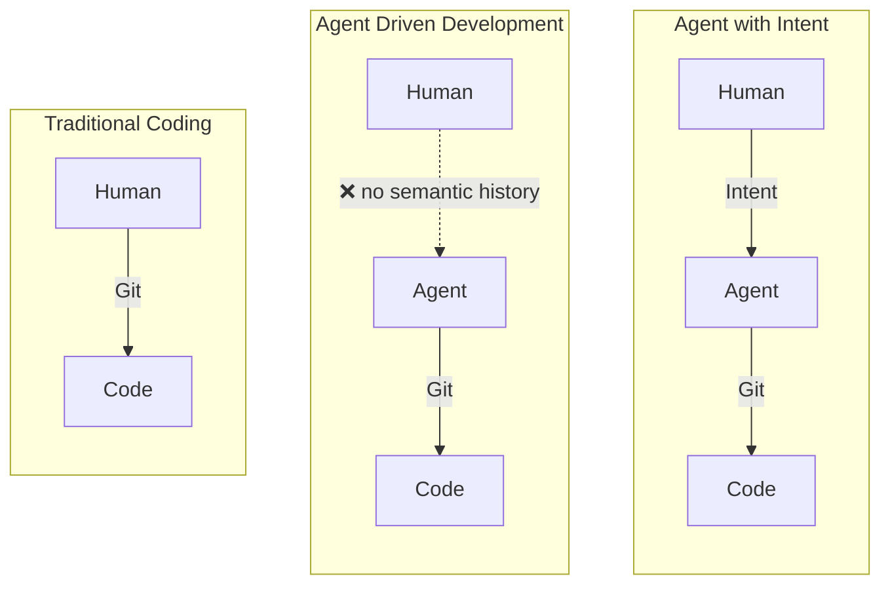
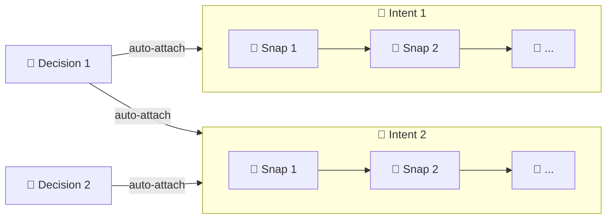

# Intent

[中文](README_CN.md) | English

A semantic history layer above Git for development. It records **goals**, **semantic snapshots**, and **decisions**.

## Why

Git records how code changes. But it doesn't record **why you're on this path**, what you decided along the way, or where you left off.

Intent adds that missing layer: **semantic history** — a small set of formal objects that preserve product formation history and survive context loss.

> Development is moving from *writing code* to *guiding agents and distilling decisions*. The history layer should reflect that.



## Three objects, one graph

| Object | What it captures |
|---|---|
| 🎯 **Intent** | A goal summarized from the interaction |
| 📸 **Snap** | A semantic snapshot — what was done and why |
| 🔶 **Decision** | A long-lived constraint that spans multiple intents |

Objects link automatically. Relationships are bidirectional and append-only.



## How to record

Early versions used a **Snap–Query** model where the agent autonomously captured snapshots after each interaction. It worked — but it was noisy, expensive on tokens, and interrupted the natural flow of work.

We switched to the **Intent–Session** model: the agent works freely, and you tell it when to record. This turns out to be more pragmatic — it costs fewer tokens, never interrupts your workflow, and yields better semantic data — because recording is retrospective, the milestones are already settled, and summarizing certainties is naturally more accurate than guessing in-flight. The overhead for you is near zero: just say "record semantics" when a goal is done.

1. Work with the agent on your goal
2. When the goal is achieved, ask the agent to look back and build the semantic history
3. The agent creates one intent (the goal) + snaps (milestones) + marks it done

"Session" doesn't strictly mean a full conversation — it represents any purposeful interaction where you know what you set out to do. Like `git commit`, recording is user-initiated.

[MAARS](https://github.com/dozybot001/MAARS) uses this approach — each session's semantic history was recorded retrospectively.

## Quick Start

```bash
# macOS / Linux
curl -fsSL https://raw.githubusercontent.com/dozybot001/Intent/main/scripts/install.sh | bash

# Windows (PowerShell)
irm https://raw.githubusercontent.com/dozybot001/Intent/main/scripts/install.ps1 | iex

# Clone repo & add agent skill
git clone https://github.com/dozybot001/Intent.git
npx skills add dozybot001/Intent -g --all
```

Requires Python 3.9+ and Git. The install script handles pipx automatically.
Re-run the installer anytime to upgrade or repair an existing `itt` install.

To browse semantic history in a browser, start **IntHub Local** (works from any directory):

```bash
itt hub start
```

Then, in your project repo:

```bash
itt hub link --api-base-url http://127.0.0.1:7210
itt hub sync
```

> **Tips:** Type `/intent-cli` to load the recording guide, or simply say "record semantics" / "记录语义" if the agent already knows about Intent.

## Showcase

This project manages its own development with Intent. Two showcase projects are included under `showcase/`:

- **`maars`** — [MAARS](https://github.com/dozybot001/MAARS) project: 1 intent, 8 snaps, 3 decisions
- **`retrospective-v4`** — Intent's own v4 pivot: 1 intent, 3 snaps
- **`intent-project`** — legacy semantic history spanning earlier schema iterations

Run `itt hub start` to browse them in IntHub.

## Docs

- [Vision](docs/EN/vision.md) — why semantic history matters
- [CLI Design](docs/EN/cli.md) — object model, commands, JSON contract

## Community

- [Contributing](.github/CONTRIBUTING.md)
- [Code of Conduct](.github/CODE_OF_CONDUCT.md)
- [Security Policy](.github/SECURITY.md)

## License

MIT
