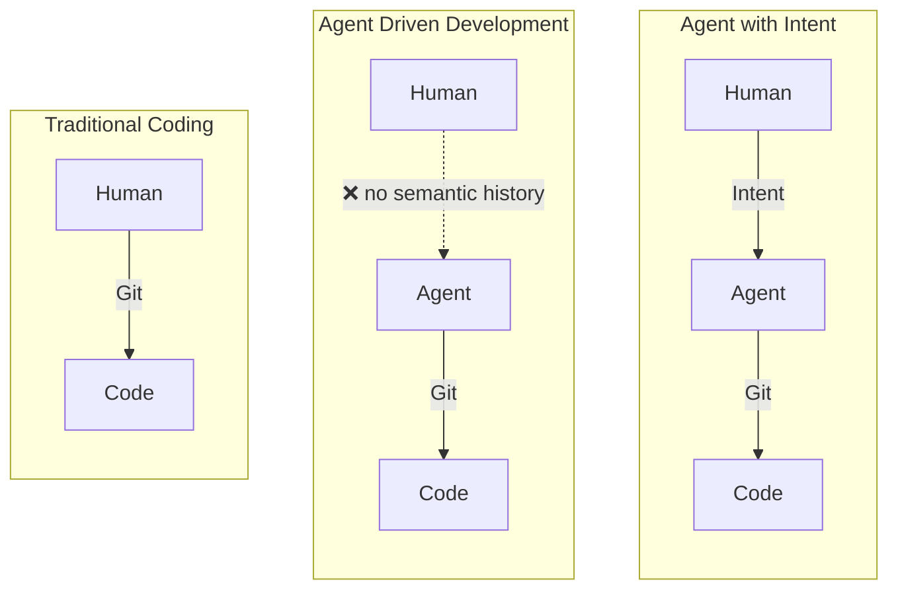
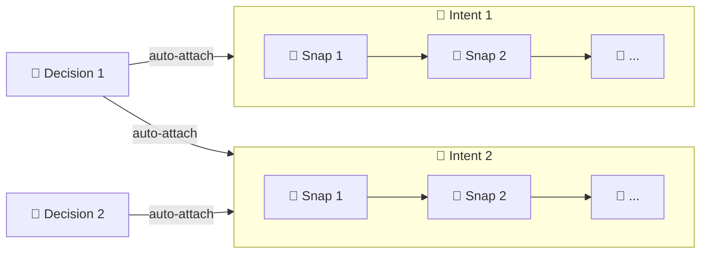

# Intent

[中文](README.CN.md) | English

A semantic history layer above Git for development. It records **goals**, **semantic snapshots**, and **decisions**.

## Why

Git records how code changes. But it doesn't record **why you're on this path**, what you decided along the way, or where you left off.

Intent adds that missing layer: **semantic history** — a small set of formal objects that preserve product formation history and survive context loss.

> Development is moving from *writing code* to *guiding agents and distilling decisions*. The history layer should reflect that.



## Three objects, one graph

| Object | What it captures |
|---|---|
| 🎯 **Intent** | A goal recognized from your query |
| 📸 **Snap** | A semantic snapshot — what was done, why, and what's next |
| 🔶 **Decision** | A long-lived constraint that spans multiple intents |

Objects link automatically. Relationships are bidirectional and append-only.



## Quick Start

```bash
# macOS / Linux
curl -fsSL https://raw.githubusercontent.com/dozybot001/Intent/main/scripts/install.sh | bash

# Windows (PowerShell)
irm https://raw.githubusercontent.com/dozybot001/Intent/main/scripts/install.ps1 | iex

# Clone repo & add agent skill
git clone https://github.com/dozybot001/Intent.git
npx skills add dozybot001/Intent -g --all
```

Requires Python 3.9+ and Git. The install script handles pipx automatically.

To browse semantic history in a browser, start **IntHub Local**:

```bash
cd Intent
itt hub start
```

Then, in your own project repo:

```bash
itt hub link --api-base-url http://127.0.0.1:7210
itt hub sync
```

> **Tips:** Because `itt` is a new command, agents are not trained on it yet. We recommend typing `/` at the start of each session, selecting the skill, and pressing Enter to enter the workflow.

## Showcase

This project manages its own development with Intent. Run `itt hub start` and the full semantic history is auto-loaded as a showcase project in IntHub.

> The showcase spans multiple schema iterations. Legacy data has not been aligned to the new format; missing fields are marked with "-".

## Docs

- [Vision](docs/EN/vision.md) — why semantic history matters
- [CLI Design](docs/EN/cli.md) — object model, commands, JSON contract

## License

MIT
