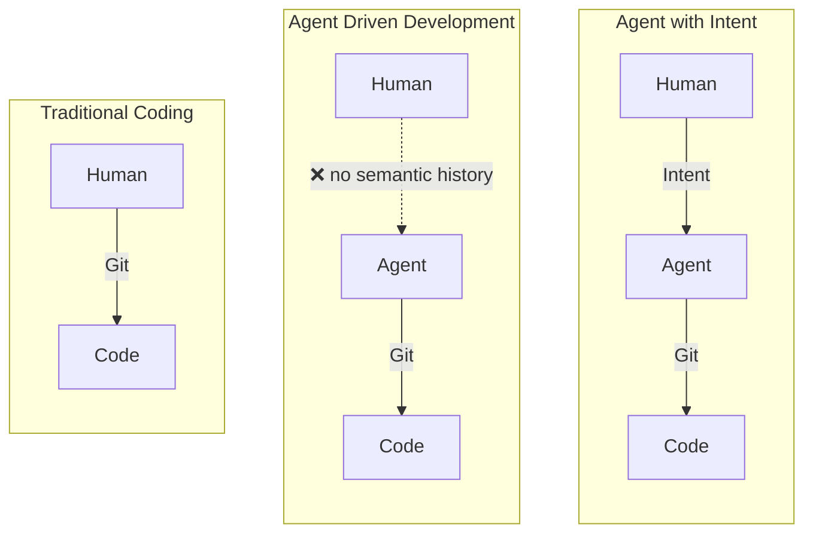
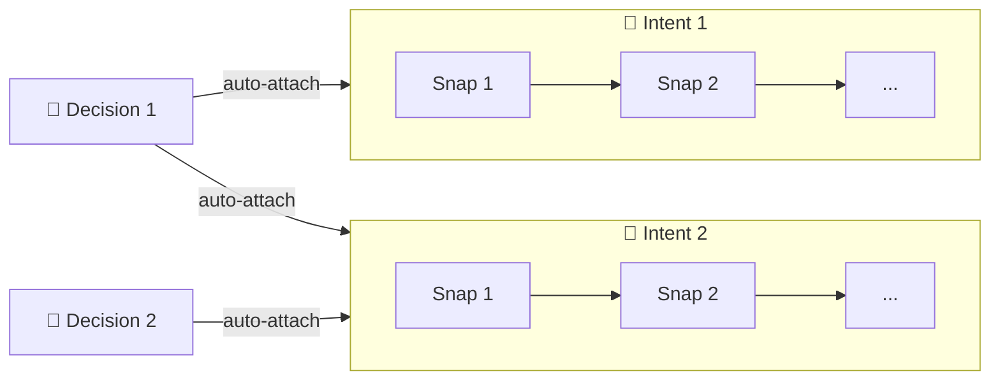
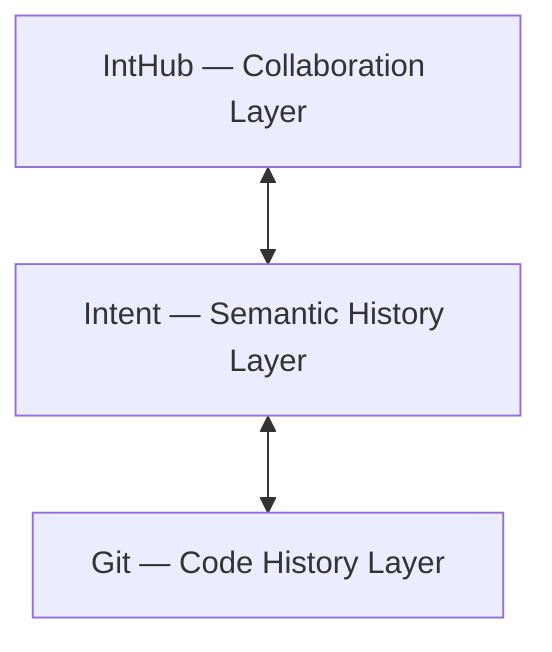

# Intent

[中文](README.CN.md) | English

Semantic history for agent-driven development. Preserves **how the product took shape** and **how work resumes across sessions and agents**.

## Why

Git records how code changes. But it doesn't record **why you're on this path**, what you decided along the way, or where you left off.

Intent adds that missing layer: **semantic history** — a small set of formal objects that preserve product formation history and survive context loss.

> Development is moving from *writing code* to *guiding agents and distilling decisions*. The history layer should reflect that.



## Three objects, one graph

| Object | What it captures |
|---|---|
| **Intent** | A goal recognized from your query |
| **Snap** | A semantic checkpoint that captures what changed, what was learned, and later feedback |
| **Decision** | A long-lived constraint that spans multiple intents |

Objects link automatically. Decisions auto-attach to every active intent; intents auto-attach to every active decision. Relationships are bidirectional and append-only.



## Install

```bash
pipx install intent-cli-python   # CLI
npx skills add dozybot001/Intent -g  # Agent skill
```

Requires Python 3.9+ and Git. The CLI provides the commands; the skill teaches the agent when to use them.

> **Tips:** Because `itt` is a new command, agents are not trained on it yet. We recommend typing `/` at the start of each session, selecting the skill, and pressing Enter to enter the workflow.

## IntHub



IntHub is the collaboration layer on top of Intent. Run **IntHub Local** to browse semantic history in your browser:

```bash
python3 bin/inthub-local.pyz
```

## Docs

- [Vision](docs/EN/vision.md) — why semantic history matters
- [CLI Design](docs/EN/cli.md) — object model, commands, JSON contract
- [Roadmap](docs/EN/roadmap.md) — phase plan
- [Dogfooding](docs/EN/dogfooding.md) — cross-agent case study
- [IntHub Local](docs/EN/inthub-local.md) — run a local IntHub instance

## License

MIT
