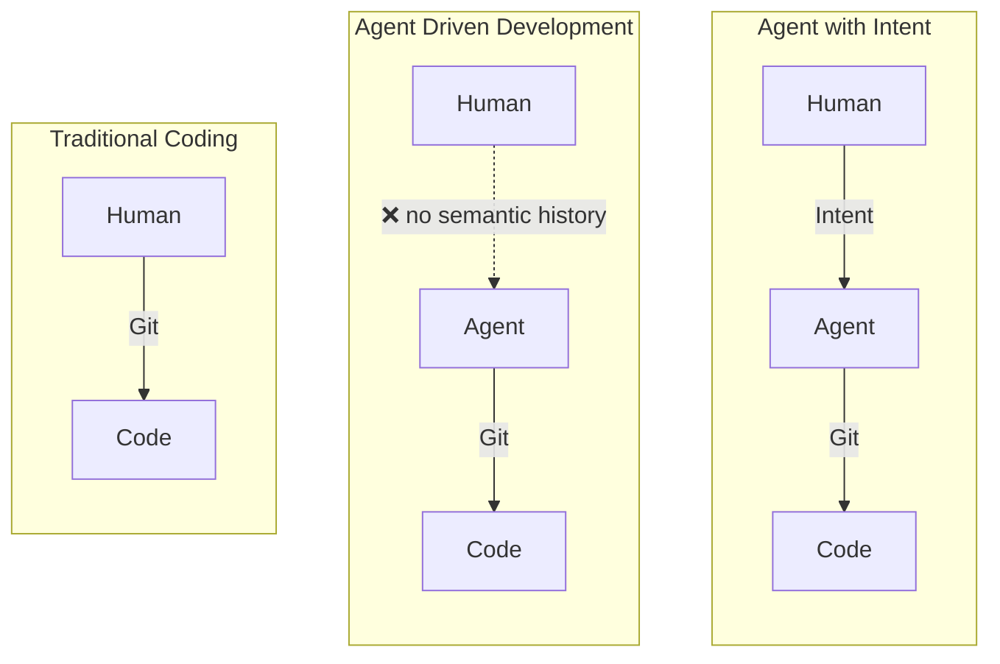
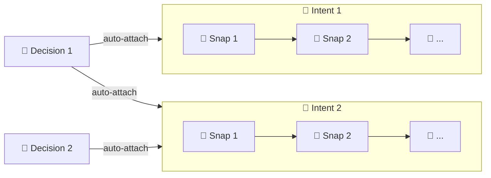

# Intent

[中文](README_CN.md) | English

A semantic history layer above Git for development. It records **goals**, **semantic snapshots**, and **decisions**.

## Why

Git records how code changes. But it doesn't record **why you're on this path**, what you decided along the way, or where you left off.

Intent adds that missing layer: **semantic history** — a small set of formal objects that preserve product formation history and survive context loss.

> Development is moving from *writing code* to *guiding agents and distilling decisions*. The history layer should reflect that.


```mermaid
flowchart LR
  subgraph traditional["Traditional Coding"]
    direction TB
    H1["Human"]
    C1["Code"]
    H1 -->|"Git"| C1
  end
  subgraph agent["Agent Driven Development"]
    direction TB
    H2["Human"]
    AG["Agent"]
    C2["Code"]
    H2 -."❌ no semantic history".-> AG
    AG -->|"Git"| C2
  end
  subgraph withintent["Agent with Intent"]
    direction TB
    H3["Human"]
    AG2["Agent"]
    C3["Code"]
    H3 -->|"Intent"| AG2
    AG2 -->|"Git"| C3
  end
  traditional ~~~ agent ~~~ withintent
```

## Three objects, one graph

| Object | What it captures |
|---|---|
| 🎯 **Intent** | A goal summarized from the interaction |
| 📸 **Snap** | A semantic snapshot — what was done and why |
| 🔶 **Decision** | A long-lived constraint that spans multiple intents |

Objects link automatically. Relationships are bidirectional and append-only.


```mermaid
flowchart LR
  D1["🔶 Decision 1"]
  D2["🔶 Decision 2"]

  subgraph Intent1["🎯 Intent 1"]
    direction LR
    S1["📸 Snap 1"] --> S2["📸 Snap 2"] --> S3["📸 ..."]
  end

  subgraph Intent2["🎯 Intent 2"]
    direction LR
    S4["📸 Snap 1"] --> S5["📸 Snap 2"] --> S6["📸 ..."]
  end

  D1 -- auto-attach --> Intent1
  D1 -- auto-attach --> Intent2
  D2 -- auto-attach --> Intent2
```

## How to record

Early versions used a **Snap–Query** model where the agent autonomously captured snapshots after each interaction. In self-use, that produced too many low-value records and interrupted the natural flow of work.

Intent now uses an **Intent–Session** model: the agent works freely, and you decide when to record. Recording is retrospective, so it can focus on settled goals, milestones, and decisions instead of capturing every intermediate action. This is a product trade-off intended to keep recording lightweight; unrecorded work is not recovered automatically.

1. Work with the agent on your goal
2. When the goal is achieved, ask the agent to look back and build the semantic history
3. The agent creates one intent (the goal) + snaps (milestones) + marks it done

"Session" doesn't strictly mean a full conversation — it represents any purposeful interaction where you know what you set out to do. Like `git commit`, recording is user-initiated.

[MAARS](https://github.com/dozybot001/MAARS) uses this approach — each session's semantic history was recorded retrospectively.

## What success means

Intent is designed around two goals, not established comparative claims:

| Goal | What still needs to be validated in real use |
|---|---|
| Low-disruption recording | Recording takes little time and context, does not interrupt normal development, and avoids command-log noise. |
| Useful continuation | A later session or another agent can recover the goal and its rationale, the latest meaningful milestone, and active long-lived decisions with less re-explanation. |

Self-dogfooding shows that the workflow is usable end to end. It does not yet establish that Intent is more efficient or more effective than a well-written handoff, ordinary notes, or other context sources.

## Quick Start

```bash
# macOS / Linux
curl -fsSL https://raw.githubusercontent.com/dozybot001/Intent/main/scripts/install.sh | bash

# Windows (PowerShell)
irm https://raw.githubusercontent.com/dozybot001/Intent/main/scripts/install.ps1 | iex

# Clone repo & add agent skill
git clone https://github.com/dozybot001/Intent.git
npx skills add dozybot001/Intent -g --all
```

Requires Python 3.9+ and Git. The install script handles pipx automatically.
Re-run the installer anytime to upgrade or repair an existing `itt` install.

Initialize Intent inside the Git repository you want to record:

```bash
cd your-project
itt init
```

`itt init` creates `.intent/` and adds it to this clone's Git-local `.git/info/exclude`; it does **not** edit the shared `.gitignore`. The command returns a warning if the local exclude cannot be updated. Review the files before intentionally sharing them, and add `.intent/` to `.gitignore` separately if the whole team should inherit that rule. The current CLI does not persist `--token`, but `hub.json` written by an older release may still contain one; remove any legacy token before committing or sharing the directory.

To browse semantic history in a browser, start **IntHub Local** (works from any directory):

```bash
itt hub start
```

Then, in your project repo:

```bash
itt hub link --api-base-url http://127.0.0.1:7210
itt hub sync
```

IntHub Local binds to `127.0.0.1` by default. Its current local API does not enforce bearer-token authentication and returns permissive CORS headers, so use it only on a trusted machine and do not expose it through a public interface or reverse proxy.

> **Tips:** Type `/intent-cli` to load the recording guide, or simply say "record semantics" / "记录语义" if the agent already knows about Intent.

## Showcase

This project has used Intent to manage its own development. Browse a published semantic-history snapshot:

**[IntHub Showcase](https://dozybot001.github.io/Intent/)** — interactive viewer for Intent's early project history, MAARS, and legacy data.

Or run `itt hub start` locally.

## Docs

- [Vision](docs/EN/vision.md) — why semantic history matters
- [Continuation Case](docs/EN/continuation-case.md) — a reproducible interruption-to-resumption walkthrough
- [CLI Design](docs/EN/cli.md) — object model, commands, JSON contract

## Community

- [Contributing](.github/CONTRIBUTING.md)
- [Code of Conduct](.github/CODE_OF_CONDUCT.md)
- [Security Policy](.github/SECURITY.md)

## License

MIT
