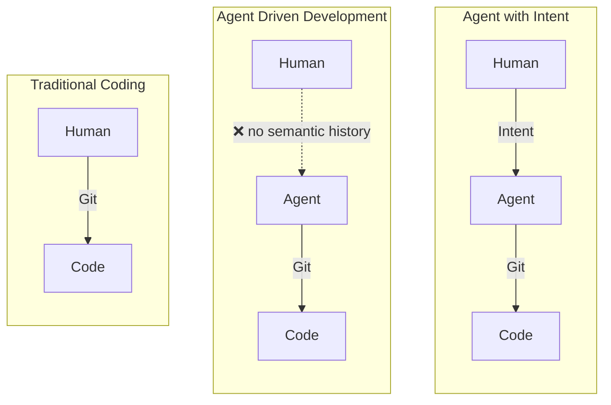
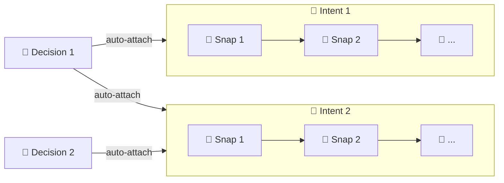

# Intent

[中文](README_CN.md) | English

A semantic history layer above Git for development. It records **goals**, **semantic snapshots**, and **decisions**.

## Why

Git records how code changes. But it doesn't record **why you're on this path**, what you decided along the way, or where you left off.

Intent adds that missing layer: **semantic history** — a small set of formal objects that preserve product formation history and survive context loss.

> Development is moving from *writing code* to *guiding agents and distilling decisions*. The history layer should reflect that.


```mermaid
flowchart LR
  subgraph traditional["Traditional Coding"]
    direction TB
    H1["Human"]
    C1["Code"]
    H1 -->|"Git"| C1
  end
  subgraph agent["Agent Driven Development"]
    direction TB
    H2["Human"]
    AG["Agent"]
    C2["Code"]
    H2 -."❌ no semantic history".-> AG
    AG -->|"Git"| C2
  end
  subgraph withintent["Agent with Intent"]
    direction TB
    H3["Human"]
    AG2["Agent"]
    C3["Code"]
    H3 -->|"Intent"| AG2
    AG2 -->|"Git"| C3
  end
  traditional ~~~ agent ~~~ withintent
```

## Three objects, one graph

| Object | What it captures |
|---|---|
| 🎯 **Intent** | A goal summarized from the interaction |
| 📸 **Snap** | A semantic snapshot — what was done and why |
| 🔶 **Decision** | A long-lived constraint that spans multiple intents |

Objects link automatically. Relationships are bidirectional and append-only.


```mermaid
flowchart LR
  D1["🔶 Decision 1"]
  D2["🔶 Decision 2"]

  subgraph Intent1["🎯 Intent 1"]
    direction LR
    S1["📸 Snap 1"] --> S2["📸 Snap 2"] --> S3["📸 ..."]
  end

  subgraph Intent2["🎯 Intent 2"]
    direction LR
    S4["📸 Snap 1"] --> S5["📸 Snap 2"] --> S6["📸 ..."]
  end

  D1 -- auto-attach --> Intent1
  D1 -- auto-attach --> Intent2
  D2 -- auto-attach --> Intent2
```

## Record and resume

Early versions used a **Snap–Query** model where the agent autonomously captured snapshots after each interaction. In self-use, that produced too many low-value records and interrupted the natural flow of work.

Intent now uses an **Intent–Session** model: the agent works freely, and you explicitly decide when Intent should write. Recording focuses on verified goals, milestones, and decisions instead of every intermediate action. This is a product trade-off intended to keep recording lightweight; unrecorded work is not recovered automatically.

1. Work with the agent on your goal
2. Explicitly ask the agent to record or update the work with Intent
3. The agent inspects existing state, reuses a matching active or suspended Intent, and writes only new high-signal semantics
4. If the goal remains open, its latest Snap is a self-contained checkpoint: verified state, current boundary, next step, and blockers or local constraints

Zero writes is a valid result when there is no new critical semantic information. There is no per-recording object quota: split independent objective boundaries into separate Intents and create only the Snaps needed to preserve meaningful semantic changes. Like `git commit`, recording is user-initiated; generic requests to summarize, take notes, or report status do not authorize writes to `.intent/`.

To resume, explicitly ask the agent to recover the project through Intent. It starts with `itt inspect`; if the latest checkpoint is not enough and `has_more` is true, it can narrowly read recent history with `itt inspect --intent ID --history 3`. Merely inspecting or explaining recovery state is read-only.

## What success means

Intent is designed around two goals, not established comparative claims:

| Goal | What still needs to be validated in real use |
|---|---|
| Low-disruption recording | Recording takes little time and context, does not interrupt normal development, and avoids command-log noise. |
| Useful continuation | A later session or another agent can recover the goal and its rationale, the latest meaningful milestone, and active long-lived decisions with less re-explanation. |

Historical self-use shows that earlier workflows ran end to end, but it is not evidence for the current continuation contract. The current version is evaluated with natural continuation cases that distinguish facts supplied by Intent from facts later rediscovered in code or re-explained by the user. See the [dogfooding protocol](docs/EN/dogfooding.md).

## Quick Start

```bash
# macOS / Linux
curl -fsSL https://raw.githubusercontent.com/dozybot001/Intent/main/scripts/install.sh | bash

# Windows (PowerShell)
irm https://raw.githubusercontent.com/dozybot001/Intent/main/scripts/install.ps1 | iex

# Clone repo & add agent skill
git clone https://github.com/dozybot001/Intent.git
npx skills add dozybot001/Intent -g --all
```

Requires Python 3.9+ and Git. The install script handles pipx automatically.
Re-run the installer anytime to upgrade or repair an existing `itt` install.

Initialize Intent inside the Git repository you want to record:

```bash
cd your-project
itt init
```

`itt init` creates `.intent/` and adds it to this clone's Git-local `.git/info/exclude`; it does **not** edit the shared `.gitignore`. The command returns a warning if the local exclude cannot be updated. Review the files before intentionally sharing them, and add `.intent/` to `.gitignore` separately if the whole team should inherit that rule.

Sign in once for the official IntHub service, then link and push each repository:

```bash
itt auth login
cd your-project
itt hub status
itt hub link
itt push
```

`itt auth login` uses `https://inthub.tenon.asia` by default. It stores the non-secret endpoint in the user config and delegates the account token to Git's configured credential helper, such as macOS Keychain, Git Credential Manager, or libsecret. The same account credential is reused across repositories; each repository keeps its own non-secret `project_id`, `workspace_id`, and `repo_binding` in `.intent/hub.json`. `itt hub status` reports that local state without calling the IntHub API. GitHub and Gitee origins are supported, while GitHub OAuth only identifies the IntHub account. The CLI never needs to rewrite `origin`, and `itt push` rejects an origin that no longer matches the saved binding. `--token` and `INTHUB_TOKEN` remain one-command or environment overrides and are never written to repository config. `itt hub sync` remains a compatible alias for `itt push`.

To browse semantic history in a browser, start **IntHub Local** (works from any directory):

```bash
itt hub start
```

Then, in your project repo:

```bash
itt hub link --api-base-url http://127.0.0.1:7210
itt push
```

IntHub Local binds to `127.0.0.1` by default. Its current local API does not enforce bearer-token authentication and returns permissive CORS headers, so use it only on a trusted machine and do not expose it through a public interface or reverse proxy.

Internet deployments use one account path: GitHub sign-up or sign-in, database-backed Web sessions, account-scoped CLI access tokens, account-isolated projects, PostgreSQL, a loopback app port, and Caddy TLS. See [IntHub Production Deployment](docs/EN/inthub-production.md).

> **Tips:** Be explicit: “Use Intent to record this work in `.intent/`” enters recording mode; “Resume this project through Intent” enters recovery mode. Ordinary summaries and status reports remain read-only.

## Showcase

This project has used Intent to manage its own development. Browse a published semantic-history snapshot:

**[IntHub Showcase](https://dozybot001.github.io/Intent/)** — interactive viewer for Intent's early project history, MAARS, and legacy data.

Or run `itt hub start` locally.

## Docs

- [Vision](docs/EN/vision.md) — why semantic history matters
- [Continuation Case](docs/EN/continuation-case.md) — a reproducible interruption-to-resumption walkthrough
- [Dogfooding Protocol](docs/EN/dogfooding.md) — source-labelled validation on natural continuations
- [CLI Design](docs/EN/cli.md) — object model, commands, JSON contract
- [IntHub Production Deployment](docs/EN/inthub-production.md) — PostgreSQL, authentication, TLS, backup, and rollback

## Community

- [Contributing](.github/CONTRIBUTING.md)
- [Code of Conduct](.github/CODE_OF_CONDUCT.md)
- [Security Policy](.github/SECURITY.md)

## License

MIT
