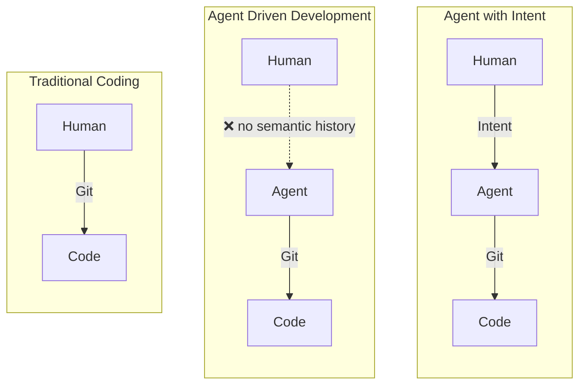
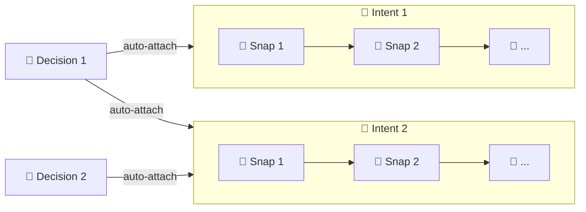

# Intent

[中文](README_CN.md) | English

A semantic history layer above Git for development. It records **goals**, **semantic snapshots**, and **decisions**.

## Why

Git records how code changes. But it doesn't record **why you're on this path**, what you decided along the way, or where you left off.

Intent adds that missing layer: **semantic history** — a small set of formal objects that preserve product formation history and survive context loss.

> Development is moving from *writing code* to *guiding agents and distilling decisions*. The history layer should reflect that.


```mermaid
flowchart LR
  subgraph traditional["Traditional Coding"]
    direction TB
    H1["Human"]
    C1["Code"]
    H1 -->|"Git"| C1
  end
  subgraph agent["Agent Driven Development"]
    direction TB
    H2["Human"]
    AG["Agent"]
    C2["Code"]
    H2 -."❌ no semantic history".-> AG
    AG -->|"Git"| C2
  end
  subgraph withintent["Agent with Intent"]
    direction TB
    H3["Human"]
    AG2["Agent"]
    C3["Code"]
    H3 -->|"Intent"| AG2
    AG2 -->|"Git"| C3
  end
  traditional ~~~ agent ~~~ withintent
```

## Three objects, one graph

| Object | What it captures |
|---|---|
| 🎯 **Intent** | A goal summarized from the interaction |
| 📸 **Snap** | A semantic snapshot — what was done and why |
| 🔶 **Decision** | A long-lived constraint that spans multiple intents |

Objects link automatically. Relationships are bidirectional and append-only.


```mermaid
flowchart LR
  D1["🔶 Decision 1"]
  D2["🔶 Decision 2"]

  subgraph Intent1["🎯 Intent 1"]
    direction LR
    S1["📸 Snap 1"] --> S2["📸 Snap 2"] --> S3["📸 ..."]
  end

  subgraph Intent2["🎯 Intent 2"]
    direction LR
    S4["📸 Snap 1"] --> S5["📸 Snap 2"] --> S6["📸 ..."]
  end

  D1 -- auto-attach --> Intent1
  D1 -- auto-attach --> Intent2
  D2 -- auto-attach --> Intent2
```

## Record and resume

Early versions used a **Snap–Query** model where the agent autonomously captured a snapshot after each interaction. In self-use, that produced too many low-value records and interrupted the natural flow of work. Intent therefore treats semantic change—not a query, file, command, commit, or tool call—as the recording boundary.

Continuous local maintenance is the normal mode. `itt init` enables it for a new project; existing histories use `itt maintenance on` once. `itt maintenance off` disables only that project. Installation does not enable unrelated or legacy projects.

The agent reads once at turn start, preserves verified important milestones, and closes with `recorded`, `no-op`, or `failed`. Independent objectives remain separate Intents. No continuation-critical change means a silent no-op, not a new Snap or a repeated permission request.

Project-local Codex entry/Stop hooks and durable turn receipts implement the normal-path closure check. Review/trust the generated definitions in Codex `/hooks`; configuration alone does not prove host execution. The gate allows one closure-only retry, then reports incomplete recording and releases the task. It cannot guarantee semantic quality, crash/cancellation recovery, or operation in unsupported hosts. See [hook integration and limits](references/codex-hooks.md). Automatic maintenance never grants login, push/pull, publication, or cross-project permission.

Whenever an open goal is recorded, its latest Snap should remain a self-contained checkpoint: verified state, current boundary, next step, and blockers or local constraints. Zero writes is valid, and there is no per-turn object quota. Decision candidates should be confirmed together when needed rather than interrupting every turn.

To resume, explicitly ask the agent to recover the project through Intent. It starts with `itt inspect`; if the latest checkpoint is not enough and `has_more` is true, it can narrowly read recent history with `itt inspect --intent ID --history 3`. Merely inspecting or explaining recovery state is read-only.

## What success means

Intent is designed around two goals, not established comparative claims:

| Goal | What still needs to be validated in real use |
|---|---|
| Low-disruption recording | Recording takes little time and context, does not interrupt normal development, and avoids command-log noise. |
| Useful continuation | A later session or another agent can recover the goal and its rationale, the latest meaningful milestone, and active long-lived decisions with less re-explanation. |

Historical self-use shows that earlier workflows ran end to end, but it is not evidence for the current continuation contract. The current version is evaluated with natural continuation cases that distinguish facts supplied by Intent from facts later rediscovered in code or re-explained by the user. See the [dogfooding protocol](docs/EN/dogfooding.md).

## Quick Start

```bash
# macOS / Linux
curl -fsSL https://raw.githubusercontent.com/dozybot001/Intent/main/scripts/install.sh | bash

# Windows (PowerShell)
irm https://raw.githubusercontent.com/dozybot001/Intent/main/scripts/install.ps1 | iex

# Clone repo & add agent skill
git clone https://github.com/dozybot001/Intent.git
npx skills add dozybot001/Intent -g --all
```

Requires Python 3.9+. Git is used by source installation and secure credential helpers, not by local semantic history. The install script handles pipx automatically.
Re-run the installer anytime to upgrade or repair an existing `itt` install.

Initialize Intent in the project directory you want to record (Git is optional):

```bash
cd your-project
itt init
# Existing history: enable once
itt maintenance on
# Project-local control
itt maintenance status
itt maintenance off
```

`itt init` also enables continuous maintenance and creates project-local hooks. Review them in Codex `/hooks` before relying on the Stop gate. Normal turns need no extra user ceremony.

`itt init` creates `.intent/` and adds it to this clone's Git-local `.git/info/exclude`; it does **not** edit the shared `.gitignore`. The command returns a warning if the local exclude cannot be updated. Review the files before intentionally sharing them, and add `.intent/` to `.gitignore` separately if the whole team should inherit that rule.

Sign in once, then synchronize one shared semantic history per project:

```bash
itt auth login
cd your-project
itt status
itt push
```

Git is optional. The directory name supplies the default project name; use `itt remote add origin https://inthub.tenon.asia --project NAME` when local copies have different names. This remote belongs to Intent and is independent of a code repository's GitHub/Gitee origin. Global credentials still use the secure Git credential helper; tokens never enter `.intent/`. Push creates the remote project when needed and uploads a version identified by its parent and snapshot checksum. Unchanged snapshots create no extra versions. `itt status` reports `empty`, `up_to_date`, `ahead`, `behind`, or `diverged`; `--local` works offline. No staging area, manual commit, branch, force-push, or automatic merge is required.

To restore the same account-private project into another local directory:

```bash
cd another-checkout
itt init
itt remote add origin https://inthub.tenon.asia --project your-project
itt pull

# Optional preview without applying changes
itt pull --dry-run

# Inspect local/remote synchronization state
itt status
```

Pull restores a complete validated shared snapshot. An unchanged local baseline can advance; local changes stay intact when the remote is unchanged. Divergence is reported without overwriting either side. Repeated pull/push is a no-op. Synchronization uses one shared project history; no workspace or Git-provider branches remain.

Pull requires an IntHub service version that provides the account-private snapshot endpoint. Passing isolated or test-environment checks does not by itself validate restoration of real account history.

To browse semantic history in a browser, start **IntHub Local** (works from any directory):

```bash
itt hub start
```

Then, in your project repo:

```bash
itt remote add origin http://127.0.0.1:7210 --project your-project
itt push
```

IntHub Local binds to `127.0.0.1` by default. Its current local API does not enforce bearer-token authentication and returns permissive CORS headers, so use it only on a trusted machine and do not expose it through a public interface or reverse proxy.

Internet deployments use one account path: Tenon sign-in, database-backed Web sessions, account-scoped CLI access tokens, account-isolated projects, PostgreSQL, a loopback app port, and Caddy TLS. See [IntHub Production Deployment](docs/EN/inthub-production.md).

> **Tips:** Continuous maintenance is project-local and quiet. “Use Intent to record this work in `.intent/`” remains available for one-off recording; “Resume this project through Intent” starts read-only recovery. IntHub push/pull always needs a separate explicit request. A trusted Stop hook checks closure, not semantic completeness.

## Docs

- [Vision](docs/EN/vision.md) — why semantic history matters
- [Continuation Case](docs/EN/continuation-case.md) — a reproducible interruption-to-resumption walkthrough
- [Dogfooding Protocol](docs/EN/dogfooding.md) — source-labelled validation on natural continuations
- [CLI Design](docs/EN/cli.md) — object model, commands, JSON contract
- [IntHub Production Deployment](docs/EN/inthub-production.md) — PostgreSQL, authentication, TLS, backup, and rollback

## Community

- [Contributing](.github/CONTRIBUTING.md)
- [Code of Conduct](.github/CODE_OF_CONDUCT.md)
- [Security Policy](.github/SECURITY.md)

## License

MIT
