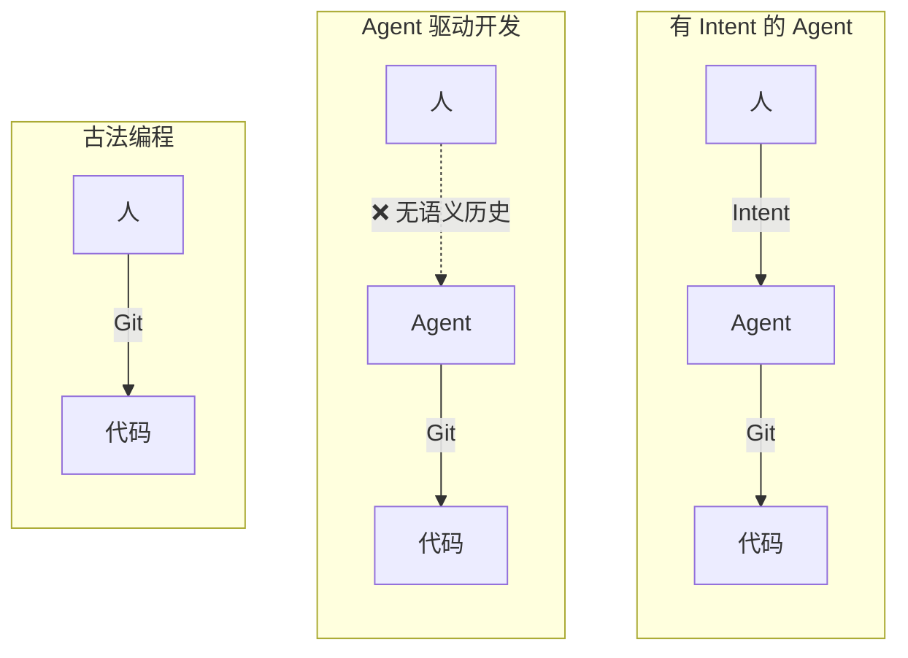
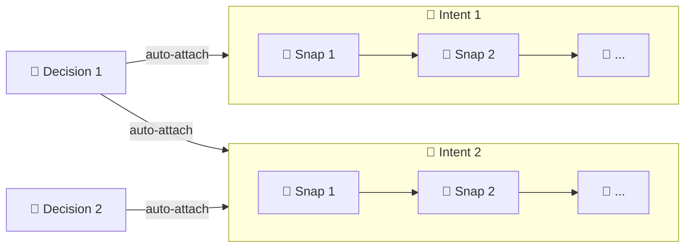

# Intent

中文 | [English](README.md)

Git 之上的开发语义历史层。它记录**目标**、**语义快照**和**决策**。

## 为什么

Git 记录代码怎么变的。但它不记录**你为什么走这条路**、途中做了什么决策、上次停在哪里。

Intent 补上这层缺失的 **语义历史** — 一组既能保留产品形成历史、又能穿越上下文丢失的正式对象。

> 开发正在从"写代码"转向"引导 agent、沉淀决策"。历史层应该反映这一点。



## 三个对象，一张图

| 对象 | 记录什么 |
|---|---|
| 🎯 **Intent** | 从交互中总结出的目标 |
| 📸 **Snap** | 语义快照 — 做了什么、为什么 |
| 🔶 **Decision** | 跨多个 intent 持续生效的长期约束 |

对象自动关联。关系始终双向且只增不减。



## 怎么记录

Intent 采用 **Intent–Session** 模式：agent 自由工作，你来决定何时记录。

1. 和 agent 一起完成你的目标
2. 目标达成后，让 agent 回顾并构建语义历史
3. Agent 创建一个 intent（目标）+ 若干 snap（里程碑）+ 标记完成

"Session" 不严格指一次完整会话——它代表任何有明确目的的交互，你知道自己要做什么，做完了就记录。和 `git commit` 一样，记录由用户发起。

[MAARS](https://github.com/dozybot001/MAARS) 就是这种方式——每次 session 的语义历史都是回溯记录的。

## 快速开始

```bash
# macOS / Linux
curl -fsSL https://raw.githubusercontent.com/dozybot001/Intent/main/scripts/install.sh | bash

# Windows (PowerShell)
irm https://raw.githubusercontent.com/dozybot001/Intent/main/scripts/install.ps1 | iex

# 克隆仓库 & 添加 agent skill
git clone https://github.com/dozybot001/Intent.git
npx skills add dozybot001/Intent -g --all
```

需要 Python 3.9+ 和 Git。安装脚本会自动处理 pipx。
需要升级或修复已有的 `itt` 安装时，直接重新运行安装脚本即可。

想在浏览器中查看语义历史，启动 **IntHub Local**（任意目录可用）：

```bash
itt hub start
```

然后在你的项目仓库里：

```bash
itt hub link --api-base-url http://127.0.0.1:7210
itt hub sync
```

> **Tips：** 输入 `/intent-cli` 加载记录指南，或者如果 agent 已经了解 Intent，直接说"记录语义"即可触发。

## Showcase

本项目用 Intent 管理自身的开发过程。`showcase/` 下包含两个示例项目：

- **`maars`** — [MAARS](https://github.com/dozybot001/MAARS) 项目：1 intent、8 snaps、3 decisions
- **`retrospective-v4`** — Intent 自身 v4 转向：1 intent、3 snaps
- **`intent-project`** — 早期格式迭代的历史语义记录

运行 `itt hub start` 在 IntHub 中浏览。

## 文档

- [愿景](docs/CN/vision.md) — 为什么需要语义历史
- [CLI 设计文档](docs/CN/cli.md) — 对象模型、命令、JSON 契约

## 社区

- [贡献指南](.github/CONTRIBUTING.md)
- [行为准则](.github/CODE_OF_CONDUCT.md)
- [安全策略](.github/SECURITY.md)

## 许可证

MIT
