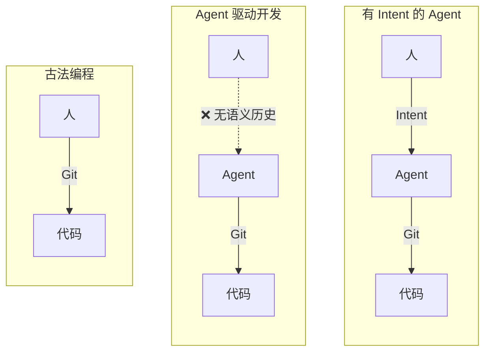
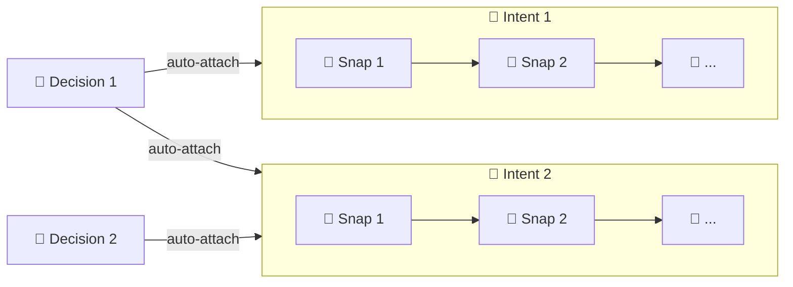

# Intent

中文 | [English](README.md)

Git 之上的开发语义历史层。它记录**目标**、**语义快照**和**决策**。

## 为什么

Git 记录代码怎么变的。但它不记录**你为什么走这条路**、途中做了什么决策、上次停在哪里。

Intent 补上这层缺失的 **语义历史** — 一组既能保留产品形成历史、又能穿越上下文丢失的正式对象。

> 开发正在从"写代码"转向"引导 agent、沉淀决策"。历史层应该反映这一点。


```mermaid
flowchart LR
  subgraph traditional["古法编程"]
    direction TB
    H1["人"]
    C1["代码"]
    H1 -->|"Git"| C1
  end
  subgraph agent["Agent 驱动开发"]
    direction TB
    H2["人"]
    AG["Agent"]
    C2["代码"]
    H2 -."❌ 无语义历史".-> AG
    AG -->|"Git"| C2
  end
  subgraph withintent["有 Intent 的 Agent"]
    direction TB
    H3["人"]
    AG2["Agent"]
    C3["代码"]
    H3 -->|"Intent"| AG2
    AG2 -->|"Git"| C3
  end
  traditional ~~~ agent ~~~ withintent
```

## 三个对象，一张图

| 对象 | 记录什么 |
|---|---|
| 🎯 **Intent** | 从交互中总结出的目标 |
| 📸 **Snap** | 语义快照 — 做了什么、为什么 |
| 🔶 **Decision** | 跨多个 intent 持续生效的长期约束 |

对象自动关联。关系始终双向且只增不减。


```mermaid
flowchart LR
  D1["🔶 Decision 1"]
  D2["🔶 Decision 2"]

  subgraph Intent1["🎯 Intent 1"]
    direction LR
    S1["📸 Snap 1"] --> S2["📸 Snap 2"] --> S3["📸 ..."]
  end

  subgraph Intent2["🎯 Intent 2"]
    direction LR
    S4["📸 Snap 1"] --> S5["📸 Snap 2"] --> S6["📸 ..."]
  end

  D1 -- auto-attach --> Intent1
  D1 -- auto-attach --> Intent2
  D2 -- auto-attach --> Intent2
```

## 怎么记录

早期版本采用 **Snap–Query** 模式——agent 在每次交互后自动捕获快照。在自用中，这会产生过多低价值记录，并打断自然的工作流。

Intent 现在采用 **Intent–Session** 模式：agent 自由工作，由你决定何时记录。记录是回溯式的，因此可以聚焦已经确定的目标、里程碑和决策，而不是捕获每个中间动作。这是一项旨在保持低打扰的产品取舍；未记录的工作不会被自动恢复。

1. 和 agent 一起完成你的目标
2. 目标达成后，让 agent 回顾并构建语义历史
3. Agent 创建一个 intent（目标）+ 若干 snap（里程碑）+ 标记完成

"Session" 不严格指一次完整会话——它代表任何有明确目的的交互，你知道自己要做什么，做完了就记录。和 `git commit` 一样，记录由用户发起。

[MAARS](https://github.com/dozybot001/MAARS) 就是这种方式——每次 session 的语义历史都是回溯记录的。

## 如何判断它有用

Intent 围绕两个产品目标设计，它们不是已被证明的对比结论：

| 目标 | 仍需在真实使用中验证的标准 |
|---|---|
| 低打扰记录 | 记录占用较少时间和上下文，不打断正常开发，并避免退化为命令日志。 |
| 有用的接续 | 后续 session 或另一个 agent 能以更少的重复解释，恢复目标及其原因、最新的有意义里程碑和当前有效的长期决策。 |

自用只能说明这套工作流可以端到端运行，尚不能证明 Intent 比一份写得很好的交接、普通笔记或其他上下文来源更高效或更有效。

## 快速开始

```bash
# macOS / Linux
curl -fsSL https://raw.githubusercontent.com/dozybot001/Intent/main/scripts/install.sh | bash

# Windows (PowerShell)
irm https://raw.githubusercontent.com/dozybot001/Intent/main/scripts/install.ps1 | iex

# 克隆仓库 & 添加 agent skill
git clone https://github.com/dozybot001/Intent.git
npx skills add dozybot001/Intent -g --all
```

需要 Python 3.9+ 和 Git。安装脚本会自动处理 pipx。
需要升级或修复已有的 `itt` 安装时，直接重新运行安装脚本即可。

在需要记录的 Git 仓库中初始化 Intent：

```bash
cd your-project
itt init
```

`itt init` 会创建 `.intent/`，并将它加入当前克隆的 Git 本地 `.git/info/exclude`；它**不会**修改团队共享的 `.gitignore`。本地忽略规则写入失败时，命令会返回 warning。有意共享前应先审查其中内容；如果整个团队都应继承该规则，再单独将 `.intent/` 加入 `.gitignore`。当前 CLI 不会持久化 `--token`，但旧版本写入的 `hub.json` 仍可能含有 token；提交或共享该目录前应先清除旧 token。

想在浏览器中查看语义历史，启动 **IntHub Local**（任意目录可用）：

```bash
itt hub start
```

然后在你的项目仓库里：

```bash
itt hub link --api-base-url http://127.0.0.1:7210
itt hub sync
```

IntHub Local 默认只绑定 `127.0.0.1`。当前本地 API 不强制校验 Bearer Token，并返回宽松的 CORS 响应头；因此只应在可信本机使用，不要将它绑定到对外网卡，也不要通过公网接口或反向代理暴露。

> **Tips：** 输入 `/intent-cli` 加载记录指南，或者如果 agent 已经了解 Intent，直接说"记录语义"即可触发。

## Showcase

本项目曾用 Intent 管理自身的开发过程。在线浏览已发布的语义历史快照：

**[IntHub Showcase](https://dozybot001.github.io/Intent/)** — 交互式查看 Intent 早期项目历史、MAARS 及旧版数据。

也可运行 `itt hub start` 在本地浏览。

## 文档

- [愿景](docs/CN/vision.md) — 为什么需要语义历史
- [接续案例](docs/CN/continuation-case.md) — 一个可复现的中断到恢复流程
- [CLI 设计文档](docs/CN/cli.md) — 对象模型、命令、JSON 契约

## 社区

- [贡献指南](.github/CONTRIBUTING.md)
- [行为准则](.github/CODE_OF_CONDUCT.md)
- [安全策略](.github/SECURITY.md)

## 许可证

MIT
