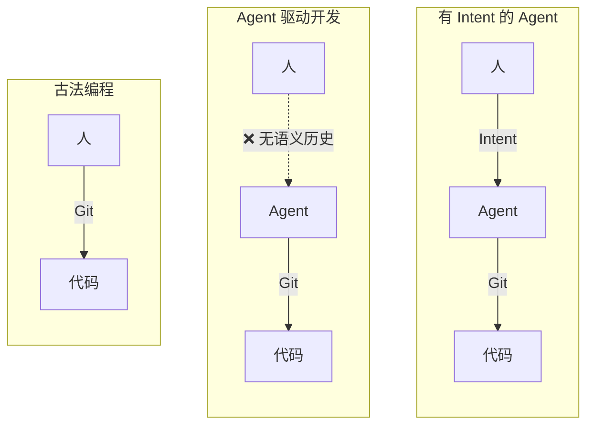
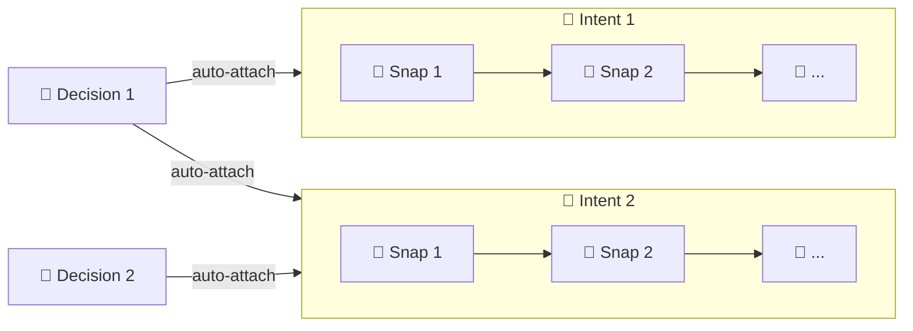

# Intent

中文 | [English](README.md)

Git 之上的开发语义历史层。它记录**目标**、**语义快照**和**决策**。

## 为什么

Git 记录代码怎么变的。但它不记录**你为什么走这条路**、途中做了什么决策、上次停在哪里。

Intent 补上这层缺失的 **语义历史** — 一组既能保留产品形成历史、又能穿越上下文丢失的正式对象。

> 开发正在从"写代码"转向"引导 agent、沉淀决策"。历史层应该反映这一点。


```mermaid
flowchart LR
  subgraph traditional["古法编程"]
    direction TB
    H1["人"]
    C1["代码"]
    H1 -->|"Git"| C1
  end
  subgraph agent["Agent 驱动开发"]
    direction TB
    H2["人"]
    AG["Agent"]
    C2["代码"]
    H2 -."❌ 无语义历史".-> AG
    AG -->|"Git"| C2
  end
  subgraph withintent["有 Intent 的 Agent"]
    direction TB
    H3["人"]
    AG2["Agent"]
    C3["代码"]
    H3 -->|"Intent"| AG2
    AG2 -->|"Git"| C3
  end
  traditional ~~~ agent ~~~ withintent
```

## 三个对象，一张图

| 对象 | 记录什么 |
|---|---|
| 🎯 **Intent** | 从交互中总结出的目标 |
| 📸 **Snap** | 语义快照 — 做了什么、为什么 |
| 🔶 **Decision** | 跨多个 intent 持续生效的长期约束 |

对象自动关联。关系始终双向且只增不减。


```mermaid
flowchart LR
  D1["🔶 Decision 1"]
  D2["🔶 Decision 2"]

  subgraph Intent1["🎯 Intent 1"]
    direction LR
    S1["📸 Snap 1"] --> S2["📸 Snap 2"] --> S3["📸 ..."]
  end

  subgraph Intent2["🎯 Intent 2"]
    direction LR
    S4["📸 Snap 1"] --> S5["📸 Snap 2"] --> S6["📸 ..."]
  end

  D1 -- auto-attach --> Intent1
  D1 -- auto-attach --> Intent2
  D2 -- auto-attach --> Intent2
```

## 记录与接续

早期版本采用 **Snap–Query** 模式——agent 在每次交互后自动捕获一条快照。在自用中，这会产生过多低价值记录，并打断自然的工作流。因此 Intent 把语义变化——而不是 query、文件、命令、commit 或工具调用——作为记录边界。

持续本地维护是常规模式：新项目 `itt init` 默认开启；已有历史只需一次 `itt maintenance on`。`itt maintenance off` 只关闭当前项目，安装 Skill 不会开启其他或旧版项目。

Agent 每轮开头读一次，过程中保存已验证的重要里程碑，回复前以 `recorded`、`no-op` 或 `failed` 收尾。独立目标分别记录为 Intent；没有接续关键变化时静默 no-op，不新增凑数 Snap，也不重复询问授权。

项目级 Codex 开头/Stop hooks 与持久回执已实现正常路径的闭环检查。需在 Codex `/hooks` 审核并信任定义；已配置不代表宿主实际执行。最多补一次收尾，仍失败则报告并释放主任务，不能保证语义质量、崩溃/取消恢复或不支持 hooks 的宿主。详见 [hooks 接入与边界](references/codex-hooks.md)。自动维护不授权登录、推送/拉取、公开发布或跨项目写入。

只要未结束目标确实发生了记录，它的最新 Snap 就应保持为自包含检查点：已验证状态、当前边界、下一步，以及 blocker 或局部约束。零写入是正确结果，每轮也没有对象数量配额。Decision 候选应在必要时一次批量确认，不能每轮打断用户。

需要接续时，明确要求 agent “通过 Intent 恢复项目”。Agent 先运行 `itt inspect`；如果最新检查点不足且 `has_more` 为 true，再用 `itt inspect --intent ID --history 3` 受限读取最近历史。仅查看或解释恢复状态时保持只读。

## 如何判断它有用

Intent 围绕两个产品目标设计，它们不是已被证明的对比结论：

| 目标 | 仍需在真实使用中验证的标准 |
|---|---|
| 低打扰记录 | 记录占用较少时间和上下文，不打断正常开发，并避免退化为命令日志。 |
| 有用的接续 | 后续 session 或另一个 agent 能以更少的重复解释，恢复目标及其原因、最新的有意义里程碑和当前有效的长期决策。 |

历史自用只能说明早期流程曾端到端运行，不能证明当前接续契约已经成立。当前版本应通过自然发生的接续案例验证，并明确区分 Intent 直接提供的信息、后来从代码重新发现的信息，以及用户重新解释的信息。见[自用验证协议](docs/CN/dogfooding.md)。

## 快速开始

```bash
# macOS / Linux
curl -fsSL https://raw.githubusercontent.com/dozybot001/Intent/main/scripts/install.sh | bash

# Windows (PowerShell)
irm https://raw.githubusercontent.com/dozybot001/Intent/main/scripts/install.ps1 | iex

# 克隆仓库 & 添加 agent skill
git clone https://github.com/dozybot001/Intent.git
npx skills add dozybot001/Intent -g --all
```

需要 Python 3.9+。源码安装与安全 credential helper 使用 Git，本地语义历史不依赖 Git。安装脚本会自动处理 pipx。
需要升级或修复已有的 `itt` 安装时，直接重新运行安装脚本即可。

在需要记录的项目目录初始化 Intent（Git 可选）：

```bash
cd your-project
itt init
# 已有历史：只需启用一次
itt maintenance on
# 项目级控制
itt maintenance status
itt maintenance off
```

`itt init` 也会开启持续维护并生成项目级 hooks。依赖 Stop 检查前先在 Codex `/hooks` 审核；日常工作无需额外用户仪式。

`itt init` 会创建 `.intent/`，并将它加入当前克隆的 Git 本地 `.git/info/exclude`；它**不会**修改团队共享的 `.gitignore`。本地忽略规则写入失败时，命令会返回 warning。有意共享前应先审查其中内容；如果整个团队都应继承该规则，再单独将 `.intent/` 加入 `.gitignore`。

先为 IntHub 全局登录一次，然后按项目同步一份共享语义历史：

```bash
itt auth login
cd your-project
itt status
itt push
```

Git 可选。默认项目名取语义根目录名；不同目录需要共享历史时，用 `itt remote add origin https://inthub.tenon.asia --project NAME` 选择相同项目。Intent remote 独立于代码仓库的 GitHub/Gitee origin。凭据由全局安全 credential helper 保存，token 不进入 `.intent/`。Push 必要时创建项目，按父版本与快照校验值保存同步版本；内容未变化不新增版本。`itt status` 返回 `empty / up_to_date / ahead / behind / diverged`，`--local` 可离线使用，无需暂存区、手动 commit、分支、force 或自动 merge。

将同一账户私有项目恢复到另一本地目录：

```bash
cd another-checkout
itt init
itt remote add origin https://inthub.tenon.asia --project your-project
itt pull
# 可选：只预览，不应用变化
itt pull --dry-run
itt status
```

Pull 校验并恢复完整共享快照；本地未变化可快进，本地有变化而远端未变化时保持本地不变，双方变化则报告分歧且不覆盖任一方。重复同步是 no-op；已不再按 workspace 或 Git provider 分支分割历史。目标项目的维护开关与回执是本地元数据，不随 IntHub 快照同步。

Pull 要求所连接的 IntHub 服务版本提供账户私有 snapshot 接口。隔离环境或测试环境中的检查通过，并不等同于真实账户历史已经完成恢复验收。

想在浏览器中查看语义历史，启动 **IntHub Local**（任意目录可用）：

```bash
itt hub start
```

然后在你的项目仓库里：

```bash
itt remote add origin http://127.0.0.1:7210 --project your-project
itt push
```

IntHub Local 默认只绑定 `127.0.0.1`。当前本地 API 不强制校验 Bearer Token，并返回宽松的 CORS 响应头；因此只应在可信本机使用，不要将它绑定到对外网卡，也不要通过公网接口或反向代理暴露。

公网部署使用统一账户路径：Tenon 统一登录、数据库 Web 会话、账户级 CLI access token、账户隔离的项目、PostgreSQL、回环应用端口和 Caddy TLS。参见 [IntHub 生产部署](docs/CN/inthub-production.md)。

> **Tips：** 持续维护按项目开启，日常静默执行。“用 Intent 把这轮工作写入 `.intent/`”仍可用于一次性记录；“通过 Intent 恢复这个项目”先只读。IntHub 推送/拉取始终需要独立明确请求。可信 Stop hook 检查的是收尾，不是语义完整性。

## 文档

- [愿景](docs/CN/vision.md) — 为什么需要语义历史
- [接续案例](docs/CN/continuation-case.md) — 一个可复现的中断到恢复流程
- [自用验证协议](docs/CN/dogfooding.md) — 对自然接续进行信息来源标注验证
- [CLI 设计文档](docs/CN/cli.md) — 对象模型、命令、JSON 契约
- [IntHub 生产部署](docs/CN/inthub-production.md) — PostgreSQL、认证、TLS、备份与回滚

## 社区

- [贡献指南](.github/CONTRIBUTING.md)
- [行为准则](.github/CODE_OF_CONDUCT.md)
- [安全策略](.github/SECURITY.md)

## 许可证

MIT
