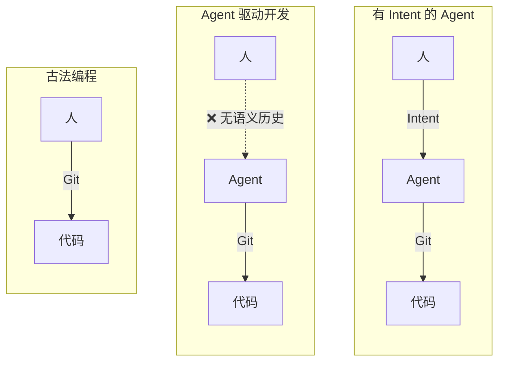
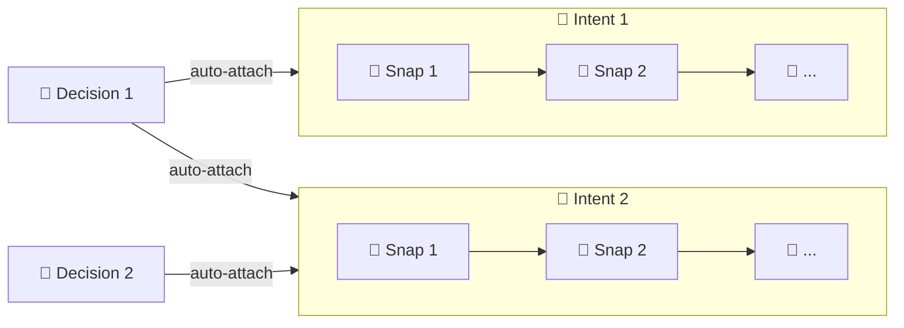

# Intent

中文 | [English](README.md)

Git 之上的开发语义历史层。它记录**目标**、**语义快照**和**决策**。

## 为什么

Git 记录代码怎么变的。但它不记录**你为什么走这条路**、途中做了什么决策、上次停在哪里。

Intent 补上这层缺失的 **语义历史** — 一组既能保留产品形成历史、又能穿越上下文丢失的正式对象。

> 开发正在从"写代码"转向"引导 agent、沉淀决策"。历史层应该反映这一点。


```mermaid
flowchart LR
  subgraph traditional["古法编程"]
    direction TB
    H1["人"]
    C1["代码"]
    H1 -->|"Git"| C1
  end
  subgraph agent["Agent 驱动开发"]
    direction TB
    H2["人"]
    AG["Agent"]
    C2["代码"]
    H2 -."❌ 无语义历史".-> AG
    AG -->|"Git"| C2
  end
  subgraph withintent["有 Intent 的 Agent"]
    direction TB
    H3["人"]
    AG2["Agent"]
    C3["代码"]
    H3 -->|"Intent"| AG2
    AG2 -->|"Git"| C3
  end
  traditional ~~~ agent ~~~ withintent
```

## 三个对象，一张图

| 对象 | 记录什么 |
|---|---|
| 🎯 **Intent** | 从交互中总结出的目标 |
| 📸 **Snap** | 语义快照 — 做了什么、为什么 |
| 🔶 **Decision** | 跨多个 intent 持续生效的长期约束 |

对象自动关联。关系始终双向且只增不减。


```mermaid
flowchart LR
  D1["🔶 Decision 1"]
  D2["🔶 Decision 2"]

  subgraph Intent1["🎯 Intent 1"]
    direction LR
    S1["📸 Snap 1"] --> S2["📸 Snap 2"] --> S3["📸 ..."]
  end

  subgraph Intent2["🎯 Intent 2"]
    direction LR
    S4["📸 Snap 1"] --> S5["📸 Snap 2"] --> S6["📸 ..."]
  end

  D1 -- auto-attach --> Intent1
  D1 -- auto-attach --> Intent2
  D2 -- auto-attach --> Intent2
```

## 记录与接续

早期版本采用 **Snap–Query** 模式——agent 在每次交互后自动捕获一条快照。在自用中，这会产生过多低价值记录，并打断自然的工作流。因此 Intent 把语义变化——而不是 query、文件、命令、commit 或工具调用——作为记录边界。

默认情况下，记录仍由用户明确发起：你要求 agent 用 Intent 记录或更新指定仓库，agent 先检查现有状态，复用语义相同的 active 或 suspended Intent，只写入已验证的高信号变化。独立目标保持为不同 Intent；共享同一结果和生命周期的实现细节则保持在同一边界内。

**显式启用的自动维护：**当用户一次性明确为指定仓库或任务启用本地自动维护后，agent 应在每轮开头运行 `itt inspect`，在工作过程中记录已验证的重要里程碑，并在结束时将本轮收口为 `recorded`、`no-op` 或 `failed`。每轮闭环是责任边界，不等于每轮必须新建 Snap；没有对接续有意义的语义变化时，正常结果就是 `no-op`。

这是用户明确授权后的 Agent 执行契约，不代表平台已经强制自动化。当前 CLI 不存在自动启用或 turn receipt 命令，Codex hooks 接入也尚未实现或启用。未被明确启用的仓库仍需要当次直接的记录请求，才能修改 `.intent/`。自动维护不得在启用时未另行授权的情况下初始化仓库，不得登录、拉取或同步 IntHub，不得臆造 Decision，也不得在 query 结束时自动 suspend 或 done Intent。

只要未结束目标确实发生了记录，它的最新 Snap 就应保持为自包含检查点：已验证状态、当前边界、下一步，以及 blocker 或局部约束。零写入是正确结果，每轮也没有对象数量配额。Decision 候选应在必要时一次批量确认，不能每轮打断用户。

需要接续时，明确要求 agent “通过 Intent 恢复项目”。Agent 先运行 `itt inspect`；如果最新检查点不足且 `has_more` 为 true，再用 `itt inspect --intent ID --history 3` 受限读取最近历史。仅查看或解释恢复状态时保持只读。

## 如何判断它有用

Intent 围绕两个产品目标设计，它们不是已被证明的对比结论：

| 目标 | 仍需在真实使用中验证的标准 |
|---|---|
| 低打扰记录 | 记录占用较少时间和上下文，不打断正常开发，并避免退化为命令日志。 |
| 有用的接续 | 后续 session 或另一个 agent 能以更少的重复解释，恢复目标及其原因、最新的有意义里程碑和当前有效的长期决策。 |

历史自用只能说明早期流程曾端到端运行，不能证明当前接续契约已经成立。当前版本应通过自然发生的接续案例验证，并明确区分 Intent 直接提供的信息、后来从代码重新发现的信息，以及用户重新解释的信息。见[自用验证协议](docs/CN/dogfooding.md)。

## 快速开始

```bash
# macOS / Linux
curl -fsSL https://raw.githubusercontent.com/dozybot001/Intent/main/scripts/install.sh | bash

# Windows (PowerShell)
irm https://raw.githubusercontent.com/dozybot001/Intent/main/scripts/install.ps1 | iex

# 克隆仓库 & 添加 agent skill
git clone https://github.com/dozybot001/Intent.git
npx skills add dozybot001/Intent -g --all
```

需要 Python 3.9+ 和 Git。安装脚本会自动处理 pipx。
需要升级或修复已有的 `itt` 安装时，直接重新运行安装脚本即可。

在需要记录的 Git 仓库中初始化 Intent：

```bash
cd your-project
itt init
```

`itt init` 会创建 `.intent/`，并将它加入当前克隆的 Git 本地 `.git/info/exclude`；它**不会**修改团队共享的 `.gitignore`。本地忽略规则写入失败时，命令会返回 warning。有意共享前应先审查其中内容；如果整个团队都应继承该规则，再单独将 `.intent/` 加入 `.gitignore`。

先为官方 IntHub 服务全局登录一次，再分别绑定和推送每个仓库：

```bash
itt auth login
cd your-project
itt hub status
itt hub link
itt push
```

`itt auth login` 默认使用 `https://inthub.tenon.asia`。非敏感服务地址保存在用户级配置中，账户 token 则交给 Git 已配置的 credential helper，例如 macOS Keychain、Git Credential Manager 或 libsecret。同一账户凭据可跨仓库复用；每个仓库仍在自己的 `.intent/hub.json` 中保存非敏感的 `project_id`、`workspace_id` 和 `repo_binding`。`itt hub status` 可以在不调用 IntHub API 的情况下报告这些本地状态，包括 `pull_source` 来源记录和 `last_pulled_at`。GitHub 和 Gitee origin 都受支持，Tenon OIDC 用于识别 IntHub 账户。CLI 不需要改写 `origin`；如果当前 origin 与保存的绑定不一致，`itt push` 会拒绝执行。`--token` 与 `INTHUB_TOKEN` 继续作为单次命令或环境覆盖，绝不会写入仓库配置。`itt hub sync` 保留为 `itt push` 的兼容别名。

要把一个账户私有 IntHub workspace 完整恢复到另一份 checkout，先初始化本地存储，并复用 `itt auth login` 已保存的 Tenon 账户凭据：

```bash
cd another-checkout
itt init
itt pull

# 可选：仅预览，不应用变化
itt pull --dry-run

# 没有已保存或已绑定来源时，显式选择一个来源
itt pull --workspace wks_...
```

`itt pull [--api-base-url URL] [--token TOKEN] [--workspace ID] [--dry-run]` 每次只恢复一个来源 workspace 的完整快照。运行时服务地址依次取自显式 `--api-base-url`、仓库级绑定、用户级配置和官方地址。来源 workspace 则依次取自显式 `--workspace`、已保存的 `pull_source` 来源记录和已绑定目的 checkout 自己的 workspace；只有这些都不适用时，服务才会自动选择唯一已同步来源，若仍有多个候选则要求显式选择。Pull 会保留目的 checkout 的身份：新 checkout 不会自动绑定，之后第一次 `itt push` 前仍需运行 `itt hub link`，为自己创建新的 workspace，而不是复用来源 ID。更新只允许受限快进；本地 Intent 已变化而来源未变化时保持零写入，本地与远端历史分歧时直接拒绝，不提供 force 或 merge 模式。

Pull 要求所连接的 IntHub 服务版本提供账户私有 snapshot 接口。隔离环境或测试环境中的检查通过，并不等同于真实账户历史已经完成恢复验收。

想在浏览器中查看语义历史，启动 **IntHub Local**（任意目录可用）：

```bash
itt hub start
```

然后在你的项目仓库里：

```bash
itt hub link --api-base-url http://127.0.0.1:7210
itt push
```

IntHub Local 默认只绑定 `127.0.0.1`。当前本地 API 不强制校验 Bearer Token，并返回宽松的 CORS 响应头；因此只应在可信本机使用，不要将它绑定到对外网卡，也不要通过公网接口或反向代理暴露。

公网部署使用统一账户路径：Tenon 统一登录、数据库 Web 会话、账户级 CLI access token、账户隔离的项目、PostgreSQL、回环应用端口和 Caddy TLS。参见 [IntHub 生产部署](docs/CN/inthub-production.md)。

> **Tips：** 请明确表达：“用 Intent 把这轮工作写入 `.intent/`”授权一次记录；“为这个仓库自动维护 Intent”启用上述 Agent 执行契约；“通过 Intent 恢复这个项目”进入本地接续模式。`itt pull` 是另一次明确的网络恢复请求，自动维护不会隐含授权它。自动维护不是 `itt` 命令，当前也没有 Codex hook 强制执行。

## 文档

- [愿景](docs/CN/vision.md) — 为什么需要语义历史
- [接续案例](docs/CN/continuation-case.md) — 一个可复现的中断到恢复流程
- [自用验证协议](docs/CN/dogfooding.md) — 对自然接续进行信息来源标注验证
- [CLI 设计文档](docs/CN/cli.md) — 对象模型、命令、JSON 契约
- [IntHub 生产部署](docs/CN/inthub-production.md) — PostgreSQL、认证、TLS、备份与回滚

## 社区

- [贡献指南](.github/CONTRIBUTING.md)
- [行为准则](.github/CODE_OF_CONDUCT.md)
- [安全策略](.github/SECURITY.md)

## 许可证

MIT
