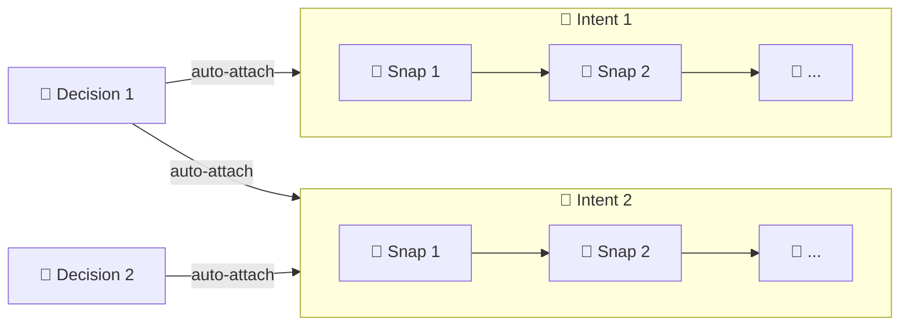
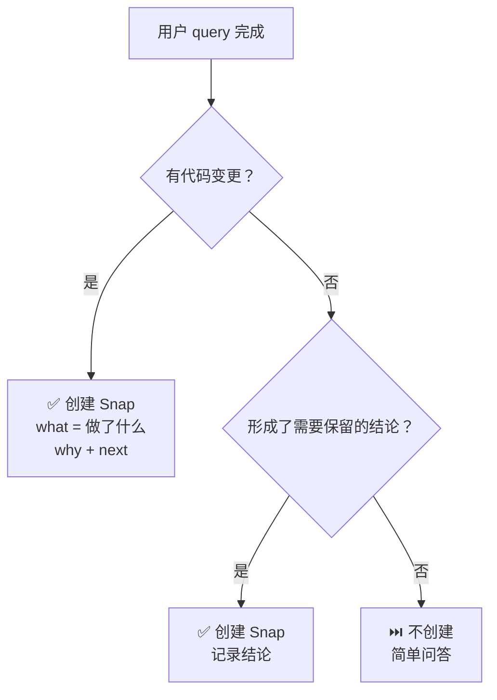
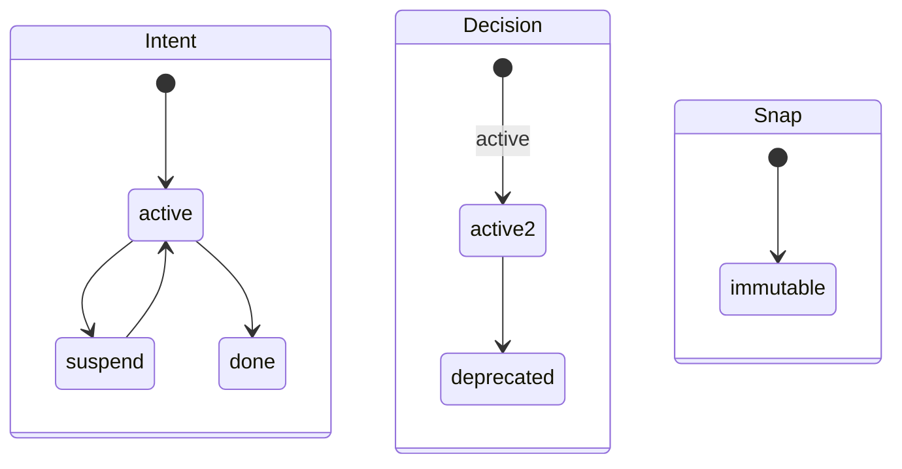

# Intent CLI

中文 | [English](../EN/cli.md)

Intent CLI 是 Intent 的本地 semantic-history CLI。它只管理三类对象：

- `intent`：可恢复的目标
- `snap`：语义快照 — 按 query 持久化 AI 的思考
- `decision`：跨 intent 持续生效的长期约束

命令面刻意保持很小：

- 恢复：`itt inspect`
- 诊断：`itt doctor`
- 浏览：IntHub

## 命令

| 命令 | 作用 | 说明 |
|---|---|---|
| `itt version` | 输出 CLI 版本 | |
| `itt init` | 在当前 Git 仓库初始化 `.intent/` | |
| `itt inspect` | resume-first 恢复视图 | 每个 session 必须先跑。返回 `active_intents`、`active_decisions`、`suspended`、`warnings`。 |
| `itt doctor` | 校验对象图 | `inspect` 有 warning 时使用。返回 `healthy`、`issues`。 |
| `itt intent create WHAT --query Q [--why W]` | 创建 intent | 自动挂载所有 active decision。`origin` 自动填充。 |
| `itt intent activate [ID]` | `suspend` → `active` | 补挂 active decision。唯一候选时自动推断 ID。 |
| `itt intent suspend [ID]` | `active` → `suspend` | 唯一候选时自动推断 ID。 |
| `itt intent done [ID]` | `active` → `done`（终态） | 唯一候选时自动推断 ID。 |
| `itt snap create WHAT [--query Q] [--why W] [--next N]` | 创建语义快照 | 自动挂载到 active intent。多个时 CLI 返回候选列表，需指定 `--intent ID`。 |
| `itt decision create WHAT [--query Q] --why W` | 创建长期约束 | 自动挂载所有 active intent。`origin` 自动填充。 |
| `itt decision deprecate ID [--reason TEXT]` | `active` → `deprecated`（终态） | 保留历史，停止未来自动挂载。 |
| `itt hub link [--api-base-url URL] [--project-name NAME]` | 绑定工作区到 IntHub | 写入 `.intent/hub.json`。需要 GitHub remote。 |
| `itt hub sync [--dry-run]` | 推送快照到 IntHub | 完整快照，非增量。附带 Git 上下文。 |

## 对象模型



### Snap：字段分工


### 什么时候创建 snap



### 状态机



## 对象 Schema

| 字段 | Intent | Snap | Decision | 说明 |
| --- | :---: | :---: | :---: | --- |
| `id` | ✓ | ✓ | ✓ | 自增零填充（`intent-001`、`snap-001`、`decision-001`） |
| `object` | ✓ | ✓ | ✓ | `"intent"`、`"snap"` 或 `"decision"` |
| `created_at` | ✓ | ✓ | ✓ | ISO 8601 UTC 时间戳 |
| `what` | ✓ | ✓ | ✓ | Intent/Decision: 简短主题。Snap: 做了什么（简洁行为描述）。 |
| `query` | ✓ | ✓ | ✓ | 触发该对象的用户 query |
| `origin` | ✓ | ✓ | ✓ | 从环境自动检测（如 `claude-code`、`cursor`、`codex-desktop`） |
| `why` | ✓ | ✓ | ✓ | Intent: 为什么要做。Snap: 为什么这么做。Decision: 为什么有这个约束。 |
| `status` | ✓ | | ✓ | Intent: `active` / `suspend` / `done`。Decision: `active` / `deprecated`。 |
| `next` | | ✓ | | 下一步 — 剩余工作、方向、阻塞项 |
| `intent_id` | | ✓ | | 所属 intent |
| `snap_ids` | ✓ | | | 有序子 snap 列表 |
| `decision_ids` | ✓ | | | 关联 decision（创建时自动挂载） |
| `intent_ids` | | | ✓ | 关联 intent（创建时自动挂载） |
| `reason` | | | ✓ | 废弃原因（通过 `--reason` 设置） |

所有字段**创建后不可变**。

### Origin 检测

`origin` 从进程环境自动推断：

| 环境信号 | Origin 标签 |
|---|---|
| `ITT_ORIGIN` / `INTENT_ORIGIN` | *（自定义标签）* |
| `CURSOR_TRACE_ID` | `cursor` |
| `CODEX_INTERNAL_ORIGINATOR_OVERRIDE="Codex Desktop"` | `codex-desktop` |
| `CODEX_THREAD_ID` / `CODEX_SHELL` / `CODEX_CI` | `codex` |
| `TERM_PROGRAM=vscode` | `vscode` |
| Codespaces / GitHub Actions / Gitpod 环境变量 | `codespaces` / `github-actions` / `gitpod` |

优先级：显式 `--origin LABEL` > `ITT_ORIGIN` / `INTENT_ORIGIN` > 内置启发式。

## JSON 输出

### 标准成功包

除 `inspect` 外，成功响应统一为：

```json
{
  "ok": true,
  "action": "<command-name>",
  "result": {},
  "warnings": []
}
```

### `inspect`

`inspect` 返回：

```json
{
  "ok": true,
  "active_intents": [],
  "active_decisions": [],
  "suspended": [],
  "warnings": []
}
```

### `doctor`

`doctor` 返回：

```json
{
  "ok": true,
  "action": "doctor",
  "result": {
    "healthy": true,
    "issues": []
  },
  "warnings": []
}
```

### 错误包

```json
{
  "ok": false,
  "error": {
    "code": "ERROR_CODE",
    "message": "Human-readable explanation.",
    "details": {},
    "suggested_fix": "itt ..."
  }
}
```

## Error Code

| Code | 含义 |
| --- | --- |
| `NOT_INITIALIZED` | `.intent/` 不存在 |
| `ALREADY_EXISTS` | 运行 `init` 时 `.intent/` 已存在 |
| `GIT_STATE_INVALID` | 当前不在 Git worktree 中 |
| `STATE_CONFLICT` | 状态流转非法 |
| `OBJECT_NOT_FOUND` | 找不到对应对象 ID |
| `INVALID_INPUT` | 参数非法或缺少必填输入 |
| `NO_ACTIVE_INTENT` | `snap create`、`intent suspend` 或 `intent done` 在省略目标时，没有 `active` intent |
| `MULTIPLE_ACTIVE_INTENTS` | `snap create`、`intent suspend` 或 `intent done` 在省略目标时，存在多个 `active` intent |
| `NO_SUSPENDED_INTENT` | `intent activate` 在省略目标时，没有 `suspend` intent |
| `MULTIPLE_SUSPENDED_INTENTS` | `intent activate` 在省略目标时，存在多个 `suspend` intent |
| `HUB_NOT_CONFIGURED` | 缺少 IntHub API base URL |
| `NOT_LINKED` | 当前工作区还没绑定到 IntHub |
| `PROVIDER_UNSUPPORTED` | 当前 Git remote 不受支持 |
| `NETWORK_ERROR` | 无法连接 IntHub |
| `SERVER_ERROR` | IntHub 返回错误或非法 JSON |

## 运行约束

- `.intent/` 是本地工作区元数据，不应进入 Git 历史
- 所有对象创建后不可变
- ID 按对象类型单调递增并零填充，例如 `intent-001`、`snap-001`、`decision-001`
