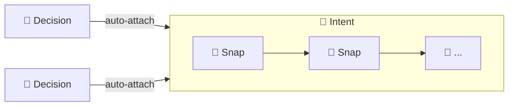
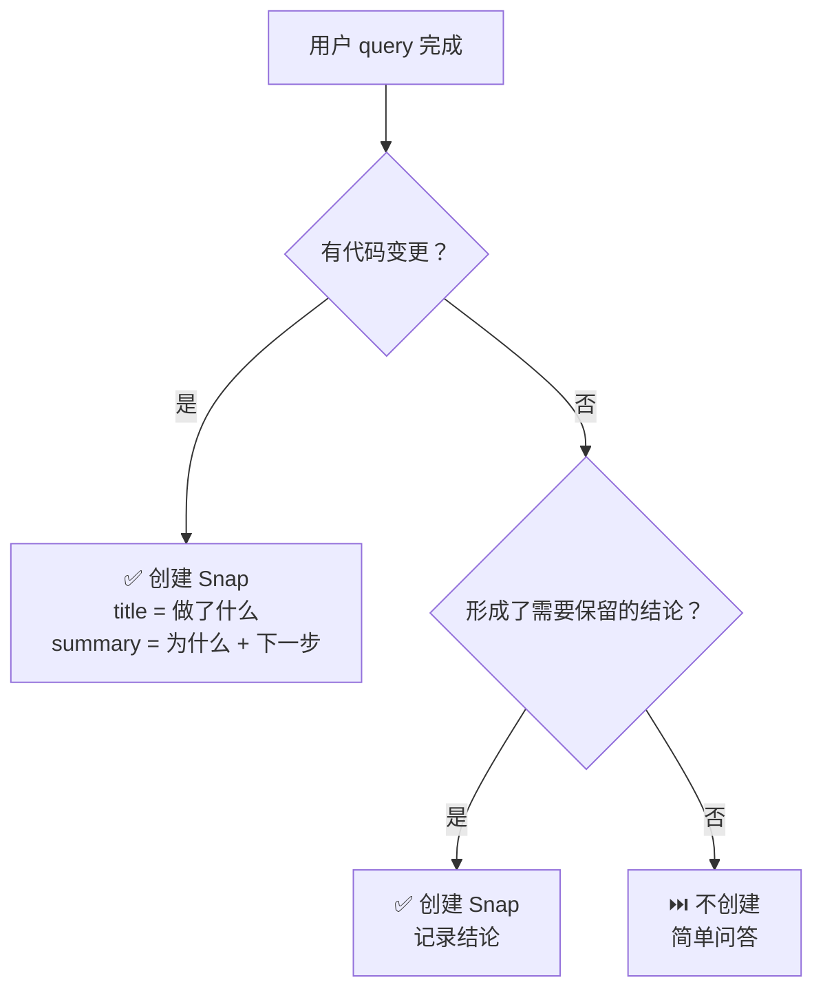
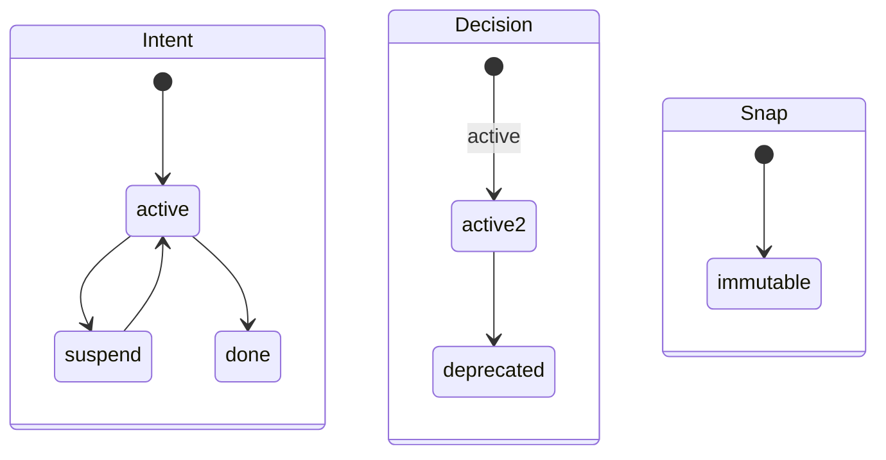

# Intent CLI

中文 | [English](../EN/cli.md)

Schema version: **1.0**

Intent CLI 是 Intent 的本地 semantic-history CLI。它只管理三类对象：

- `intent`：可恢复的目标
- `snap`：语义快照 — 按 query 持久化 AI 的思考
- `decision`：跨 intent 持续生效的长期约束

命令面刻意保持很小：

- 恢复工作用 `itt inspect`
- 诊断结构问题用 `itt doctor`
- 图谱浏览交给 IntHub
- 不再提供 `list` 命令

## 命令总览

### 全局

| 命令 | 作用 |
| --- | --- |
| `itt version` | 输出 CLI 版本 |
| `itt init` | 在当前 Git 仓库初始化 `.intent/` |
| `itt inspect` | resume-first 恢复视图 |
| `itt doctor` | 结构诊断视图 |

### Intent

| 命令 | 作用 |
| --- | --- |
| `itt intent create TITLE --query Q [--rationale R] [--origin LABEL]` | 创建一个新的 intent |
| `itt intent activate [ID]` | `suspend` → `active` |
| `itt intent suspend [ID]` | `active` → `suspend` |
| `itt intent done [ID]` | `active` → `done` |

### Snap

| 命令 | 作用 |
| --- | --- |
| `itt snap create TITLE [--intent ID] [--query Q] [--origin LABEL] --summary S` | 创建语义快照（`title` = 做了什么；`summary` = 为什么 + 下一步；`query` = 触发的用户 query） |

### Decision

| 命令 | 作用 |
| --- | --- |
| `itt decision create TITLE --rationale R [--query Q] [--origin LABEL]` | 创建一个新的 decision |
| `itt decision deprecate ID [--reason TEXT]` | `active` → `deprecated` |
### Hub

| 命令 | 作用 |
| --- | --- |
| `itt hub link [--project-name NAME] [--api-base-url URL] [--token TOKEN]` | 必要时先配置本地 IntHub 访问，再绑定当前工作区 |
| `itt hub sync [--api-base-url URL] [--token TOKEN] [--dry-run]` | 把本地语义快照推送到 IntHub |

## 全局命令

### `itt version`

输出当前 CLI 版本。

```bash
itt version
```

### `itt init`

在当前 Git 仓库中初始化 `.intent/`。

```bash
itt init
```

### `itt inspect`

resume-first 恢复视图。

- 在 session 开始时使用，用来继续干活
- 默认输出：`active_intents`、`active_decisions`、`suspended`、`warnings`
- 不负责完整对象浏览

```bash
itt inspect
```

### `itt doctor`

结构诊断视图。

- 当 `inspect` 出现 warning，或你怀疑对象图不一致时使用
- 默认输出：`healthy`、`issues`
- 校验断链引用、非法状态和单向关系

```bash
itt doctor
```

## 对象模型



### Snap：字段分工


### 什么时候创建 snap



### 状态机



## 对象 Schema

| 字段 | Intent | Snap | Decision | 说明 |
| --- | :---: | :---: | :---: | --- |
| `id` | ✓ | ✓ | ✓ | 自增零填充（`intent-001`、`snap-001`、`decision-001`） |
| `object` | ✓ | ✓ | ✓ | `"intent"`、`"snap"` 或 `"decision"` |
| `created_at` | ✓ | ✓ | ✓ | ISO 8601 UTC 时间戳 |
| `title` | ✓ | ✓ | ✓ | Intent/Decision: 简短主题。Snap: 做了什么（简洁行为描述）。 |
| `status` | ✓ | | ✓ | Intent: `active` / `suspend` / `done`。Decision: `active` / `deprecated`。Snap 无状态。 |
| `query` | ✓ | ✓ | ✓ | 触发该对象的用户 query |
| `rationale` | ✓ | | ✓ | 为什么这个目标/约束重要 |
| `origin` | ✓ | ✓ | ✓ | 从环境自动检测（如 `claude-code`、`cursor`、`codex-desktop`） |
| `summary` | | ✓ | | 为什么这么做 + 下一步 |
| `intent_id` | | ✓ | | 所属 intent |
| `snap_ids` | ✓ | | | 有序子 snap 列表 |
| `decision_ids` | ✓ | | | 关联 decision（创建时自动挂载） |
| `intent_ids` | | | ✓ | 关联 intent（创建时自动挂载） |
| `deprecated_reason` | | | ✓ | 废弃原因（通过 `--reason` 设置） |

所有字段**创建后不可变**。

### Origin 检测

`origin` 从进程环境自动推断。内置启发式：`CURSOR_TRACE_ID` → `cursor`、`CODEX_INTERNAL_ORIGINATOR_OVERRIDE="Codex Desktop"` → `codex-desktop`、`CODEX_THREAD_ID` / `CODEX_SHELL` / `CODEX_CI` → `codex`、`TERM_PROGRAM=vscode` → `vscode`，以及 Codespaces、GitHub Actions、Gitpod。在 shell 配置中设置 `ITT_ORIGIN` 或 `INTENT_ORIGIN` 可自定义标签。`--origin LABEL` 可单次覆盖。

## 对象命令

### Intent

`create` 识别一个可恢复目标。`activate`、`suspend`、`done` 是状态流转。

```bash
itt intent create "Fix the login timeout bug" \
  --query "why does login timeout after 5s?" \
  --rationale "users on slow networks get logged out mid-session"

itt intent suspend intent-001
itt intent activate intent-001
itt intent done intent-001
```

说明：

- 新建 intent 默认 `active`；创建时自动挂载当前全部 `active` decision
- 重新激活时补挂挂起期间新增的 `active` decision
- `activate`、`suspend`、`done` 在恰好只有一个候选时自动推断 `ID`

### Snap

语义快照，持久化 AI 在每次 query 中的思考。`title` = 做了什么，`summary` = 为什么 + 下一步，`query` = 触发的用户 query。

```bash
itt snap create "超时改为30s并改为异步刷新" \
  --query "为什么登录超时5秒" \
  --summary "refresh flow 中的竞态阻塞了登录流程。改为异步刷新解耦路径。Token refresh 端点仍硬编码 — 不同服务，需要单独处理。"
```

说明：

- `--summary` 必填；`--intent` 在恰好一个 `active` intent 时自动推断
- 创建 snap 会同时写入 `snap.intent_id` 和父 intent 的 `snap_ids`
- Snap 不可变；纠正错误应写新 snap

### Decision

`create` 记录长期约束。`deprecate` 是终态。

```bash
itt decision create "Timeout must stay configurable" \
  --query "user asked about deployment flexibility" \
  --rationale "Different deployments have different latency envelopes"

itt decision deprecate decision-001 --reason "Replaced by decision-005"
```

说明：

- 新建 decision 默认 `active`；创建时自动挂载当前全部 `active` intent
- `deprecate` 保留历史，只停止未来自动挂载

CLI 不提供 `show` 命令 — 恢复用 `itt inspect`，浏览用 IntHub。

## Hub 命令

### `itt hub link`

必要时先配置本地 IntHub 访问，然后绑定当前 GitHub-backed 工作区。

```bash
itt hub link --api-base-url http://127.0.0.1:7210 --project-name "Intent"
itt hub link --api-base-url http://127.0.0.1:7210 --token dev-token --project-name "Intent"
```

说明：

- 要求当前 `origin` remote 是受支持的 GitHub 仓库
- 会写入 `.intent/hub.json`
- 会持久化 `api_base_url`、可选本地 token、`workspace_id`、`project_id`、`repo_binding`

### `itt hub sync`

把当前 `.intent/` 快照和 Git 上下文推送到 IntHub。

```bash
itt hub sync
itt hub sync --dry-run
```

说明：

- 上传的是完整快照，不是增量 patch
- 会附带 `branch`、`head_commit`、`dirty`、`remote_url` 等 Git 上下文
- `--dry-run` 只输出将要发送的 payload，不真正发请求

## JSON 输出

### 标准成功包

除 `inspect` 外，成功响应统一为：

```json
{
  "ok": true,
  "action": "<command-name>",
  "result": {},
  "warnings": []
}
```

### `inspect`

`inspect` 返回：

```json
{
  "ok": true,
  "active_intents": [],
  "active_decisions": [],
  "suspended": [],
  "warnings": []
}
```

### `doctor`

`doctor` 返回：

```json
{
  "ok": true,
  "action": "doctor",
  "result": {
    "healthy": true,
    "issues": []
  },
  "warnings": []
}
```

### 错误包

```json
{
  "ok": false,
  "error": {
    "code": "ERROR_CODE",
    "message": "Human-readable explanation.",
    "details": {},
    "suggested_fix": "itt ..."
  }
}
```

## Error Code

| Code | 含义 |
| --- | --- |
| `NOT_INITIALIZED` | `.intent/` 不存在 |
| `ALREADY_EXISTS` | 运行 `init` 时 `.intent/` 已存在 |
| `GIT_STATE_INVALID` | 当前不在 Git worktree 中 |
| `STATE_CONFLICT` | 状态流转非法 |
| `OBJECT_NOT_FOUND` | 找不到对应对象 ID |
| `INVALID_INPUT` | 参数非法或缺少必填输入 |
| `NO_ACTIVE_INTENT` | `snap create`、`intent suspend` 或 `intent done` 在省略目标时，没有 `active` intent |
| `MULTIPLE_ACTIVE_INTENTS` | `snap create`、`intent suspend` 或 `intent done` 在省略目标时，存在多个 `active` intent |
| `NO_SUSPENDED_INTENT` | `intent activate` 在省略目标时，没有 `suspend` intent |
| `MULTIPLE_SUSPENDED_INTENTS` | `intent activate` 在省略目标时，存在多个 `suspend` intent |
| `HUB_NOT_CONFIGURED` | 缺少 IntHub API base URL |
| `NOT_LINKED` | 当前工作区还没绑定到 IntHub |
| `PROVIDER_UNSUPPORTED` | 当前 Git remote 不受支持 |
| `NETWORK_ERROR` | 无法连接 IntHub |
| `SERVER_ERROR` | IntHub 返回错误或非法 JSON |

## 运行约束

- `.intent/` 是本地工作区元数据，不应进入 Git 历史
- 所有对象创建后不可变
- ID 按对象类型单调递增并零填充，例如 `intent-001`、`snap-001`、`decision-001`
