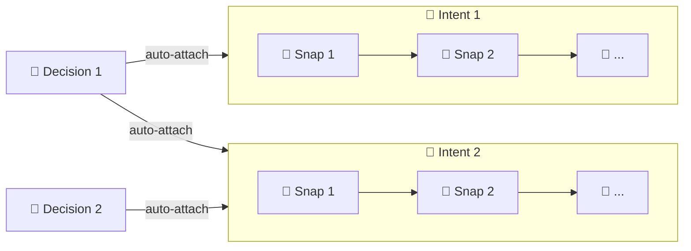
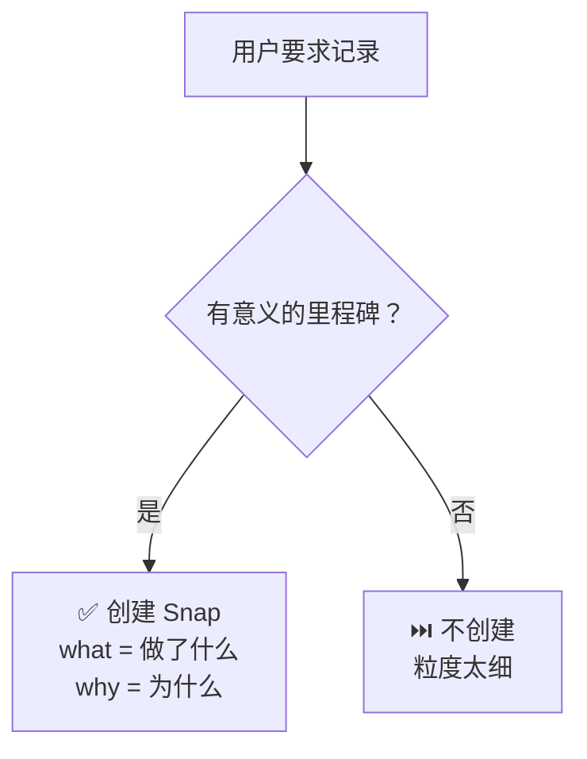
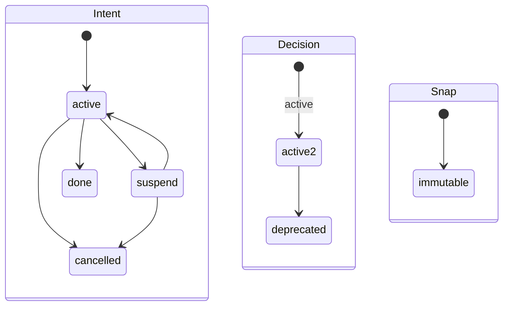

# Intent CLI

中文 | [English](../EN/cli.md)

Intent CLI 是 Intent 的本地 semantic-history CLI。它只管理三类对象：

- `intent`：可恢复的目标
- `snap`：语义快照 — 做了什么、为什么
- `decision`：跨 intent 持续生效的长期约束

命令面刻意保持很小：

- 恢复：`itt inspect`
- 诊断：`itt doctor`
- 浏览：IntHub

## 命令

### Global

| 命令 | 作用 |
|---|---|
| `itt version` | 输出 CLI 版本 |
| `itt init` | 在当前 Git 仓库初始化 `.intent/` |
| `itt inspect [--intent ID] [--history N]` | 恢复视图，返回目标原因、最新 Snap、可选的受限历史、有效 Decision 和完整图诊断 |
| `itt doctor` | 返回同一套完整对象图诊断，并显式给出 `healthy` 结果 |

### Intent

| 命令 | 作用 |
|---|---|
| `itt intent create WHAT [--why W]` | 创建 intent。自动挂载所有 active decision。 |
| `itt intent activate [ID]` | `suspend` → `active`。补挂 active decision。唯一候选时自动推断 ID。 |
| `itt intent suspend [ID]` | `active` → `suspend`。唯一候选时自动推断 ID。 |
| `itt intent done [ID]` | `active` → `done`（终态）。唯一候选时自动推断 ID。 |
| `itt intent cancel [ID] [--reason TEXT]` | `active` / `suspend` → `cancelled`（终态）。只有一个未结束 intent 时自动推断 ID。 |

### Snap

| 命令 | 作用 |
|---|---|
| `itt snap create WHAT [--why W]` | 创建语义快照。自动挂载到 active intent；多个时需指定 `--intent ID`。 |

### Decision

| 命令 | 作用 |
|---|---|
| `itt decision create WHAT [--why W]` | 创建长期约束。自动挂载所有 active intent。 |
| `itt decision deprecate ID [--reason TEXT]` | `active` → `deprecated`（终态）。保留历史，停止未来自动挂载。 |

### Hub

| 命令 | 作用 |
|---|---|
| `itt auth login [--api-base-url URL] [--token TOKEN]` | 校验账户 token、保存全局服务地址，并把 token 交给 Git credential helper。默认连接官方 IntHub。 |
| `itt auth status [--api-base-url URL] [--token TOKEN]` | 检查所选全局账户凭据是否有效，绝不输出 token。 |
| `itt auth logout [--api-base-url URL]` | 删除本机 credential-helper 条目，不撤销服务端 token。 |
| `itt push [--api-base-url URL] [--token TOKEN] [--dry-run]` | 推送当前仓库的完整 Intent 快照，作为主要 Git 风格命令。 |
| `itt hub start [--port PORT] [--no-open]` | 启动 IntHub Local |
| `itt hub status [--api-base-url URL]` | 在不调用 IntHub API 的情况下读取有效服务地址、本地仓库绑定、同步时间、pending link/sync 操作和可复用凭据是否存在。 |
| `itt hub link [--project-name NAME] [--api-base-url URL] [--token TOKEN]` | 将当前仓库绑定到 IntHub。默认使用全局地址和账户凭据，只把非敏感绑定信息写入 `.intent/hub.json`。 |
| `itt hub sync [--api-base-url URL] [--token TOKEN] [--dry-run]` | `itt push` 的兼容别名。 |

鉴权采用类似 Git 的“全局凭据、仓库级 remote”分层。`itt auth login` 把服务地址写入用户级 Intent 配置，并让 Git 已配置的 credential helper 保存账户 token。建议使用 macOS Keychain、Git Credential Manager 或 libsecret 等安全 helper；Git 的 `store` helper 会以明文保存凭据。每个仓库仍需运行一次 `itt hub link`，因为项目和 workspace 绑定属于仓库。GitHub 和 Gitee origin 都受支持；GitHub OAuth 只用于识别 IntHub 账户，不限制仓库 provider。CLI 绝不修改 `origin`，且每次 push 都会校验当前 provider 与仓库 ID 仍和保存的绑定一致。link 与 push 会在网络 I/O 前持久化非敏感 pending 操作 ID；有界重试或之后再次执行时，可以收敛丢失响应，并避免对未变化状态创建第二个操作。CLI 的凭据优先级依次为显式 `--token`、`INTHUB_TOKEN`、按有效 API 地址查找的 credential helper。

## 对象模型


```mermaid
flowchart LR
  D1["🔶 Decision 1"]
  D2["🔶 Decision 2"]

  subgraph Intent1["🎯 Intent 1"]
    direction LR
    S1["📸 Snap 1"] --> S2["📸 Snap 2"] --> S3["📸 ..."]
  end

  subgraph Intent2["🎯 Intent 2"]
    direction LR
    S4["📸 Snap 1"] --> S5["📸 Snap 2"] --> S6["📸 ..."]
  end

  D1 -- auto-attach --> Intent1
  D1 -- auto-attach --> Intent2
  D2 -- auto-attach --> Intent2
```

### Snap：字段分工


```mermaid
flowchart LR
  W["what\n🤖 AI 做了什么"] --> Y["why\n💡 为什么"]
```

### 什么时候创建 snap


```mermaid
flowchart TD
  Q["用户要求记录"] --> C{有意义的里程碑？}
  C -->|是| B["✅ 创建 Snap\nwhat = 做了什么\nwhy = 为什么"]
  C -->|否| A["⏭️ 不创建\n粒度太细"]
```

### 状态机


```mermaid
stateDiagram-v2
  state Intent {
    [*] --> active
    active --> suspend
    suspend --> active
    active --> done
    active --> cancelled
    suspend --> cancelled
  }
  state Decision {
    [*] --> active2: active
    active2 --> deprecated
  }
  state Snap {
    [*] --> immutable
  }
```

## 对象 Schema

| 字段 | Intent | Snap | Decision | 说明 |
| --- | :---: | :---: | :---: | --- |
| `id` | ✓ | ✓ | ✓ | 自增零填充（`intent-001`、`snap-001`、`decision-001`） |
| `object` | ✓ | ✓ | ✓ | `"intent"`、`"snap"` 或 `"decision"` |
| `created_at` | ✓ | ✓ | ✓ | ISO 8601 UTC 时间戳 |
| `what` | ✓ | ✓ | ✓ | Intent/Decision: 简短主题。Snap: 做了什么（简洁行为描述）。 |
| `origin` | ✓ | ✓ | ✓ | 从环境自动检测（如 `claude-code`、`cursor`、`codex-desktop`） |
| `why` | ✓ | ✓ | ✓ | Intent: 为什么要做。Snap: 为什么这么做。Decision: 为什么有这个约束。 |
| `status` | ✓ | | ✓ | Intent: `active` / `suspend` / `done` / `cancelled`。Decision: `active` / `deprecated`。 |
| `intent_id` | | ✓ | | 所属 intent |
| `snap_ids` | ✓ | | | 有序子 snap 列表 |
| `decision_ids` | ✓ | | | 关联 decision（创建时自动挂载） |
| `intent_ids` | | | ✓ | 关联 intent（创建时自动挂载） |
| `reason` | ✓ | | ✓ | intent 取消或 decision 废弃的原因（通过 `--reason` 设置） |

通过 CLI 创建后，`what`、`why`、`origin`、`created_at` 等描述性字段视为写一次。
后续命令可能推进 `status`，补充 `reason`，以及追加自动维护的关系字段（如 `snap_ids`、`decision_ids`、`intent_ids`）。

### Origin 检测

`origin` 从进程环境自动推断：

| 环境信号 | Origin 标签 |
|---|---|
| `ITT_ORIGIN` / `INTENT_ORIGIN` | *（自定义标签）* |
| `CURSOR_TRACE_ID` | `cursor` |
| `CODEX_INTERNAL_ORIGINATOR_OVERRIDE="Codex Desktop"` | `codex-desktop` |
| `CODEX_THREAD_ID` / `CODEX_SHELL` / `CODEX_CI` | `codex` |
| `TERM_PROGRAM=vscode` | `vscode` |
| Codespaces / GitHub Actions / Gitpod 环境变量 | `codespaces` / `github-actions` / `gitpod` |

优先级：显式 `--origin LABEL` > `ITT_ORIGIN` / `INTENT_ORIGIN` > 内置启发式。

## JSON 输出

### 标准成功包

除 `inspect` 外，成功响应统一为：

```json
{
  "ok": true,
  "action": "<command-name>",
  "result": {},
  "warnings": []
}
```

### `inspect`

`inspect` 返回接续已记录工作所需的上下文。`active_intents` 和 `suspended` 会包含目标的 `why`、存在时的完整最新 Snap 对象、`snap_count` 和 `has_more`；`active_decisions` 也会包含每项 Decision 的 `why`。在默认视图中，若 `latest_snap` 之前还有更早的 Snap，`has_more` 为 true。

```json
{
  "ok": true,
  "active_intents": [
    {
      "id": "intent-001",
      "what": "收紧发布流程",
      "why": "部分发布会让工作区处于不一致状态",
      "snap_count": 3,
      "has_more": true,
      "latest_snap": {
        "id": "snap-003",
        "object": "snap",
        "created_at": "2026-07-30T08:00:00+00:00",
        "what": "将产物发布改为原子切换",
        "why": "消费方不应观察到部分发布结果",
        "intent_id": "intent-001",
        "origin": "codex"
      }
    }
  ],
  "active_decisions": [
    {
      "id": "decision-001",
      "what": "先完成构建，再切换当前发布",
      "why": "构建失败时必须保留现行版本"
    }
  ],
  "suspended": [
    {
      "id": "intent-002",
      "what": "替换旧发布器",
      "why": "旧链路难以恢复",
      "snap_count": 0,
      "has_more": false,
      "latest_snap_id": null,
      "latest_snap": null
    }
  ],
  "warnings": []
}
```

使用 `itt inspect --intent intent-001` 可将恢复视图聚焦到一个 active 或 suspended Intent。再加正整数 `--history N` 时，响应会包含 `recent_snaps`，按记录顺序从旧到新返回最多最近 N 个完整 Snap 对象。为保持兼容，`latest_snap` 仍会保留；目标条目的 `has_more` 表示这次受限选择之前是否还有更早的 Snap。`--history` 必须与 `--intent` 同用；done 和 cancelled Intent 的历史仍通过 IntHub 浏览，不进入恢复视图。

```json
{
  "snap_count": 5,
  "has_more": true,
  "latest_snap": { "id": "snap-005" },
  "recent_snaps": [
    { "id": "snap-003" },
    { "id": "snap-004" },
    { "id": "snap-005" }
  ]
}
```

`warnings` 包含对象图校验返回的全部结构化问题，不再只检查孤立 Snap。每项问题都含有 `code`、`object`、`id` 和 `message`；对象图健康时返回空列表。在接续已记录的工作或新增语义记录前运行 `itt inspect`。

### `doctor`

`doctor` 运行与 `inspect.warnings` 相同的校验，并用显式健康标记包装结果。与其他命令的严格读取不同，它会在记录结构化解析、schema 或完整性问题后跳过当前坏对象并继续扫描，因此第一处损坏不会遮住后续问题：

```json
{
  "ok": true,
  "action": "doctor",
  "result": {
    "healthy": true,
    "issues": []
  },
  "warnings": []
}
```

### 错误包

```json
{
  "ok": false,
  "error": {
    "code": "ERROR_CODE",
    "message": "Human-readable explanation.",
    "details": {},
    "suggested_fix": "itt ..."
  }
}
```

## Error Code

| Code | 含义 |
| --- | --- |
| `NOT_INITIALIZED` | `.intent/` 不存在 |
| `ALREADY_EXISTS` | 运行 `init` 时 `.intent/` 已存在 |
| `GIT_STATE_INVALID` | 当前不在 Git worktree 中 |
| `STATE_CONFLICT` | 状态流转非法 |
| `OBJECT_NOT_FOUND` | 找不到对应对象 ID |
| `INVALID_INPUT` | 参数非法或缺少必填输入 |
| `INVALID_OBJECT_ID` | 显式对象 ID 不是与类型匹配的本地 ID，例如 `intent-001` |
| `UNSAFE_STORAGE` | `.intent/`、对象目录、锁或对象文件通过符号链接重定向，或越出存储边界 |
| `STORAGE_PARSE_ERROR` | 存储对象不是合法 UTF-8 JSON；`doctor` 会列出扫描到的全部解析失败 |
| `STORAGE_SCHEMA_ERROR` | 存储对象缺少必需字段，或字段类型不合法 |
| `STORAGE_INTEGRITY_ERROR` | 对象文件名与 JSON `id` 不一致；重试前需人工检查并修复报告的本地文件 |
| `STORAGE_WRITE_CONFLICT` | 创建目标已存在，或更新目标缺失、文件名不规范；不会覆盖已有对象 |
| `STORAGE_SECURITY_ERROR` | 其他存储安全不变量校验失败 |
| `NO_ACTIVE_INTENT` | `snap create`、`intent suspend` 或 `intent done` 在省略目标时，没有 `active` intent |
| `MULTIPLE_ACTIVE_INTENTS` | `snap create`、`intent suspend` 或 `intent done` 在省略目标时，存在多个 `active` intent |
| `NO_SUSPENDED_INTENT` | `intent activate` 在省略目标时，没有 `suspend` intent |
| `MULTIPLE_SUSPENDED_INTENTS` | `intent activate` 在省略目标时，存在多个 `suspend` intent |
| `NO_OPEN_INTENT` | `intent cancel` 省略目标，且没有 `active` 或 `suspend` intent |
| `MULTIPLE_OPEN_INTENTS` | `intent cancel` 省略目标，且存在多个 `active` 或 `suspend` intent |
| `WORKSPACE_BUSY` | 另一个 Intent 命令仍持有工作区写锁；可用时 details 会包含其 PID、操作和开始时间 |
| `GLOBAL_CONFIG_ERROR` | 用户级 IntHub 地址配置不合法或无法写入 |
| `CREDENTIAL_STORE_ERROR` | Git 已配置的 credential helper 无法保存或删除账户 token |
| `HUB_NOT_CONFIGURED` | 缺少 IntHub API base URL |
| `NOT_LINKED` | 当前工作区还没绑定到 IntHub |
| `LINK_PENDING` | 之前的仓库绑定请求必须先通过 `itt hub link` 收敛，才能 push |
| `PENDING_LINK_CONFLICT` | pending link 指向不同的服务地址或仓库 |
| `HUB_STATE_INVALID` | 仓库级 pending Hub 状态格式损坏 |
| `PROVIDER_UNSUPPORTED` | 当前 Git remote 不受支持 |
| `REPO_BINDING_MISMATCH` | 当前 `origin` 指向的 provider 或仓库与已保存的 IntHub 绑定不一致 |
| `NETWORK_ERROR` | 无法连接 IntHub |
| `NETWORK_TIMEOUT` | IntHub 未在有界请求时间内响应；变更是否完成可能未知 |
| `SERVER_ERROR` | IntHub 返回错误或非法 JSON |

## 运行约束

- `itt init` 会将 `.intent/` 加入当前克隆的 `.git/info/exclude`，不修改团队共享的 `.gitignore`；本地忽略规则写入失败时会返回 warning
- 账户鉴权是全局的：默认服务地址属于用户级配置，token 交给 Git credential helper，仓库级 `hub.json` 只保存非敏感的 project/workspace 绑定信息
- 仓库绑定支持精确的 `github.com` 与 `gitee.com` origin；不要为 IntHub 临时改写 `origin`，应使用 `itt hub status` 而不是直接读取 `hub.json`
- 显式 `--token` 和 `INTHUB_TOKEN` 会覆盖已保存凭据，且绝不会持久化到 `hub.json`
- IntHub Local 默认绑定 `127.0.0.1`，但当前 API 不强制校验 Bearer Token，且使用宽松 CORS；不要将它暴露到局域网或公网
- IntHub 生产配置使用 GitHub 登录或注册和有时限的只读 HttpOnly Web 会话；CLI 写入使用当前账户签发的 access token（HTTP `Bearer`），项目读取和写入均按账户隔离，生产数据库使用 PostgreSQL，详见 [IntHub 生产部署](inthub-production.md)
- 对象和 Hub 配置通过原子替换写入，变更命令使用带有界 owner 诊断的工作区级跨进程写锁；这会串行化 Intent CLI 写入，但不会把 `.intent/` 变成多用户数据库
- IntHub 请求每次尝试最多等待 15 秒、最多尝试两次；随附 argv 适配器具有 60 秒进程安全超时，并始终输出一个 JSON 文档
- 对象 ID 在路径 I/O 前校验，对象路径必须留在对应类型目录内，`.intent/` 对象存储拒绝符号链接重定向
- 描述性字段写一次；状态与自动维护的关系字段会随着后续命令推进
- ID 按对象类型单调递增并零填充，例如 `intent-001`、`snap-001`、`decision-001`
