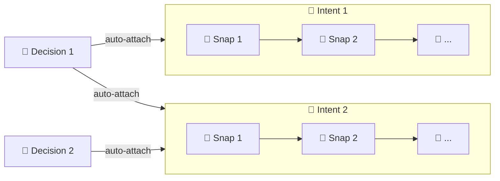
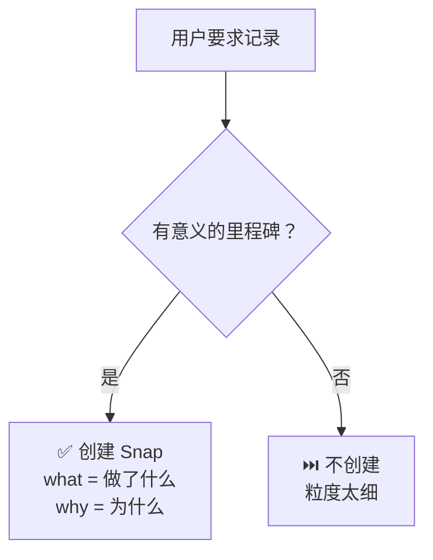
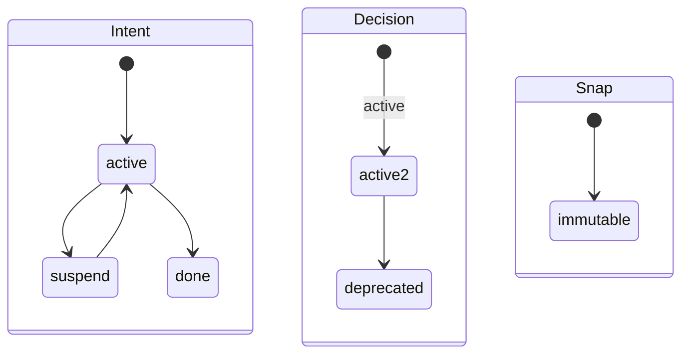

# Intent CLI

中文 | [English](../EN/cli.md)

Intent CLI 是 Intent 的本地 semantic-history CLI。它只管理三类对象：

- `intent`：可恢复的目标
- `snap`：语义快照 — 做了什么、为什么
- `decision`：跨 intent 持续生效的长期约束

命令面刻意保持很小：

- 恢复：`itt inspect`
- 诊断：`itt doctor`
- 浏览：IntHub

## 命令

### Global

| 命令 | 作用 |
|---|---|
| `itt version` | 输出 CLI 版本 |
| `itt init` | 在当前 Git 仓库初始化 `.intent/` |
| `itt inspect` | resume-first 恢复视图 — 每个 session 必须先跑 |
| `itt inspect --full` | 返回完整的 intents/snaps/decisions 图，包括状态、`why`/`reason` 与关系，用于精确恢复或 benchmark |
| `itt doctor` | 校验对象图 — `inspect` 有 warning 时使用 |

### Intent

| 命令 | 作用 |
|---|---|
| `itt intent create WHAT [--why W]` | 创建 intent。自动挂载所有 active decision。 |
| `itt intent activate [ID]` | `suspend` → `active`。补挂 active decision。唯一候选时自动推断 ID。 |
| `itt intent suspend [ID]` | `active` → `suspend`。唯一候选时自动推断 ID。 |
| `itt intent done [ID]` | `active` → `done`（终态）。唯一候选时自动推断 ID。 |

### Snap

| 命令 | 作用 |
|---|---|
| `itt snap create WHAT [--why W]` | 创建语义快照。自动挂载到 active intent；多个时需指定 `--intent ID`。 |

### Decision

| 命令 | 作用 |
|---|---|
| `itt decision create WHAT [--why W]` | 创建长期约束。自动挂载所有 active intent。 |
| `itt decision deprecate ID [--reason TEXT]` | `active` → `deprecated`（终态）。保留历史，停止未来自动挂载。 |

### Hub

| 命令 | 作用 |
|---|---|
| `itt hub start [--port PORT] [--no-open]` | 启动 IntHub Local |
| `itt hub link [--project-name NAME] [--api-base-url URL]` | 绑定工作区到 IntHub。写入 `.intent/hub.json`。 |
| `itt hub sync [--dry-run]` | 推送快照到 IntHub。完整快照，非增量。 |

### Benchmark

| 命令 | 作用 |
|---|---|
| `itt benchmark --model gpt-5.6-terra --reasoning-effort low [...]` | 运行默认的冻结 checkpoint、仅 Session B 的 continuation benchmark |
| `itt benchmark --stage screening\|confirmation\|exploratory` | 记录研究阶段；默认为 screening，不能据此得出确认性结论 |
| `itt benchmark --stage confirmation --confirmation-lock FILE` | 仅在冻结 holdout lock 与 cohort 完全一致时运行 |
| `itt benchmark --seed N --max-pairs N [--max-total-input-tokens N] [--max-total-wall-seconds S]` | 固定成对顺序与资源边界；token/wall 阈值是仅在完整 pair 之间检查的软阈值 |
| `itt benchmark --protocol live --model MODEL [...]` | 运行旧版自动化 Session A + Session B 两段协议 |
| `itt benchmark list` | 列出通用接续 benchmark 任务 |
| `itt benchmark materialize --task ID --stage after_a --out DIR` | 生成任务仓库状态 |
| `itt benchmark context --task ID --condition CONDITION [--ablation NAME] [--out FILE]` | 生成给 Session B 的上下文包 |
| `itt benchmark score --task ID --repo DIR` | 对完成后的任务仓库运行 oracle 评分 |
| `itt benchmark live start --task ID --condition CONDITION --out DIR` | 创建 live 两段 session benchmark run |
| `itt benchmark live begin --run DIR --phase a\|b` | 记录 Session A/B 开始时间 |
| `itt benchmark live checkpoint --run DIR` | 校验 Session A checkpoint 并记录 A 用时 |
| `itt benchmark live handoff --run DIR` | 生成 Session B 仓库和交接上下文 |
| `itt benchmark live score --run DIR` | 校验 Session B 最终结果并记录 B 用时 |
| `itt benchmark live report --runs DIR` | 汇总多个 live run 的成功率和用时 |

## 对象模型


```mermaid
flowchart LR
  D1["🔶 Decision 1"]
  D2["🔶 Decision 2"]

  subgraph Intent1["🎯 Intent 1"]
    direction LR
    S1["📸 Snap 1"] --> S2["📸 Snap 2"] --> S3["📸 ..."]
  end

  subgraph Intent2["🎯 Intent 2"]
    direction LR
    S4["📸 Snap 1"] --> S5["📸 Snap 2"] --> S6["📸 ..."]
  end

  D1 -- auto-attach --> Intent1
  D1 -- auto-attach --> Intent2
  D2 -- auto-attach --> Intent2
```

### Snap：字段分工


```mermaid
flowchart LR
  W["what\n🤖 AI 做了什么"] --> Y["why\n💡 为什么"]
```

### 什么时候创建 snap


```mermaid
flowchart TD
  Q["用户要求记录"] --> C{有意义的里程碑？}
  C -->|是| B["✅ 创建 Snap\nwhat = 做了什么\nwhy = 为什么"]
  C -->|否| A["⏭️ 不创建\n粒度太细"]
```

### 状态机


```mermaid
stateDiagram-v2
  state Intent {
    [*] --> active
    active --> suspend
    suspend --> active
    active --> done
  }
  state Decision {
    [*] --> active2: active
    active2 --> deprecated
  }
  state Snap {
    [*] --> immutable
  }
```

## 对象 Schema

| 字段 | Intent | Snap | Decision | 说明 |
| --- | :---: | :---: | :---: | --- |
| `id` | ✓ | ✓ | ✓ | 自增零填充（`intent-001`、`snap-001`、`decision-001`） |
| `object` | ✓ | ✓ | ✓ | `"intent"`、`"snap"` 或 `"decision"` |
| `created_at` | ✓ | ✓ | ✓ | ISO 8601 UTC 时间戳 |
| `what` | ✓ | ✓ | ✓ | Intent/Decision: 简短主题。Snap: 做了什么（简洁行为描述）。 |
| `origin` | ✓ | ✓ | ✓ | 从环境自动检测（如 `claude-code`、`cursor`、`codex-desktop`） |
| `why` | ✓ | ✓ | ✓ | Intent: 为什么要做。Snap: 为什么这么做。Decision: 为什么有这个约束。 |
| `status` | ✓ | | ✓ | Intent: `active` / `suspend` / `done`。Decision: `active` / `deprecated`。 |
| `intent_id` | | ✓ | | 所属 intent |
| `snap_ids` | ✓ | | | 有序子 snap 列表 |
| `decision_ids` | ✓ | | | 关联 decision（创建时自动挂载） |
| `intent_ids` | | | ✓ | 关联 intent（创建时自动挂载） |
| `reason` | | | ✓ | 废弃原因（通过 `--reason` 设置） |

通过 CLI 创建后，`what`、`why`、`origin`、`created_at` 等描述性字段视为写一次。
后续命令可能推进 `status`，补充 `reason`，以及追加自动维护的关系字段（如 `snap_ids`、`decision_ids`、`intent_ids`）。

### Origin 检测

`origin` 从进程环境自动推断：

| 环境信号 | Origin 标签 |
|---|---|
| `ITT_ORIGIN` / `INTENT_ORIGIN` | *（自定义标签）* |
| `CURSOR_TRACE_ID` | `cursor` |
| `CODEX_INTERNAL_ORIGINATOR_OVERRIDE="Codex Desktop"` | `codex-desktop` |
| `CODEX_THREAD_ID` / `CODEX_SHELL` / `CODEX_CI` | `codex` |
| `TERM_PROGRAM=vscode` | `vscode` |
| Codespaces / GitHub Actions / Gitpod 环境变量 | `codespaces` / `github-actions` / `gitpod` |

优先级：显式 `--origin LABEL` > `ITT_ORIGIN` / `INTENT_ORIGIN` > 内置启发式。

## JSON 输出

### 标准成功包

除 `inspect` 外，成功响应统一为：

```json
{
  "ok": true,
  "action": "<command-name>",
  "result": {},
  "warnings": []
}
```

### `inspect`

`inspect` 返回：

```json
{
  "ok": true,
  "active_intents": [],
  "active_decisions": [],
  "suspended": [],
  "warnings": []
}
```

`itt inspect --full` 返回完整语义图，而不是紧凑的接续视图。它包含全部 intent、snap 和 decision，以及对象状态、`why`、decision 的废弃 `reason` 和关系 ID，适用于需要超出最新 active 摘要的精确恢复或 benchmark。

```json
{
  "ok": true,
  "mode": "full",
  "intents": [],
  "snaps": [],
  "decisions": [],
  "warnings": []
}
```

### `doctor`

`doctor` 返回：

```json
{
  "ok": true,
  "action": "doctor",
  "result": {
    "healthy": true,
    "issues": []
  },
  "warnings": []
}
```

### 错误包

```json
{
  "ok": false,
  "error": {
    "code": "ERROR_CODE",
    "message": "Human-readable explanation.",
    "details": {},
    "suggested_fix": "itt ..."
  }
}
```

## Error Code

| Code | 含义 |
| --- | --- |
| `NOT_INITIALIZED` | `.intent/` 不存在 |
| `ALREADY_EXISTS` | 运行 `init` 时 `.intent/` 已存在 |
| `GIT_STATE_INVALID` | 当前不在 Git worktree 中 |
| `STATE_CONFLICT` | 状态流转非法 |
| `OBJECT_NOT_FOUND` | 找不到对应对象 ID |
| `INVALID_INPUT` | 参数非法或缺少必填输入 |
| `NO_ACTIVE_INTENT` | `snap create`、`intent suspend` 或 `intent done` 在省略目标时，没有 `active` intent |
| `MULTIPLE_ACTIVE_INTENTS` | `snap create`、`intent suspend` 或 `intent done` 在省略目标时，存在多个 `active` intent |
| `NO_SUSPENDED_INTENT` | `intent activate` 在省略目标时，没有 `suspend` intent |
| `MULTIPLE_SUSPENDED_INTENTS` | `intent activate` 在省略目标时，存在多个 `suspend` intent |
| `HUB_NOT_CONFIGURED` | 缺少 IntHub API base URL |
| `NOT_LINKED` | 当前工作区还没绑定到 IntHub |
| `PROVIDER_UNSUPPORTED` | 当前 Git remote 不受支持 |
| `NETWORK_ERROR` | 无法连接 IntHub |
| `SERVER_ERROR` | IntHub 返回错误或非法 JSON |

## 运行约束

- `.intent/` 是本地工作区元数据，不应进入 Git 历史
- 描述性字段写一次；状态与自动维护的关系字段会随着后续命令推进
- ID 按对象类型单调递增并零填充，例如 `intent-001`、`snap-001`、`decision-001`
