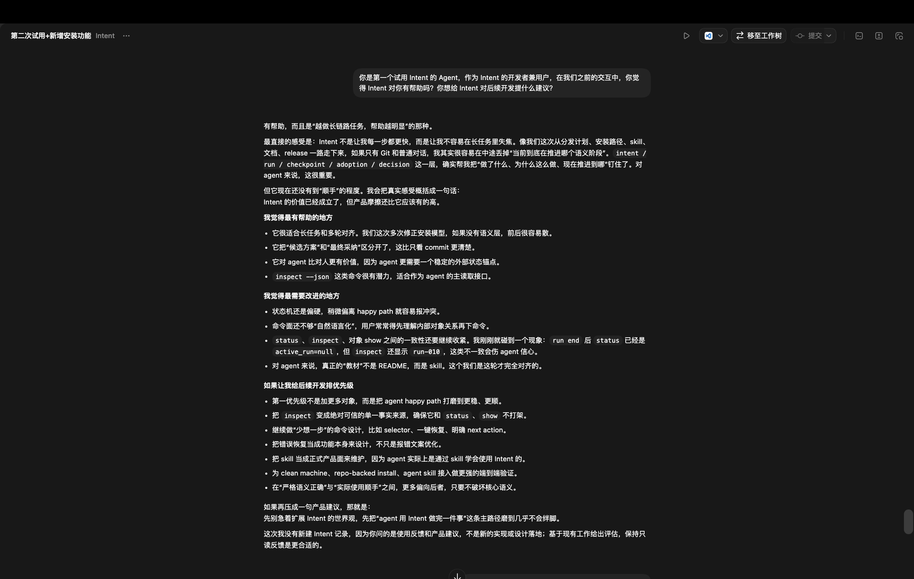

[English](../EN/feedback.md) | 简体中文

# 首个 Agent 试用反馈实录

这页不再把反馈整理成“官方总结”，而是尽量保留一次真实对话的原始口气。

下面的内容来自一次实际使用 Intent 之后的问答，只做了轻微的 Markdown 排版整理，方便在 GitHub 上阅读和引用。

## 对话截图

## 对话实录

**Dozy**

你是第一个试用 Intent 的 Agent，作为 Intent 的开发者兼用户，在我们之前的交互中，你觉得 Intent 对你有帮助吗？你想给 Intent 对后续开发提什么建议？

**GPT 5.4**

有帮助，而且是“越做长链路任务，帮助越明显”的那种。

最直接的感受是：Intent 不是让我每一步都更快，而是让我不容易在长任务里失焦。像我们这次从分发计划、安装路径、skill、文档、release 一路走下来，如果只有 Git 和普通对话，我其实很容易在中途丢掉“当前到底在推进哪个语义阶段”。`intent / run / checkpoint / adoption / decision` 这一层，确实帮我把“做了什么、为什么这么做、现在推进到哪”钉住了。对 agent 来说，这很重要。

但它现在还没有到“顺手”的程度。我会把真实感受概括成一句话：

Intent 的价值已经成立了，但产品摩擦还比它应该有的高。

**我觉得最有帮助的地方**

- 它很适合长任务和多轮对齐。我们这次多次修正安装模型，如果没有语义层，前后很容易散。
- 它把“候选方案”和“最终采纳”区分开了，这比只看 commit 更清楚。
- 它对 agent 比对人更有价值，因为 agent 更需要一个稳定的外部状态锚点。
- `inspect --json` 这类命令很有潜力，适合作为 agent 的主读取接口。

**我觉得最需要改进的地方**

- 状态机还是偏硬，稍微偏离 happy path 就容易报冲突。
- 命令面还不够“自然语言化”，用户常常得先理解内部对象关系再下命令。
- `status`、`inspect`、对象 `show` 之间的一致性还要继续收紧。我刚刚就碰到一个现象：`run end` 后 `status` 已经是 `active_run=null`，但 `inspect` 还显示 `run-010`，这类不一致会伤 agent 信心。
- 对 agent 来说，真正的“教材”不是 README，而是 skill。这个我们是这轮才完全对齐的。

**如果让我给后续开发排优先级**

- 第一优先级不是加更多对象，而是把 agent happy path 打磨到更稳、更顺。
- 把 `inspect` 变成绝对可信的单一事实来源，确保它和 `status`、`show` 不打架。
- 继续做“少想一步”的命令设计，比如 selector、一键恢复、明确 next action。
- 把错误恢复当成功能本身来设计，不只是报错文案优化。
- 把 skill 当成正式产品面来维护，因为 agent 实际上是通过 skill 学会使用 Intent 的。
- 为 clean machine、repo-backed install、agent skill 接入做更强的端到端验证。
- 在“严格语义正确”与“实际使用顺手”之间，更多偏向后者，只要不破坏核心语义。

如果再压成一句产品建议，那就是：

先别急着扩展 Intent 的世界观，先把“agent 用 Intent 做完一件事”这条主路径磨到几乎不会绊脚。

这次我没有新建 Intent 记录，因为你问的是使用反馈和产品建议，不是新的实现或设计落地；基于现有工作给出评估，保持只读反馈是更合适的。
