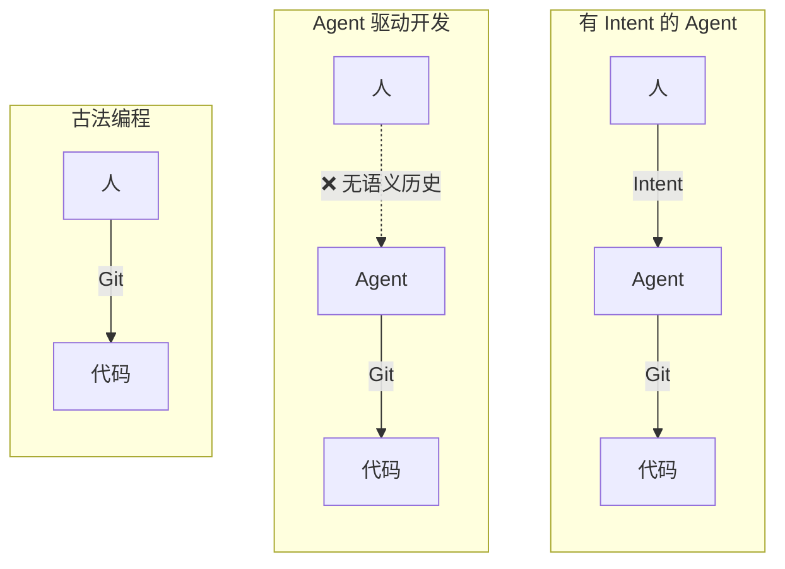
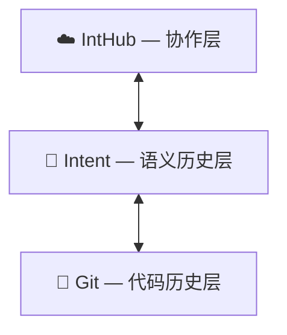

# Intent 的愿景

中文 | [English](../EN/vision.md)

## 这篇文档回答什么

- 为什么 agent 时代需要一层新的 semantic history
- Intent 补的是哪一层，而不是替代什么
- 为什么这件事在 agent 时代更迫切
- 应该用什么标准判断 Intent 是否成立

## 这篇文档不回答什么

- 具体对象、命令和状态应该怎么设计
- JSON schema、状态机和机器可读 contract
- 当前实现细节
- 阶段路线和优先级安排

## 与其他文档的边界

- 具体实现与对象语义以 [CLI 统一设计文档](cli.md) 为准
- 项目路线与阶段安排以 [路线图](roadmap.md) 为准

## 1. 核心判断

Git 仍然是代码世界的基础设施，这一点没有变。

变化的是软件开发的工作方式：

- 人越来越多通过 agent 间接塑造代码
- 实现过程越来越像“提出目标、推进结果、持续修正、沉淀决策”
- 开发过程稳定地产生出更高层的语义节点，例如当前意图、交互快照、长期决策、回退与续做

因此，新的问题不是“怎么替代 Git”，而是：

**如何在 Git 之上，为人和 agent 的协作补上一层 semantic history。**

Intent 的定位就是这一层。

## 2. 现在真正缺的不是信息，而是稳定对象边界

高层语义信息今天并不稀缺。它通常散落在：

- commit message
- issue
- PR discussion
- docs
- 团队聊天
- agent conversation
- 临时笔记和口头共识

问题不是“这些信息不存在”，而是它们通常：

- 可以阅读，但不稳定
- 可以讨论，但难以持续追踪
- 可以回忆，但没有统一边界
- 对人还能凑合，对 agent 不够可靠

这会导致一个很实际的问题：我们能看到代码怎么变了，却很难稳定回答下面这些问题。

- 当前到底在解决什么问题
- 最近一次交互实际推进了什么
- 用户对这次推进给了什么反馈
- 哪些长期决策仍然有效
- 为什么当前会沿着这条路径继续推进

Intent 要解决的不是“记录更多信息”，而是：

**把这些高层语义提升为第一类对象。**

## 3. 为什么现有工具组合不够

`Git + PR + issue + docs + chat` 当然有用，但它们并没有把这层语义历史建成一个统一系统。

主要问题有四个：

- 语义是分散表达的，不是正式建模的
- 语义节点边界不稳定，很难引用、比较和回溯
- 对 agent 来说，缺少稳定入口和可查询上下文
- “推进、修正、回退、沉淀决策”仍然散落在不同媒介里

在传统开发里，中心动作更像“写代码”。

在 agent-driven development 里，越来越关键的动作其实是：

- 提出目标
- 推进实现
- 持续修正
- 记录交互反馈
- 必要时回退
- 沉淀长期有效的决策

也就是说，开发过程的重心正在从“写”转向“引导、衔接与沉淀”。

## 4. Intent 补的是哪一层

Intent 不替代 Git。它补的是 Git 天然没有被设计去承载的那层历史。

| 层 | 负责什么 | 典型内容 |
| --- | --- | --- |
| Git | code history | commit、branch、diff |
| Intent | semantic history | 当前意图、交互快照、长期决策、回退与续做 |
| 协作层 | 远端组织与协作 | timeline、共享视图、协作上下文 |

因此可以把 Intent 理解成：

**构建在 Git 之上的 semantic history layer。**

一句话说就是：

**Git 记录代码变化，Intent 记录语义历史。**

## 5. 项目边界

Intent 当前不打算做这些事：

- 替代 Git 的版本控制能力
- 替代 issue、PR 或 docs 系统
- 保存全部原始对话和全部中间过程
- 成为“记录一切”的重型过程平台
- 把远端协作当成第一优先级前提

Intent 的边界很明确：

**只记录那些值得被正式追踪、衔接、修正、回退和复用的语义节点。**

## 6. 为什么这在 agent 时代更迫切

在传统开发里，很多高层语义虽然没有被正式建模，但至少还在程序员脑中，或者散落在日常协作材料里。

在 agent 时代，情况变了：

- 大量实现由 agent 承担
- 人更像 reviewer、coordinator、director
- 用户与 agent 的 query、修正、反馈和回退，本身开始成为开发过程的一部分
- session 更容易中断，而语义连续性更容易丢失

这意味着，系统不能只记录“代码如何变化”，还要能记录“为什么当前沿着这条路径继续推进”。

对 agent 来说，这层能力尤其重要，因为它需要的是：

- 稳定的对象边界
- 明确的状态
- 可查询的上下文
- 可持续复用的长期决策

## 7. 判断这件事是否成立

Intent 是否成立，不取决于它记录了多少东西，而取决于它是否真的降低了协作中的语义损耗。

更具体地说：

- 新 session 需要重新补推上下文的次数是否更少
- 人类是否更容易看懂当前在解决什么、最近推进了什么、为什么这么推进
- 被中断的工作是否更容易续做
- 长期决策是否更容易被稳定继承，而不是埋没在聊天或记忆里

如果这些收益不成立，那么无论 schema 多漂亮、命令多完整，Intent 都不成立。

## 8. 一句话定义

Intent 是一个面向 agent-driven software development 的 Git-compatible semantic history layer。

## 9. 总结

Intent 关注的不是 Git 的版本控制能力，而是 Git 之外的语义历史：

- 当前在解决什么问题
- 最近一次交互推进了什么
- 用户如何反馈这次推进
- 哪些长期决策仍然有效
- 当前路径如何形成，以及必要时如何记录回退或修正
