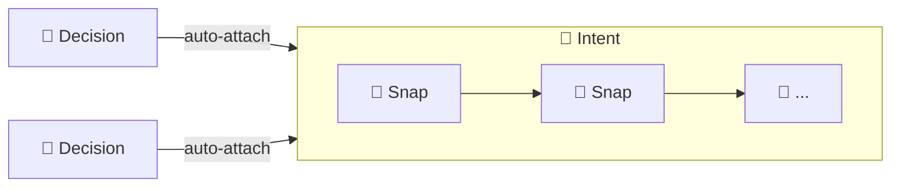
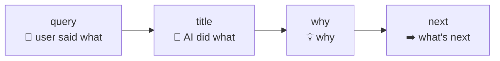
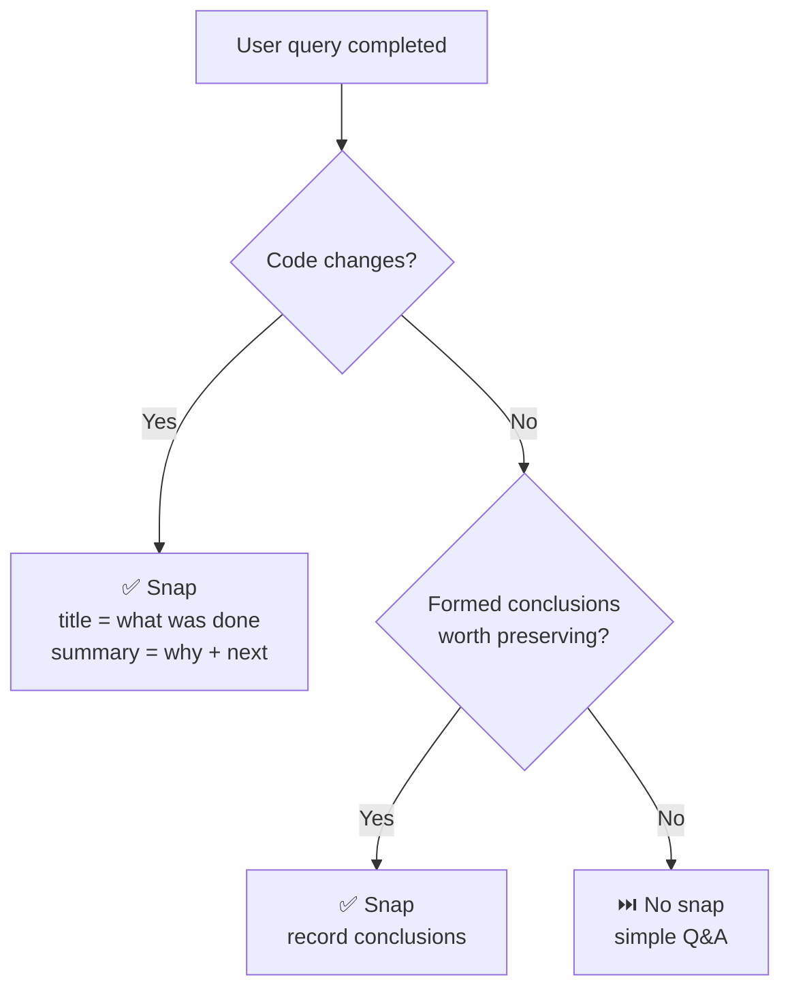
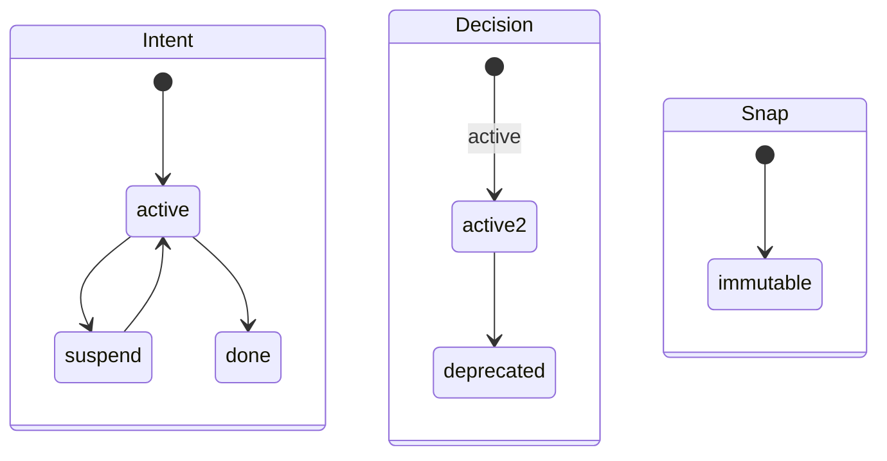

# Intent CLI

[中文](../CN/cli.md) | English

Schema version: **1.0**

Intent CLI is the local semantic-history CLI for Intent. It manages only three object types:

- `intent`: a recoverable goal
- `snap`: a semantic snapshot per query — what was done, why, what's next
- `decision`: a long-lived constraint across intents

The CLI is intentionally small:

- Recovery uses `itt inspect`
- Structural diagnosis uses `itt doctor`
- Graph browsing belongs to IntHub
- There are no `list` commands

## Command Surface

### Global

| Command | Role |
| --- | --- |
| `itt version` | Print CLI version |
| `itt init` | Initialize `.intent/` in the current Git repo |
| `itt inspect` | Resume-first recovery view |
| `itt doctor` | Structure diagnosis view |

### Intent

| Command | Role |
| --- | --- |
| `itt intent create TITLE --query Q [--why R] [--origin LABEL]` | Create a new intent |
| `itt intent activate [ID]` | `suspend` → `active` |
| `itt intent suspend [ID]` | `active` → `suspend` |
| `itt intent done [ID]` | `active` → `done` |

### Snap

| Command | Role |
| --- | --- |
| `itt snap create TITLE [--intent ID] [--query Q] [--why R] [--next N] [--origin LABEL]` | Create a semantic snapshot (`title` = what was done; `why` = why; `next` = what's next) |

### Decision

| Command | Role |
| --- | --- |
| `itt decision create TITLE --why R [--query Q] [--origin LABEL]` | Create a new decision |
| `itt decision deprecate ID [--reason TEXT]` | `active` → `deprecated` |
### Hub

| Command | Role |
| --- | --- |
| `itt hub link [--project-name NAME] [--api-base-url URL] [--token TOKEN]` | Configure local IntHub access if needed, then link the current workspace |
| `itt hub sync [--api-base-url URL] [--token TOKEN] [--dry-run]` | Push the local semantic snapshot to IntHub |

## Global Commands

### `itt version`

Print the current CLI version.

```bash
itt version
```

### `itt init`

Initialize `.intent/` inside the current Git repository.

```bash
itt init
```

### `itt inspect`

Resume-first recovery view.

- Use it at the start of a session.
- Default output: `active_intents`, `active_decisions`, `suspended`, `warnings`.
- It is not a full graph browser.

```bash
itt inspect
```

### `itt doctor`

Structure diagnosis view.

- Use it when `inspect` shows warnings or the graph looks inconsistent.
- Default output: `healthy`, `issues`.
- It validates broken references, invalid statuses, and one-way links.

```bash
itt doctor
```

## Object Model



### Snap: what each field carries



### When to create a snap



### State machines



## Object Schema

| Field | Intent | Snap | Decision | Notes |
| --- | :---: | :---: | :---: | --- |
| `id` | ✓ | ✓ | ✓ | Auto-incremented, zero-padded (`intent-001`, `snap-001`, `decision-001`) |
| `object` | ✓ | ✓ | ✓ | `"intent"`, `"snap"`, or `"decision"` |
| `created_at` | ✓ | ✓ | ✓ | ISO 8601 UTC timestamp |
| `title` | ✓ | ✓ | ✓ | Intent/Decision: short theme. Snap: what was done (concise action). |
| `query` | ✓ | ✓ | ✓ | User query that triggered the object |
| `origin` | ✓ | ✓ | ✓ | Auto-detected from environment (e.g. `claude-code`, `cursor`, `codex-desktop`) |
| `why` | ✓ | ✓ | ✓ | Intent: why this goal. Snap: why this approach. Decision: why this constraint. |
| `status` | ✓ | | ✓ | Intent: `active` / `suspend` / `done`. Decision: `active` / `deprecated`. |
| `next` | | ✓ | | What comes next — remaining work, direction, blockers |
| `intent_id` | | ✓ | | Parent intent |
| `snap_ids` | ✓ | | | Ordered list of child snaps |
| `decision_ids` | ✓ | | | Linked decisions (auto-attached on create) |
| `intent_ids` | | | ✓ | Linked intents (auto-attached on create) |
| `reason` | | | ✓ | Why the decision was deprecated (set via `--reason`) |

All fields are **immutable after creation**.

### Origin detection

`origin` is auto-detected from the process environment. Built-in hints: `CURSOR_TRACE_ID` → `cursor`, `CODEX_INTERNAL_ORIGINATOR_OVERRIDE="Codex Desktop"` → `codex-desktop`, `CODEX_THREAD_ID` / `CODEX_SHELL` / `CODEX_CI` → `codex`, `TERM_PROGRAM=vscode` → `vscode`, plus Codespaces / GitHub Actions / Gitpod. Set `ITT_ORIGIN` or `INTENT_ORIGIN` in your shell profile for a custom label. Use `--origin LABEL` to override for a single command.

## Object Commands

### Intent

`create` recognizes a new recoverable goal. `activate`, `suspend`, and `done` are state transitions.

```bash
itt intent create "Fix the login timeout bug" \
  --query "why does login timeout after 5s?" \
  --why "users on slow networks get logged out mid-session"

itt intent suspend intent-001
itt intent activate intent-001
itt intent done intent-001
```

Notes:

- New intents start as `active`; creating auto-attaches all current `active` decisions
- Reactivating catches up any `active` decisions added while suspended
- `activate`, `suspend`, `done` infer `ID` when exactly one candidate matches

### Snap

A semantic snapshot per query. `title` = what was done, `why` = why, `next` = what's next.

```bash
itt snap create "Timeout changed to 30s with async refresh" \
  --query "why does login timeout after 5s?" \
  --why "Race condition in refresh flow blocks login synchronously. Async refresh decouples the paths." \
  --next "Token refresh endpoint still hardcoded — separate service, needs its own fix."
```

Notes:

- `--why` is required; `--intent` infers when exactly one intent is `active`
- Creating a snap writes both `snap.intent_id` and the parent intent's `snap_ids`
- Snaps are immutable; correct mistakes by writing a later snap

### Decision

`create` records a long-lived constraint. `deprecate` is terminal.

```bash
itt decision create "Timeout must stay configurable" \
  --query "user asked about deployment flexibility" \
  --why "Different deployments have different latency envelopes"

itt decision deprecate decision-001 --reason "Replaced by decision-005"
```

Notes:

- New decisions start as `active`; creating auto-attaches all current `active` intents
- `deprecate` preserves history; it only stops future auto-attachment

There are no `show` commands — recovery uses `itt inspect`, browsing uses IntHub.

## Hub Commands

### `itt hub link`

Configure local IntHub access if needed, then link the current GitHub-backed workspace.

```bash
itt hub link --api-base-url http://127.0.0.1:7210 --project-name "Intent"
itt hub link --api-base-url http://127.0.0.1:7210 --token dev-token --project-name "Intent"
```

Notes:

- Requires the current `origin` remote to be a supported GitHub repo
- Writes `.intent/hub.json`
- Persists `api_base_url`, optional local token, `workspace_id`, `project_id`, and `repo_binding`

### `itt hub sync`

Push the current `.intent/` snapshot plus Git context to IntHub.

```bash
itt hub sync
itt hub sync --dry-run
```

Notes:

- Sync uploads a full snapshot, not an incremental patch
- Sync includes Git context such as `branch`, `head_commit`, `dirty`, and `remote_url`
- `--dry-run` prints the outgoing payload instead of sending it

## JSON Output

### Standard success envelope

All successful commands except `inspect` use:

```json
{
  "ok": true,
  "action": "<command-name>",
  "result": {},
  "warnings": []
}
```

### `inspect`

`inspect` returns:

```json
{
  "ok": true,
  "active_intents": [],
  "active_decisions": [],
  "suspended": [],
  "warnings": []
}
```

### `doctor`

`doctor` returns:

```json
{
  "ok": true,
  "action": "doctor",
  "result": {
    "healthy": true,
    "issues": []
  },
  "warnings": []
}
```

### Error envelope

```json
{
  "ok": false,
  "error": {
    "code": "ERROR_CODE",
    "message": "Human-readable explanation.",
    "details": {},
    "suggested_fix": "itt ..."
  }
}
```

## Error Codes

| Code | Meaning |
| --- | --- |
| `NOT_INITIALIZED` | `.intent/` does not exist |
| `ALREADY_EXISTS` | `.intent/` already exists when running `init` |
| `GIT_STATE_INVALID` | Not inside a Git worktree |
| `STATE_CONFLICT` | Illegal state transition |
| `OBJECT_NOT_FOUND` | Object ID not found |
| `INVALID_INPUT` | Invalid arguments or missing required input |
| `NO_ACTIVE_INTENT` | `snap create`, `intent suspend`, or `intent done` omitted the target intent and none is `active` |
| `MULTIPLE_ACTIVE_INTENTS` | `snap create`, `intent suspend`, or `intent done` omitted the target intent and several are `active` |
| `NO_SUSPENDED_INTENT` | `intent activate` omitted the target intent and none is `suspend` |
| `MULTIPLE_SUSPENDED_INTENTS` | `intent activate` omitted the target intent and several are `suspend` |
| `HUB_NOT_CONFIGURED` | IntHub API base URL is missing |
| `NOT_LINKED` | Current workspace has not been linked to IntHub |
| `PROVIDER_UNSUPPORTED` | Current Git remote is not supported |
| `NETWORK_ERROR` | IntHub could not be reached |
| `SERVER_ERROR` | IntHub returned an error or invalid JSON |

## Operational Notes

- `.intent/` is local workspace metadata and should stay out of Git history
- All objects are immutable after creation
- IDs are zero-padded and monotonic per object type: `intent-001`, `snap-001`, `decision-001`
