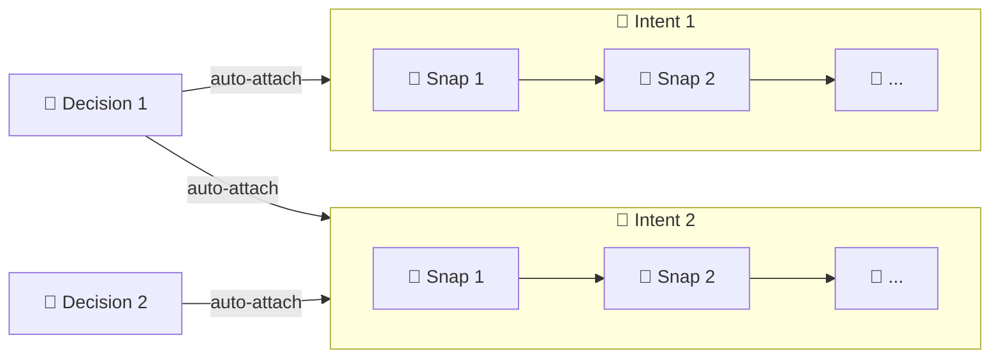
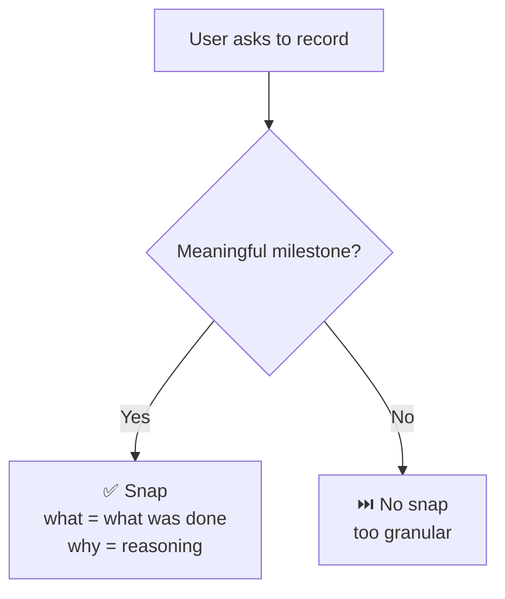
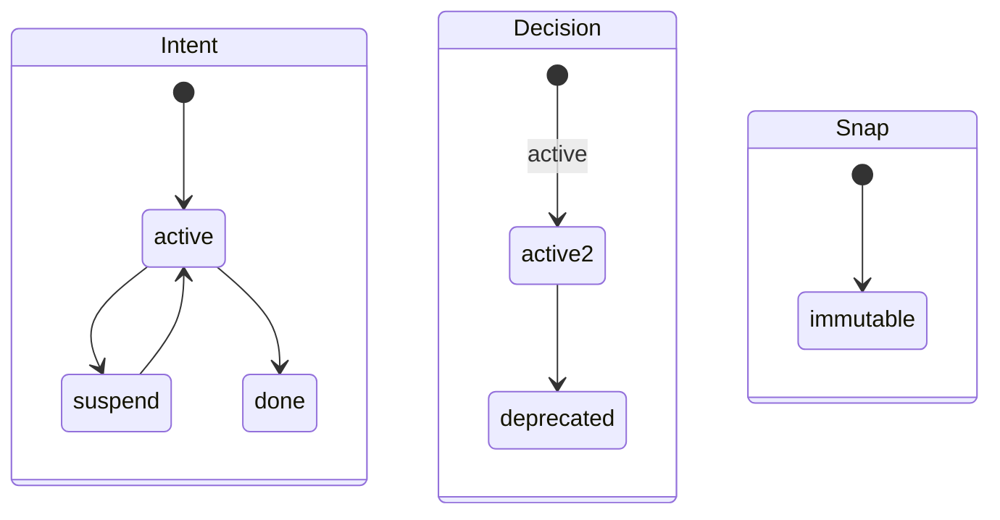

# Intent CLI

[中文](../CN/cli.md) | English

Intent CLI is the local semantic-history CLI for Intent. It manages only three object types:

- `intent`: a recoverable goal
- `snap`: a semantic snapshot — what was done and why
- `decision`: a long-lived constraint across intents

The CLI is intentionally small:

- Recovery: `itt inspect`
- Diagnosis: `itt doctor`
- Browsing: IntHub

## Commands

### Global

| Command | What it does |
|---|---|
| `itt version` | Print CLI version |
| `itt init` | Initialize `.intent/` in current Git repo |
| `itt inspect` | Resume-first recovery view — start every session here |
| `itt doctor` | Validate object graph — use when `inspect` shows warnings |

### Intent

| Command | What it does |
|---|---|
| `itt intent create WHAT [--why W]` | Create a new intent. Auto-attaches all active decisions. |
| `itt intent activate [ID]` | `suspend` → `active`. Catches up active decisions. Infers ID when unique. |
| `itt intent suspend [ID]` | `active` → `suspend`. Infers ID when unique. |
| `itt intent done [ID]` | `active` → `done` (terminal). Infers ID when unique. |

### Snap

| Command | What it does |
|---|---|
| `itt snap create WHAT [--why W]` | Create a semantic snapshot. Auto-attaches to active intent; if multiple, specify `--intent ID`. |

### Decision

| Command | What it does |
|---|---|
| `itt decision create WHAT [--why W]` | Create a long-lived constraint. Auto-attaches all active intents. |
| `itt decision deprecate ID [--reason TEXT]` | `active` → `deprecated` (terminal). Preserves history; stops future auto-attach. |

### Hub

| Command | What it does |
|---|---|
| `itt hub start [--port PORT] [--no-open]` | Launch IntHub Local |
| `itt hub link [--project-name NAME] [--api-base-url URL]` | Link workspace to IntHub. Writes `.intent/hub.json`. |
| `itt hub sync [--dry-run]` | Push snapshot to IntHub. Full snapshot, not incremental. |

## Object Model



### Snap: what each field carries


### When to create a snap



### State machines



## Object Schema

| Field | Intent | Snap | Decision | Notes |
| --- | :---: | :---: | :---: | --- |
| `id` | ✓ | ✓ | ✓ | Auto-incremented, zero-padded (`intent-001`, `snap-001`, `decision-001`) |
| `object` | ✓ | ✓ | ✓ | `"intent"`, `"snap"`, or `"decision"` |
| `created_at` | ✓ | ✓ | ✓ | ISO 8601 UTC timestamp |
| `what` | ✓ | ✓ | ✓ | Intent/Decision: short theme. Snap: what was done (concise action). |
| `origin` | ✓ | ✓ | ✓ | Auto-detected from environment (e.g. `claude-code`, `cursor`, `codex-desktop`) |
| `why` | ✓ | ✓ | ✓ | Intent: why this goal. Snap: why this approach. Decision: why this constraint. |
| `status` | ✓ | | ✓ | Intent: `active` / `suspend` / `done`. Decision: `active` / `deprecated`. |
| `intent_id` | | ✓ | | Parent intent |
| `snap_ids` | ✓ | | | Ordered list of child snaps |
| `decision_ids` | ✓ | | | Linked decisions (auto-attached on create) |
| `intent_ids` | | | ✓ | Linked intents (auto-attached on create) |
| `reason` | | | ✓ | Why the decision was deprecated (set via `--reason`) |

Once created through the CLI, descriptive fields such as `what`, `why`, `origin`, and `created_at` are treated as write-once.
Later commands may advance `status`, add `reason`, and append auto-maintained relationship fields such as `snap_ids`, `decision_ids`, and `intent_ids`.

### Origin detection

`origin` is auto-detected from the process environment:

| Environment signal | Origin label |
|---|---|
| `ITT_ORIGIN` / `INTENT_ORIGIN` | *(custom label)* |
| `CURSOR_TRACE_ID` | `cursor` |
| `CODEX_INTERNAL_ORIGINATOR_OVERRIDE="Codex Desktop"` | `codex-desktop` |
| `CODEX_THREAD_ID` / `CODEX_SHELL` / `CODEX_CI` | `codex` |
| `TERM_PROGRAM=vscode` | `vscode` |
| Codespaces / GitHub Actions / Gitpod env vars | `codespaces` / `github-actions` / `gitpod` |

Priority: explicit `--origin LABEL` > `ITT_ORIGIN` / `INTENT_ORIGIN` > built-in heuristics.

## JSON Output

### Standard success envelope

All successful commands except `inspect` use:

```json
{
  "ok": true,
  "action": "<command-name>",
  "result": {},
  "warnings": []
}
```

### `inspect`

`inspect` returns:

```json
{
  "ok": true,
  "active_intents": [],
  "active_decisions": [],
  "suspended": [],
  "warnings": []
}
```

### `doctor`

`doctor` returns:

```json
{
  "ok": true,
  "action": "doctor",
  "result": {
    "healthy": true,
    "issues": []
  },
  "warnings": []
}
```

### Error envelope

```json
{
  "ok": false,
  "error": {
    "code": "ERROR_CODE",
    "message": "Human-readable explanation.",
    "details": {},
    "suggested_fix": "itt ..."
  }
}
```

## Error Codes

| Code | Meaning |
| --- | --- |
| `NOT_INITIALIZED` | `.intent/` does not exist |
| `ALREADY_EXISTS` | `.intent/` already exists when running `init` |
| `GIT_STATE_INVALID` | Not inside a Git worktree |
| `STATE_CONFLICT` | Illegal state transition |
| `OBJECT_NOT_FOUND` | Object ID not found |
| `INVALID_INPUT` | Invalid arguments or missing required input |
| `NO_ACTIVE_INTENT` | `snap create`, `intent suspend`, or `intent done` omitted the target intent and none is `active` |
| `MULTIPLE_ACTIVE_INTENTS` | `snap create`, `intent suspend`, or `intent done` omitted the target intent and several are `active` |
| `NO_SUSPENDED_INTENT` | `intent activate` omitted the target intent and none is `suspend` |
| `MULTIPLE_SUSPENDED_INTENTS` | `intent activate` omitted the target intent and several are `suspend` |
| `HUB_NOT_CONFIGURED` | IntHub API base URL is missing |
| `NOT_LINKED` | Current workspace has not been linked to IntHub |
| `PROVIDER_UNSUPPORTED` | Current Git remote is not supported |
| `NETWORK_ERROR` | IntHub could not be reached |
| `SERVER_ERROR` | IntHub returned an error or invalid JSON |

## Operational Notes

- `.intent/` is local workspace metadata and should stay out of Git history
- Descriptive fields are write-once; status and auto-maintained relationship fields evolve through later commands
- IDs are zero-padded and monotonic per object type: `intent-001`, `snap-001`, `decision-001`
