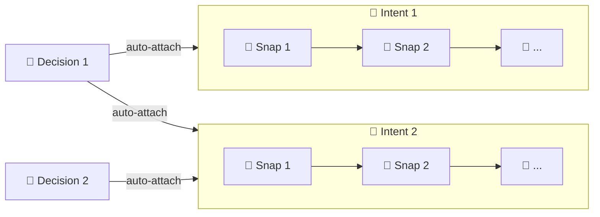
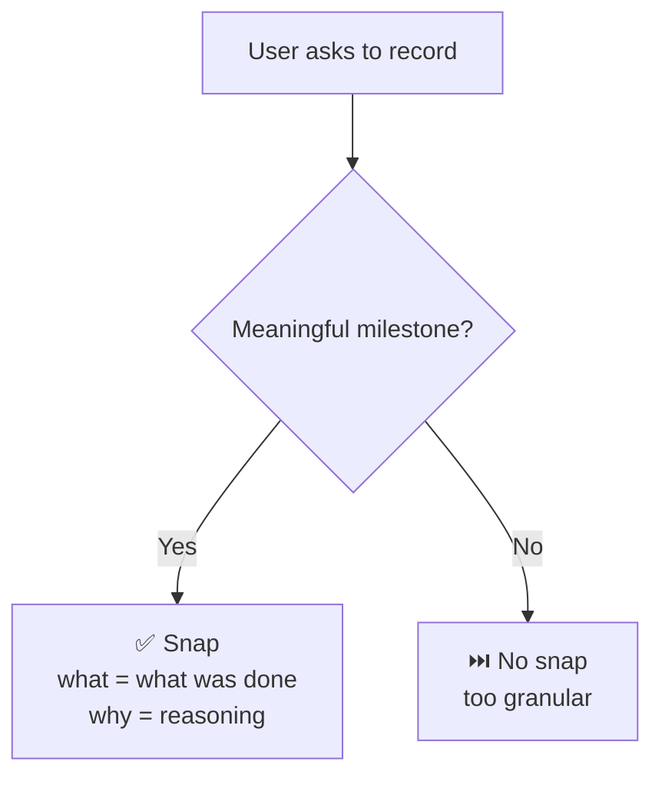
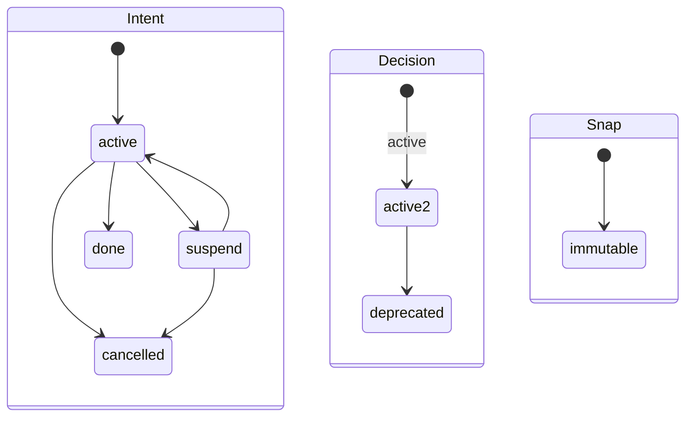

# Intent CLI

[中文](../CN/cli.md) | English

Intent CLI is the local semantic-history CLI for Intent. It manages only three object types:

- `intent`: a recoverable goal
- `snap`: a semantic snapshot — what was done and why
- `decision`: a long-lived constraint across intents

The CLI is intentionally small:

- Recovery: `itt inspect`
- Diagnosis: `itt doctor`
- Browsing: IntHub

## Commands

### Global

| Command | What it does |
|---|---|
| `itt version` | Print CLI version |
| `itt init` | Initialize `.intent/` in current Git repo |
| `itt inspect [--intent ID] [--history N]` | Recovery view with each goal's rationale, latest snap, optional bounded history, active decisions, and full graph warnings |
| `itt doctor` | Return the same full object-graph diagnosis with an explicit `healthy` result |

### Intent

| Command | What it does |
|---|---|
| `itt intent create WHAT [--why W]` | Create a new intent. Auto-attaches all active decisions. |
| `itt intent activate [ID]` | `suspend` → `active`. Catches up active decisions. Infers ID when unique. |
| `itt intent suspend [ID]` | `active` → `suspend`. Infers ID when unique. |
| `itt intent done [ID]` | `active` → `done` (terminal). Infers ID when unique. |
| `itt intent cancel [ID] [--reason TEXT]` | `active` / `suspend` → `cancelled` (terminal). Infers ID when only one open intent exists. |

### Snap

| Command | What it does |
|---|---|
| `itt snap create WHAT [--why W]` | Create a semantic snapshot. Auto-attaches to active intent; if multiple, specify `--intent ID`. |

### Decision

| Command | What it does |
|---|---|
| `itt decision create WHAT [--why W]` | Create a long-lived constraint. Auto-attaches all active intents. |
| `itt decision deprecate ID [--reason TEXT]` | `active` → `deprecated` (terminal). Preserves history; stops future auto-attach. |

### Hub

| Command | What it does |
|---|---|
| `itt auth login [--api-base-url URL] [--token TOKEN]` | Validate an account token, save the global endpoint, and delegate the token to Git's credential helper. Defaults to the official IntHub service. |
| `itt auth status [--api-base-url URL] [--token TOKEN]` | Check whether the selected global account credential is valid. Never prints the token. |
| `itt auth logout [--api-base-url URL]` | Remove the local credential-helper entry. Does not revoke the server-side token. |
| `itt push [--api-base-url URL] [--token TOKEN] [--dry-run]` | Push the current repository's complete Intent snapshot. Primary Git-style command. |
| `itt hub start [--port PORT] [--no-open]` | Launch IntHub Local |
| `itt hub status [--api-base-url URL]` | Read the effective endpoint, local repository binding, sync timestamps, pending link/sync operations, and reusable-credential availability without calling the IntHub API. |
| `itt hub link [--project-name NAME] [--api-base-url URL] [--token TOKEN]` | Link this repository to IntHub. Uses the global endpoint and account credential by default; writes only non-secret binding data to `.intent/hub.json`. |
| `itt hub sync [--api-base-url URL] [--token TOKEN] [--dry-run]` | Compatibility alias for `itt push`. |

Authentication follows Git's split between global credentials and repository-local remotes. `itt auth login` stores the endpoint in the user-level Intent config and asks Git's configured credential helper to store the account token. A secure helper such as macOS Keychain, Git Credential Manager, or libsecret is recommended; Git's `store` helper keeps credentials in plaintext. Each repository must still run `itt hub link` once because its project and workspace binding is repository-specific. GitHub and Gitee origins are supported. GitHub OAuth identifies the IntHub account; it does not constrain the repository provider. The CLI never changes `origin`, and each push verifies that the current provider and repository ID still match the saved binding. Link and push persist non-secret pending operation IDs before network I/O; bounded retries and later reruns therefore reconcile a lost response without inventing a second operation for unchanged state. The CLI precedence is explicit `--token`, `INTHUB_TOKEN`, then the credential helper selected for the effective API base URL.

## Object Model


```mermaid
flowchart LR
  D1["🔶 Decision 1"]
  D2["🔶 Decision 2"]

  subgraph Intent1["🎯 Intent 1"]
    direction LR
    S1["📸 Snap 1"] --> S2["📸 Snap 2"] --> S3["📸 ..."]
  end

  subgraph Intent2["🎯 Intent 2"]
    direction LR
    S4["📸 Snap 1"] --> S5["📸 Snap 2"] --> S6["📸 ..."]
  end

  D1 -- auto-attach --> Intent1
  D1 -- auto-attach --> Intent2
  D2 -- auto-attach --> Intent2
```

### Snap: what each field carries


```mermaid
flowchart LR
  W["what\n🤖 AI did what"] --> Y["why\n💡 why"]
```

### When to create a snap


```mermaid
flowchart TD
  Q["User asks to record"] --> C{Meaningful milestone?}
  C -->|Yes| B["✅ Snap\nwhat = what was done\nwhy = reasoning"]
  C -->|No| A["⏭️ No snap\ntoo granular"]
```

### State machines


```mermaid
stateDiagram-v2
  state Intent {
    [*] --> active
    active --> suspend
    suspend --> active
    active --> done
    active --> cancelled
    suspend --> cancelled
  }
  state Decision {
    [*] --> active2: active
    active2 --> deprecated
  }
  state Snap {
    [*] --> immutable
  }
```

## Object Schema

| Field | Intent | Snap | Decision | Notes |
| --- | :---: | :---: | :---: | --- |
| `id` | ✓ | ✓ | ✓ | Auto-incremented, zero-padded (`intent-001`, `snap-001`, `decision-001`) |
| `object` | ✓ | ✓ | ✓ | `"intent"`, `"snap"`, or `"decision"` |
| `created_at` | ✓ | ✓ | ✓ | ISO 8601 UTC timestamp |
| `what` | ✓ | ✓ | ✓ | Intent/Decision: short theme. Snap: what was done (concise action). |
| `origin` | ✓ | ✓ | ✓ | Auto-detected from environment (e.g. `claude-code`, `cursor`, `codex-desktop`) |
| `why` | ✓ | ✓ | ✓ | Intent: why this goal. Snap: why this approach. Decision: why this constraint. |
| `status` | ✓ | | ✓ | Intent: `active` / `suspend` / `done` / `cancelled`. Decision: `active` / `deprecated`. |
| `intent_id` | | ✓ | | Parent intent |
| `snap_ids` | ✓ | | | Ordered list of child snaps |
| `decision_ids` | ✓ | | | Linked decisions (auto-attached on create) |
| `intent_ids` | | | ✓ | Linked intents (auto-attached on create) |
| `reason` | ✓ | | ✓ | Why an intent was cancelled or a decision was deprecated (set via `--reason`) |

Once created through the CLI, descriptive fields such as `what`, `why`, `origin`, and `created_at` are treated as write-once.
Later commands may advance `status`, add `reason`, and append auto-maintained relationship fields such as `snap_ids`, `decision_ids`, and `intent_ids`.

### Origin detection

`origin` is auto-detected from the process environment:

| Environment signal | Origin label |
|---|---|
| `ITT_ORIGIN` / `INTENT_ORIGIN` | *(custom label)* |
| `CURSOR_TRACE_ID` | `cursor` |
| `CODEX_INTERNAL_ORIGINATOR_OVERRIDE="Codex Desktop"` | `codex-desktop` |
| `CODEX_THREAD_ID` / `CODEX_SHELL` / `CODEX_CI` | `codex` |
| `TERM_PROGRAM=vscode` | `vscode` |
| Codespaces / GitHub Actions / Gitpod env vars | `codespaces` / `github-actions` / `gitpod` |

Priority: explicit `--origin LABEL` > `ITT_ORIGIN` / `INTENT_ORIGIN` > built-in heuristics.

## JSON Output

### Standard success envelope

All successful commands except `inspect` use:

```json
{
  "ok": true,
  "action": "<command-name>",
  "result": {},
  "warnings": []
}
```

### `inspect`

`inspect` returns the context needed to resume recorded work. `active_intents` and `suspended` include the goal's `why`, its complete latest Snap object when one exists, `snap_count`, and `has_more`; `active_decisions` includes each decision's `why`. In the default view, `has_more` is true when older Snaps exist beyond `latest_snap`.

```json
{
  "ok": true,
  "active_intents": [
    {
      "id": "intent-001",
      "what": "Harden the release flow",
      "why": "partial releases left the workspace inconsistent",
      "snap_count": 3,
      "has_more": true,
      "latest_snap": {
        "id": "snap-003",
        "object": "snap",
        "created_at": "2026-07-30T08:00:00+00:00",
        "what": "Made artifact publication atomic",
        "why": "consumers must never observe a partial release",
        "intent_id": "intent-001",
        "origin": "codex"
      }
    }
  ],
  "active_decisions": [
    {
      "id": "decision-001",
      "what": "Build before switching the active release",
      "why": "a failed build must leave the current release untouched"
    }
  ],
  "suspended": [
    {
      "id": "intent-002",
      "what": "Replace the legacy publisher",
      "why": "the legacy path is difficult to recover",
      "snap_count": 0,
      "has_more": false,
      "latest_snap_id": null,
      "latest_snap": null
    }
  ],
  "warnings": []
}
```

Use `itt inspect --intent intent-001` to focus the recovery view on one active or suspended Intent. Add a positive `--history N` to include `recent_snaps`, containing at most the last N complete Snap objects in their recorded order from oldest to newest. `latest_snap` remains present for compatibility, and the focused entry's `has_more` reports whether additional earlier Snaps exist beyond that bounded selection. `--history` requires `--intent`; completed and cancelled Intent history remains available through IntHub rather than the recovery view.

```json
{
  "snap_count": 5,
  "has_more": true,
  "latest_snap": { "id": "snap-005" },
  "recent_snaps": [
    { "id": "snap-003" },
    { "id": "snap-004" },
    { "id": "snap-005" }
  ]
}
```

`warnings` contains the complete structured issues returned by graph validation, not only orphaned Snaps. Each issue has `code`, `object`, `id`, and `message`; a healthy graph returns an empty list. Run `itt inspect` when resuming recorded work and before adding new semantic records.

### `doctor`

`doctor` runs the same validation used by `inspect.warnings` and wraps the result with an explicit health flag. Unlike strict command reads, it skips each malformed object after recording a structured parse, schema, or integrity issue, so one damaged file does not hide later damage:

```json
{
  "ok": true,
  "action": "doctor",
  "result": {
    "healthy": true,
    "issues": []
  },
  "warnings": []
}
```

### Error envelope

```json
{
  "ok": false,
  "error": {
    "code": "ERROR_CODE",
    "message": "Human-readable explanation.",
    "details": {},
    "suggested_fix": "itt ..."
  }
}
```

## Error Codes

| Code | Meaning |
| --- | --- |
| `NOT_INITIALIZED` | `.intent/` does not exist |
| `ALREADY_EXISTS` | `.intent/` already exists when running `init` |
| `GIT_STATE_INVALID` | Not inside a Git worktree |
| `STATE_CONFLICT` | Illegal state transition |
| `OBJECT_NOT_FOUND` | Object ID not found |
| `INVALID_INPUT` | Invalid arguments or missing required input |
| `INVALID_OBJECT_ID` | An explicit object ID is not a type-matching local ID such as `intent-001` |
| `UNSAFE_STORAGE` | `.intent/`, an object directory, lock, or object file redirects through a symlink or escapes its storage boundary |
| `STORAGE_PARSE_ERROR` | A stored object is not valid UTF-8 JSON; `doctor` reports every parse failure it can scan |
| `STORAGE_SCHEMA_ERROR` | A stored object is missing a required field or has an invalid field type |
| `STORAGE_INTEGRITY_ERROR` | A stored filename and its JSON `id` disagree; inspect and repair the reported local file before retrying |
| `STORAGE_WRITE_CONFLICT` | A create target already exists, or an update target is missing or non-canonical; no existing object is overwritten |
| `STORAGE_SECURITY_ERROR` | Another storage-safety invariant failed |
| `NO_ACTIVE_INTENT` | `snap create`, `intent suspend`, or `intent done` omitted the target intent and none is `active` |
| `MULTIPLE_ACTIVE_INTENTS` | `snap create`, `intent suspend`, or `intent done` omitted the target intent and several are `active` |
| `NO_SUSPENDED_INTENT` | `intent activate` omitted the target intent and none is `suspend` |
| `MULTIPLE_SUSPENDED_INTENTS` | `intent activate` omitted the target intent and several are `suspend` |
| `NO_OPEN_INTENT` | `intent cancel` omitted the target and no intent is `active` or `suspend` |
| `MULTIPLE_OPEN_INTENTS` | `intent cancel` omitted the target and several intents are `active` or `suspend` |
| `WORKSPACE_BUSY` | Another Intent command still holds the workspace write lock; details identify its PID, operation, and start time when available |
| `GLOBAL_CONFIG_ERROR` | The user-level IntHub endpoint config is invalid or cannot be written |
| `CREDENTIAL_STORE_ERROR` | Git's configured credential helper could not persist or remove the account token |
| `HUB_NOT_CONFIGURED` | IntHub API base URL is missing |
| `NOT_LINKED` | Current workspace has not been linked to IntHub |
| `LINK_PENDING` | A previous repository-link request must be reconciled with `itt hub link` before pushing |
| `PENDING_LINK_CONFLICT` | Pending link state targets a different endpoint or repository |
| `HUB_STATE_INVALID` | Repository-local pending Hub state is malformed |
| `PROVIDER_UNSUPPORTED` | Current Git remote is not supported |
| `REPO_BINDING_MISMATCH` | Current `origin` identifies a different provider or repository than the saved IntHub binding |
| `NETWORK_ERROR` | IntHub could not be reached |
| `NETWORK_TIMEOUT` | IntHub did not answer within the bounded request timeout; mutation completion may be unknown |
| `SERVER_ERROR` | IntHub returned an error or invalid JSON |

## Operational Notes

- `itt init` adds `.intent/` to the current clone's `.git/info/exclude` without editing the shared `.gitignore`; it returns a warning if the local exclude cannot be updated
- Account authentication is global: the default endpoint is user-level, the token is delegated to Git's credential helper, and repository-local `hub.json` contains only non-secret project/workspace binding data
- Repository binding supports exact `github.com` and `gitee.com` origins; do not temporarily rewrite `origin` for IntHub, and use `itt hub status` instead of reading `hub.json` directly
- Explicit `--token` and `INTHUB_TOKEN` override the stored credential and are never persisted to `hub.json`
- IntHub Local binds to `127.0.0.1` by default, but its current API does not enforce bearer-token authentication and uses permissive CORS; do not expose it to a LAN or the public internet
- The IntHub production profile uses GitHub sign-up or sign-in and bounded read-only HttpOnly Web sessions; CLI writes use an access token issued by the current account (sent as HTTP `Bearer`), all project reads and writes are account-scoped, and production uses PostgreSQL; see [IntHub Production Deployment](inthub-production.md)
- Object and Hub-config replacements are atomic, and mutating object commands use a workspace-level cross-process lock with bounded owner diagnostics; this serializes Intent CLI writers but does not turn `.intent/` into a multi-user database
- IntHub requests use a 15-second per-attempt timeout and at most two attempts; the bundled argv adapter has a 60-second process safety timeout and always emits one JSON document
- Object IDs are validated before path I/O, object paths must remain under their type directory, and `.intent/` object storage refuses symlink redirection
- Descriptive fields are write-once; status and auto-maintained relationship fields evolve through later commands
- IDs are zero-padded and monotonic per object type: `intent-001`, `snap-001`, `decision-001`
