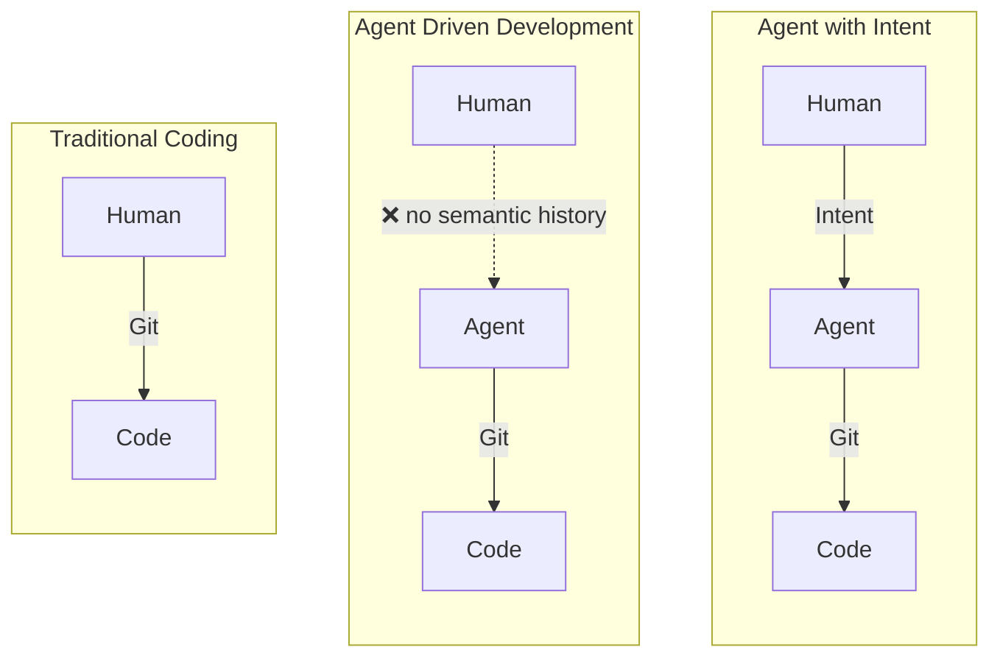
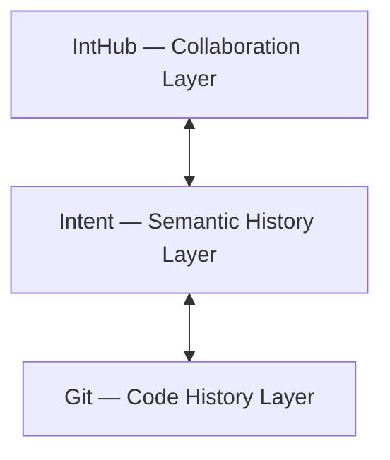
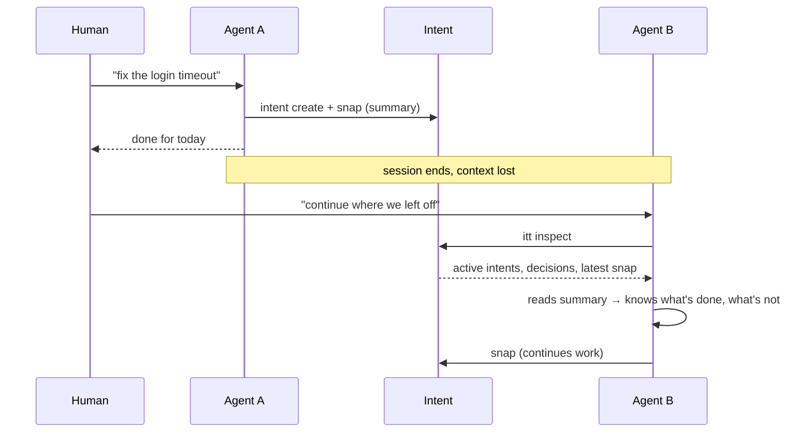

# Intent Vision

[中文](../CN/vision.md) | English

## What this document answers

- Why the agent era needs a new layer of semantic history
- What layer Intent fills — and what it does not replace
- Why this is more urgent in the agent era
- What criteria should be used to judge whether Intent is valid

## What this document does not answer

- How specific objects, commands, and states should be designed
- JSON schemas, state machines, and machine-readable contracts
- Current implementation details
- Roadmap and priority planning

## Relationship to other documents

- For implementation and object semantics, see the [CLI design doc](cli.md)
- For roadmap and phasing, see the [Roadmap](roadmap.md)

## 1. Core thesis

Git remains foundational infrastructure for the code world. That hasn't changed.

What has changed is how software development works:

- People increasingly shape code indirectly through agents
- The development process looks more like "propose a goal, drive toward results, continuously correct, crystallize decisions"
- The development process reliably produces higher-level semantic nodes: current intent, interaction snapshots, long-term decisions, reverts and continuations

The new question is therefore not "how to replace Git", but:

**How to add a semantic history layer on top of Git for human-agent collaboration.**

Intent is that layer.

## 2. What's truly missing is not information — it's stable object boundaries

High-level semantic information is not scarce today. It's typically scattered across:

- Commit messages
- Issues
- PR discussions
- Docs
- Team chat
- Agent conversations
- Ad-hoc notes and verbal agreements

The problem is not that this information doesn't exist, but that it's usually:

- Readable, but unstable
- Discussable, but hard to track continuously
- Recallable, but lacking unified boundaries
- Passable for humans, but unreliable for agents

This leads to a very practical problem: we can see how code changed, but we can't reliably answer these questions:

- What problem are we actually solving right now
- What did the last interaction actually accomplish
- What feedback did the user give on that progress
- Which long-term decisions are still in effect
- Why are we continuing along this particular path

What Intent solves is not "recording more information", but:

**Promoting these high-level semantics to first-class objects.**

## 3. Why the existing tool combination falls short

`Git + PR + issue + docs + chat` is certainly useful, but it hasn't turned this semantic history layer into a unified system.

Four main problems:

- Semantics are expressed in a scattered way, not formally modeled
- Semantic node boundaries are unstable — hard to reference, compare, and trace back
- For agents, there's no stable entry point or queryable context
- "Progress, correction, revert, decision crystallization" remain scattered across different media

In traditional development, the central action is more like "writing code."

In agent-driven development, the increasingly critical actions are:

- Proposing goals
- Driving implementation
- Continuously correcting
- Recording interaction feedback
- Reverting when necessary
- Crystallizing long-lived decisions

The center of gravity in development is shifting from "writing" to "guiding, connecting, and crystallizing."

## 4. What layer Intent fills

Intent does not replace Git. It fills the layer of history that Git was never designed to carry.

| Layer | Responsible for | Typical content |
| --- | --- | --- |
| Git | code history | commits, branches, diffs |
| Intent | semantic history | current intent, interaction snapshots, long-term decisions, reverts and continuations |
| Collaboration layer | remote organization & collaboration | timelines, shared views, collaboration context |

Intent can be understood as:

**A semantic history layer built on top of Git.**

In one sentence:

**Git records code changes. Intent records semantic history.**

## 5. Project boundaries

Intent currently does not intend to:

- Replace Git's version control capabilities
- Replace issue, PR, or docs systems
- Store all raw conversations and all intermediate processes
- Become a heavyweight "record everything" process platform
- Treat remote collaboration as a first-priority prerequisite

Intent's boundary is clear:

**Only record the semantic nodes worth formally tracking, linking, correcting, reverting, and reusing.**

## 6. Why this is more urgent in the agent era

In traditional development, semantics lived in the programmer's head. In the agent era, sessions are interrupted, agents are swapped, and context is lost between turns. Intent makes this handoff structural — not verbal.

## 7. Judging whether this works

Whether Intent is valid depends not on how much it records, but on whether it genuinely reduces semantic loss in collaboration.

More specifically:

- Are new sessions needing to re-explain context less often
- Can humans more easily understand what's being solved, what's been progressed, and why
- Is interrupted work easier to resume
- Are long-term decisions more reliably inherited, rather than buried in chat or memory

If these benefits don't materialize, then no matter how elegant the schema or how complete the commands, Intent doesn't hold up.

## 8. One-line definition

Intent is a Git-compatible semantic history layer for agent-driven software development.

## 9. Summary

Intent focuses not on Git's version control capability, but on the semantic history beyond Git:

- What problem is currently being solved
- What did the last interaction accomplish
- How the user responded to that progress
- Which long-term decisions are still in effect
- How the current path was formed, and how to record reverts or corrections when necessary
